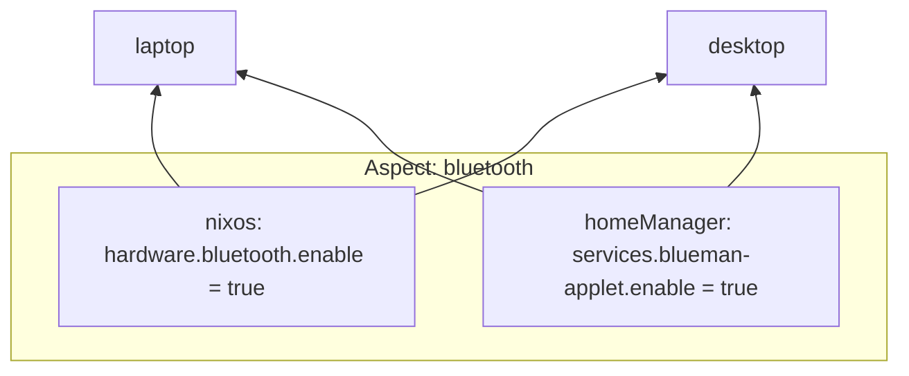
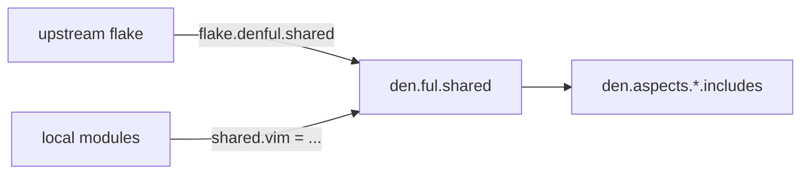
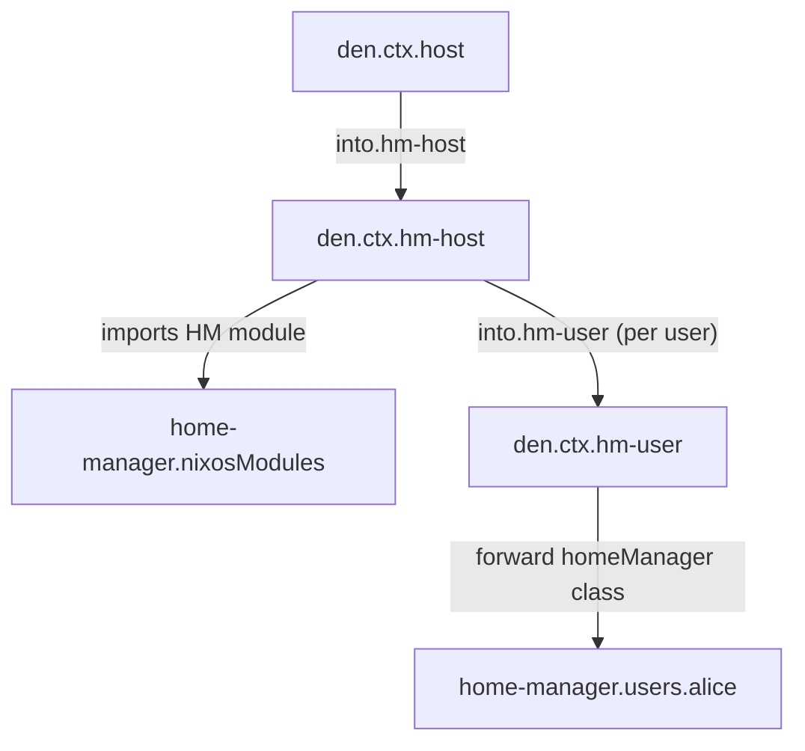
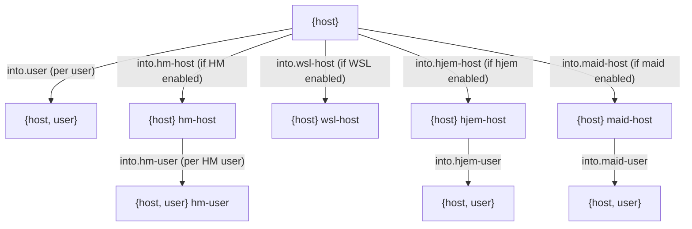
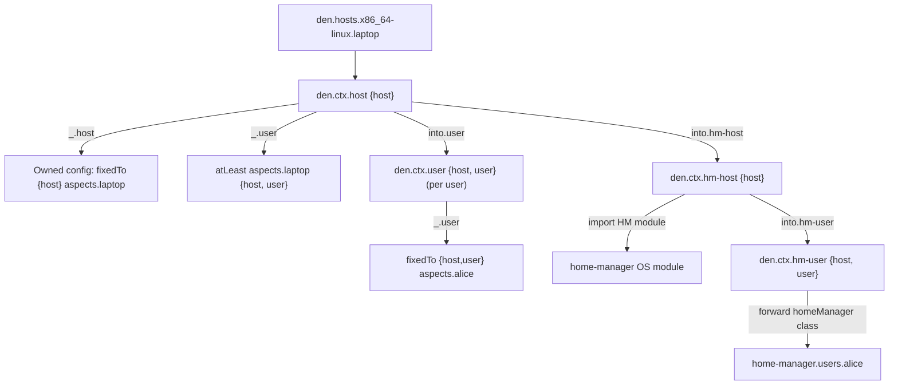

# AI Agent Instructions: Mastering Nix Organization with Den

> You are an AI assistant helping users achieve the best possible Nix configuration
> organization using **Den** — the aspect-oriented, context-driven Dendritic Nix framework.
> Follow these instructions precisely and completely.

---

## Nix Style Guidelines

Prefer using the following style for modules:

```nix
{ den, lib, inputs, ... }:
let
  inherit (den.lib) perHost;

  foo = { host }: {
    nixos = ...;
  };
in
{
  den.aspects.igloo.includes = [
    (perHost foo)
  ];
}
```

Use let-bindings, and keep the last attribute set definition short.

Avoid using inlined anonymous functions at includes. Prefer aspects bound in let or previously assigned to den.aspects.* or any other aspect namespace.

Aspects must be short, focused on re-usability
and only ONE concern across different Nix classes.


## Actively Use Den Sources.

Locate Den source code from the flake inputs.

Actively read Den source code and documentation. Docs are
under ./docs and Den also provides CI tests that serve as
examples of every Den feature under templates/ci/modules,
explore all the codebase to find our what is possible with
Den.

When building always use --show-trace to
see the full trace of the evaluation.

Agents are encouraged to use nix eval to investigate what expressions evaluate to, they also can use it to investigate locations of files from the nix store that need to be loaded into context. Never start interactive repl, only use nix eval for exploration.

When not sure about how to do something always refer to Den source code and CI examples. Den source and documentation is the ultimate source of truth regarding Den capabilities and practices.


## 0. Foundational Mental Model

Before writing a single line of Nix, internalize these axioms:

1. **Features first, hosts second.** Never organize by machine. Organize by concern.
   A "bluetooth" aspect knows how to configure NixOS AND HomeManager. Hosts just
   declare which aspects they include.
2. **Context IS the condition.** Never write `mkIf`, never write `enable = true` guards
   inside aspects. A function that takes `{ host, user }` is automatically skipped in
   `{ host }`-only contexts. The argument signature IS the conditional.
3. **Aspects are functions.** A Dendritic aspect is a Nix function returning per-class
   configs. This makes them composable, type-checkable, and parametric.
4. **Everything is optional and incremental.** Den works with/without flakes,
   with/without flake-parts. Migrate one host at a time.
5. **Testable Aspects** When writing generic re-usable aspects always create Tests for them, see Den own templates/ci for how tests are structured and their test-support files.

---

## 1. Repository / File Layout (Always)

This structure is not mandatory, directory and file naming
in Den serves as documentation, Den does not care about
file location, it is important for the User since paths
effectively document features and semantics.

```
flake.nix            ← or default.nix for noflake
modules/
  den.nix            ← ONLY file declaring den.flakeModule import + global policy
  hosts.nix          ← den.hosts declarations
  users.nix          ← den.aspects for users (or split per user)
  schema.nix         ← den.schema.{host,user,home,conf}
  defaults.nix       ← den.default global configuration
  aspects/
    bluetooth.nix    ← one file per cross-cutting concern
    gaming.nix
    dev-tools.nix
    tiling-wm.nix
    ...
  _nixos/            ← legacy NixOS modules (underscore = import-tree ignores)
  _darwin/           ← legacy Darwin modules
```

**Rules:**
- Every file under `modules/` (without `_` prefix) is auto-loaded by `import-tree`.
- Never manually list imports. Create files. Den finds them.
- Use `_` prefix for non-Dendritic NixOS module directories.
- One concern per file. Never monolithic configs.
- Any file can configure any module, incrementally.
- Use file organization to your advantage.

---

## 2. Declaring Hosts and Users

### 2.1 Host Declaration Pattern

Always declare hosts with full metadata:

```nix
# modules/hosts.nix
{ ... }: {
  den.hosts.x86_64-linux.laptop = {
    users.alice = {};
    users.bob.classes = [ "homeManager" "hjem" ];
    gpu = "nvidia";          # freeform metadata readable by aspects
    roles = [ "devops" ];    # custom metadata for role-based dispatch
  };

  den.hosts.aarch64-darwin.mac = {
    users.alice = {};
  };
}
```

**Host schema options to set explicitly:**
- `hostName` — if different from the attrset key
- `users.<name>.classes` — always set explicitly, never rely on defaults blindly
- `users.<name>.roles` — add custom roles for role-based class dispatch
- Any freeform attribute becomes readable as `host.<attr>` in aspects

### 2.2 Standalone Homes

```nix
den.homes.x86_64-linux.alice = {};
den.homes.aarch64-darwin.alice = {};
```

### 2.3 Schema — Shared Metadata for ALL Entities

Always define shared options via `den.schema.*` instead of repeating per host:

```nix
# modules/schema.nix
{ lib, ... }: {
  den.schema.host = { host, lib, ... }: {
    options.hardened    = lib.mkEnableOption "hardened profile";
    options.roles       = lib.mkOption { default = []; type = lib.types.listOf lib.types.str; };
    config.hardened     = lib.mkDefault false;
  };

  den.schema.user = { user, lib, ... }: {
    options.roles      = lib.mkOption { default = []; type = lib.types.listOf lib.types.str; };
    config.classes     = lib.mkDefault [ "homeManager" ];
  };

  den.schema.conf = { lib, ... }: {
    options.copyright  = lib.mkOption { default = "Copy-Left"; };
  };
}
```

---

## 3. Global Defaults — `den.default`

Keep defaults simple, the intention of it is not to be
overloaded with lots of logic but to serve as defaults
for truly global settings and fully parametric aspects.

```nix
# modules/defaults.nix
{ den, ... }: {
  den.default = {
    nixos.system.stateVersion       = "25.11";
    homeManager.home.stateVersion   = "25.11";
    darwin.system.stateVersion      = 5;
    includes = [
      den.provides.define-user   # sets users.users.<name> + home dirs
      den.provides.hostname      # sets networking.hostName
      den.provides.inputs'       # exposes flake-parts inputs' to all modules
    ];
  };
}
```

**Caution:** Owned configs from `den.default` are deduplicated. Parametric functions
in `den.default.includes` run at EVERY context stage. Use `den.lib.take.exactly`
to restrict to specific context shapes.

---

## 4. Aspect Authoring Rules

### 4.1 Anatomy of a Perfect Aspect

```nix
# modules/aspects/bluetooth.nix
{ den, ... }: {
  den.aspects.bluetooth = {
    # Owned configs per class — always prefer attrset form for static data
    nixos.hardware.bluetooth.enable     = true;
    nixos.hardware.bluetooth.powerOnBoot = true;
    darwin.services.blueutil.enable     = true;

    # os class = applies to BOTH nixos and darwin (built-in Den class)
    # os.some.option = ...;

    # Home Manager owned config
    homeManager.services.blueman-applet.enable = true;

    # Depends on other aspects
    includes = [
      den.aspects.pipewire          # full DAG is pulled in
      den.aspects.bluetooth.provides.applet   # sub-aspect
    ];

    # Sub-aspects / features within this concern
    provides.applet = {
      homeManager.services.blueman-applet.enable = true;
    };

    # Parametric provides — context-aware
    provides.headset = { host, user, ... }:
      { homeManager.services.easyeffects.enable = host.class == "nixos"; };
  };
}
```

### 4.2 Three Kinds of Includes (know them all)

| Kind | Example | When runs |
|------|---------|-----------|
| Static attrset | `{ nixos.foo = 1; }` | Always, unconditionally |
| Static leaf | `{ class, aspect-chain }: { ${class}.foo = 1; }` | Once, gets class name |
| Parametric | `{ host, user }: { ... }` | Only when context matches args |

### 4.3 Named Aspects Anti-Pattern Warning

**NEVER** inline anonymous functions in `includes`. Always name them:

```nix
# BAD — anonymous, hard to debug
den.aspects.laptop.includes = [ ({ host }: { nixos.networking.hostName = host.hostName; }) ];

# GOOD — named aspect, proper error traces
den.aspects.set-hostname = { host, ... }: { nixos.networking.hostName = host.hostName; };
den.aspects.laptop.includes = [ den.aspects.set-hostname ];
```

### 4.4 Parametric Dispatch Variants

Use the right parametric constructor:

| Constructor | Use case |
|-------------|----------|
| `den.lib.parametric` | Default. Owned + statics + atLeast-matching functions |
| `den.lib.parametric.atLeast` | Only parametric functions, no owned/statics |
| `den.lib.parametric.exactly` | Only exact-match context functions |
| `den.lib.parametric.fixedTo attrs` | Always use given attrs as context |
| `den.lib.parametric.expands attrs` | Extend received context before dispatch |
| `den.lib.perHost` | Wrap an aspect with exatly {host} |
| `den.lib.perUser` | Wrap an aspect with exatly {host,user} |
| `den.lib.perHome` | Wrap an aspect with exatly {home} |

### 4.5 Context-Aware Function Signatures

```nix
# Runs for ANY context (host, user, home)
{ nixos.networking.firewall.enable = true; }

# Runs only in {host} contexts (atLeast: host present)
({ host, ... }: { nixos.networking.hostName = host.hostName; })

# Runs ONLY in {host, user} contexts (atLeast)
({ host, user, ... }: { nixos.users.users.${user.userName}.extraGroups = ["wheel"]; })

# Runs ONLY in exactly {host} — use take.exactly to prevent user context calls
# Prefer: den.lib.perHost 
(den.lib.take.exactly ({ host }: { nixos.x = host.hostName; }))

# Runs ONLY in exactly {host, user}
# Prefer: den.lib.perUser
(den.lib.take.exactly ({ host, user }: { nixos.y = user.userName; }))

# Runs only for standalone {home} context
# Prefer den.lib.perHome
({ home }: { homeManager.home.username = home.userName; })
```

---

## 5. Mutual Host<->User Configuration

Den supports a patterns for Host↔User mutual configuration.
Read `https://den.oeiuwq.com/guides/mutual` and apply these rules:

### 5.1 Explicit Mutual Provider (`den._.mutual-provider`)

For EXPLICIT named host↔user pairings.

```nix
# Enable for everything
den.default.includes = [ den._.mutual-provider ];

# Host igloo contributes TO user tux specifically
den.aspects.igloo.provides.tux = { user, ... }: {
  homeManager.programs.helix.enable = true;
};

# User tux contributes TO host igloo specifically
den.aspects.tux.provides.igloo = { host, ... }: {
  nixos.programs.nh.enable = true;
};

# Host provides to all users
den.aspects.igloo.provides.to-users = {};

# User provides to all hosts
den.aspects.tux.provides.to-hosts = {};
```

---

## 6. All Built-in Batteries — Use Them All

Always prefer batteries over manual repetition:

```nix
den.default.includes = [
  den.provides.define-user        # OS user accounts + home dirs
  den.provides.hostname           # sets networking.hostName
  den.provides.inputs'            # flake-parts inputs' in all modules
  den.provides.self'              # flake-parts self' in all modules
];

# Per user
den.aspects.alice.includes = [
  den.provides.primary-user              # wheel, networkmanager, isNormalUser
  (den.provides.user-shell "fish")       # shell at OS + HM level
  (den.provides.unfree ["vscode" "spotify"])  # unfree predicate
  (den.provides.tty-autologin "alice")   # TTY1 auto-login
];

# For WSL hosts
den.hosts.x86_64-linux.wsl-machine = {
  wsl.enable = true;   # activates den.ctx.wsl-host automatically
};
```

Battery reference:
- `define-user` — creates `users.users.<name>` with `isNormalUser`, `home`
- `hostname` — sets `networking.hostName` from `host.hostName`
- `primary-user` — NixOS: `wheel`+`networkmanager`; Darwin: `system.primaryUser`; WSL: `defaultUser`
- `user-shell "bash"|"fish"|"zsh"` — OS shell + HM `programs.<shell>.enable`
- `unfree [...]` — `nixpkgs.config.allowUnfreePredicate` for named packages
- `tty-autologin "user"` — `services.getty.autologinUser`
- `mutual-provider` — explicit named host↔user cross-config
- `forward` — creates custom Nix classes (see §7)
- `import-tree` — auto-imports legacy non-dendritic `.nix` directories
- `inputs'` — flake-parts system-qualified inputs
- `self'` — flake-parts system-qualified self

Explore their source code, create new re-usable aspects that can serve without any hardcoded user or host value. Den is about re-usability, use `modules/community/<namespace>` to place aspects under namespace that can be re-used by local infra and outside the flake.

---

## 7. Custom Nix Classes — The `forward` Battery

Whenever you need a new abstraction that maps to a subpath of an existing class,
create a custom class with `den.provides.forward`:

### 7.1 The `os` class (cross-platform, built into Den)

```nix
# Already built-in. Use it for settings applying to BOTH nixos and darwin:
den.aspects.my-laptop.os.networking.hostName = "Yavanna";
```

### 7.2 Role-based class (dynamic dispatch)

```nix
# modules/role-class.nix
{ den, lib, ... }:
let
  roleClass = { host, user }: { class, aspect-chain }:
    den._.forward {
      each      = lib.intersectLists (host.roles or []) (user.roles or []);
      fromClass = lib.id;
      intoClass = _: host.class;
      intoPath  = _: [];
      fromAspect = _: lib.head aspect-chain;
    };
in {
  den.ctx.user.includes = [ roleClass ];
}
```

### 7.3 Impermanence class with guard

```nix
# modules/persys-class.nix
{ den, lib, ... }:
let
  persys = { class, aspect-chain }: den._.forward {
    each      = lib.singleton true;
    fromClass = _: "persys";
    intoClass = _: class;
    intoPath  = _: [ "environment" "persistance" "/nix/persist/system" ];
    fromAspect = _: lib.head aspect-chain;
    guard     = { options, ... }: options ? environment.persistance;
  };
in {
  den.ctx.host.includes = [ persys ];
  # Aspects just use the class, guard ensures safety
  # den.aspects.laptop.persys.hideMounts = true;
}
```

### 7.4 git class forwarding into home-manager

```nix
{ den, lib, ... }:
let
  gitClass = { class, aspect-chain }: den._.forward {
    each      = lib.singleton true;
    fromClass = _: "git";
    intoClass = _: "homeManager";
    intoPath  = _: [ "programs" "git" ];
    fromAspect = _: lib.head aspect-chain;
    adaptArgs  = lib.id;
  };
in {
  den.ctx.user.includes = [ gitClass ];
}
# Usage: den.aspects.alice.git.userEmail = "alice@example.com";
```

**forward parameters reference:**
- `each` — list of items to iterate (users, roles, `lib.singleton true`)
- `fromClass` — source class name to read from
- `intoClass` — target class to write into
- `intoPath` — attribute path in target class
- `fromAspect` — which aspect to read
- `guard` — `{ options, config, ... } -> bool` — only forward if true
- `adaptArgs` — transform module args before forwarding
- `adapterModule` — custom module for forwarded submodule type

---

## 8. Home Environment Integration

### 8.1 Best Practice: Declare classes explicitly

```nix
# Per user
den.hosts.x86_64-linux.laptop.users.alice.classes = [ "homeManager" ];
den.hosts.x86_64-linux.laptop.users.bob.classes   = [ "hjem" ];

# Global default via schema
den.schema.user.classes = lib.mkDefault [ "homeManager" ];
```

### 8.2 Configure homes in user aspects

```nix
den.aspects.alice = {
  homeManager = { pkgs, ... }: {
    home.packages       = [ pkgs.htop pkgs.ripgrep ];
    programs.git.enable = true;
    programs.starship.enable = true;
  };

  hjem.files.".envrc".text = "use flake ~/proj";

  # User contributing OS config to any host it lives on
  nixos.users.users.alice.extraGroups = [ "docker" ];

  # User contributing to Darwin hosts specifically
  darwin.services.karabiner-elements.enable = true;
};
```

### 8.3 Host contributing home config to users

```nix
# Host igloo provides vim to ALL its users' home environments
den.aspects.igloo.provides.to-users = {
  homeManager.programs.vim.enable = true;   # goes to ALL users on igloo
};
den.ctx.user.includes = [ den._.mutual-provider ];
```

### 8.4 Multiple home environments per user

```nix
den.hosts.x86_64-linux.laptop.users.alice.classes = [ "homeManager" "hjem" ];
den.aspects.alice = {
  homeManager = { pkgs, ... }: { home.packages = [ pkgs.vim ]; };
  hjem.files.".bashrc".text = "# managed by hjem";
};
```

---

## 9. Namespaces — Sharing Aspect Libraries

### 9.1 Create and export a namespace

```nix
# modules/namespace.nix
{ inputs, den, ... }: {
  imports = [ (inputs.den.namespace "myorg" true) ]; # true = export

  # Populate
  myorg.bluetooth = { nixos.hardware.bluetooth.enable = true; };
  myorg.gaming    = {
    includes = [ myorg.bluetooth ];
    nixos.programs.steam.enable = true;
  };
}
```

### 9.2 Import upstream namespaces

```nix
imports = [ (inputs.den.namespace "shared" [ inputs.team-config ]) ];
# Now: shared.* contains merged aspects from upstream
```

### 9.3 Enable angle bracket syntax

Angle bracket syntax is recommended for large, deep provides hierarchies.

```nix
{ den, ... }: {
  _module.args.__findFile = den.lib.__findFile;
}
```

Then use `<aspect>`, `<aspect/sub>`, `<namespace>`, `<den.provides.battery>`:

```nix
den.aspects.laptop.includes = [
  <tools/editors>
  <alice/work-vpn>
  <myorg/gaming>
  <den.provides.primary-user>
];
```

---

## 10. Custom Context Types — Extending the Pipeline

```nix
# modules/gpu-context.nix
{ den, lib, ... }: {
  den.ctx.gpu-host = {
    description = "GPU-accelerated host";
    _.gpu-host   = { host }: { nixos.hardware.nvidia.enable = true; };
  };

  den.ctx.host.into.gpu-host = { host }:
    lib.optional (host ? gpu) { inherit host; };
}

# Usage: just set host.gpu = "nvidia" in hosts.nix
# The context activates automatically.
```

---

## 11. Migration Strategy (Incremental)

If the user has an existing configuration:

1. **Add Den input** to `flake.nix` + import `inputs.den.flakeModule` in one module.
2. **Declare hosts** in `den.hosts` matching existing `nixosConfigurations` names.
3. **Use `import-tree` battery** to load existing NixOS module directories:
   ```nix
   den.ctx.host.includes = [ (den.provides.import-tree._.host ./hosts) ];
   den.ctx.user.includes = [ (den.provides.import-tree._.user ./users) ];
   ```
4. **Extract one concern at a time** into aspects. Start with the most reused feature.
5. **Replace batteries** for manual patterns: `define-user`, `primary-user`, `user-shell`.
6. **Remove legacy** files as aspects cover them.

Never big-bang rewrite. Always keep the build green.

---

## 12. Debugging Checklist

```nix
# Step 1: Expose den for REPL inspection (remove after)
{ den, ... }: { flake.den = den; }
```

```console
nix repl
:lf .
den.aspects.laptop          # inspect aspect
den.hosts.x86_64-linux.laptop  # inspect host metadata
den.ctx                     # inspect context pipeline
nixosConfigurations.laptop.config.networking.hostName  # verify output
```

```nix
# Step 2: Trace context in an aspect
den.aspects.laptop.includes = [
  ({ host, ... }@ctx: builtins.trace ctx { nixos.networking.hostName = host.hostName; })
];
```

```console
# Step 3: Manually resolve an aspect
nix-repl> aspect = den.aspects.laptop { host = den.hosts.x86_64-linux.laptop; }
nix-repl> module = den.lib.aspects.resolve "nixos" [] aspect
```

**Common issues and fixes:**
- **Duplicate list values** → use `den.lib.take.exactly` in `den.default.includes`
- **Wrong class** → Darwin is `"darwin"` not `"nixos"`, check `host.class`
- **Bidirectional double-invocation** → add `take.exactly`/`take.atLeast` guards
- **Module not found** → remove `_` prefix, or move out of `_nixos/` directory
- **Bidirectional with `{host}` only** → `igloo.includes` called with `{host}` only for OS; add `take.atLeast` for user-context calls

---

## 13. Complete Optimal Structure (Reference Implementation)

```
modules/
  den.nix           ← imports den.flakeModule, namespace setup, __findFile
  schema.nix        ← den.schema.{host,user,home,conf} with typed options
  defaults.nix      ← den.default with stateVersion + global batteries
  hosts.nix         ← ALL den.hosts declarations with metadata
  aspects/
    # Cross-cutting concerns (no host/user specifics here)
    bluetooth.nix
    gaming.nix
    dev-tools.nix
    tiling-wm.nix
    networking.nix
    security.nix
    # Platform-specific features
    darwin-specific.nix
    # Custom classes
    role-class.nix
    persys-class.nix
    git-class.nix
  users/
    alice.nix       ← den.aspects.alice with homeManager/hjem/user/includes
    bob.nix         ← den.aspects.bob
  hosts/
    laptop.nix      ← den.aspects.laptop with nixos/darwin/os/includes
    server.nix      ← den.aspects.server
    mac.nix         ← den.aspects.mac
```

Each file contributes ONLY to `den.aspects.<name>` for that concern.
Any file can contribute to any aspect. No centralized wiring.

---

## 14. Quality Checklist for AI Agents

Before submitting any Den configuration, verify:

- [ ] No `mkIf` used inside aspects — context dispatch handles conditions
- [ ] No anonymous functions in `includes` — all are named aspects
- [ ] `den.schema.*` defines shared options instead of repeating per-host
- [ ] `den.default` sets `stateVersion` for all classes
- [ ] All batteries used instead of manual equivalents
- [ ] `mutual-provider` used for host↔user cross-config
- [ ] `perHost`/`perUser`/`take.exactly`/`take.atLeast` guards on mutual aspects
- [ ] One file per concern in `modules/aspects/`
- [ ] Non host/user specific re-usable aspects in `modules/community/<namespace>/`
- [ ] No monolithic `configuration.nix` style files
- [ ] Custom metadata in `host.roles`, `host.gpu`, etc. drives parametric dispatch
- [ ] `den.provides.import-tree` used for any legacy non-Dendritic modules
- [ ] Namespaces used for any shared aspect libraries
- [ ] Angle brackets enabled and used for concise references
- [ ] All custom classes use `guard` when depending on optional modules
- [ ] CI tests referenced at `templates/ci/modules/features/` for every feature used

---

## 15. Key Source References

All source truth lives at:
- `https://den.oeiuwq.com` — official documentation
- `https://den.oeiuwq.com/guides/mutual` — Mutual Host<->User config
- `https://github.com/vic/den/tree/main/templates/ci/modules/features/` — executable feature tests (best learning resource)
- `https://github.com/vic/den/tree/main/modules/aspects/provides/` — all batteries source
- `https://github.com/vic/flake-aspects` — underlying aspect library
- `https://dendrix.oeiuwq.com/Dendritic.html` — Dendritic design advantages

When unsure about any Den feature, consult `templates/ci/modules/features/<feature>.nix`
for a working, tested, executable example. These tests ARE the specification.

``` [1](#0-0) [2](#0-1) [3](#0-2) [4](#0-3) [5](#0-4) [6](#0-5) [7](#0-6) [8](#0-7) [9](#0-8) [10](#0-9) [11](#0-10) [12](#0-11) [13](#0-12) [14](#0-13) [15](#0-14) [16](#0-15) [17](#0-16) [18](#0-17) [19](#0-18) [20](#0-19) [21](#0-20)

### Citations

**File:** docs/src/content/docs/explanation/core-principles.mdx (L9-36)
```text

<Aside title="Recommended Read">
[Flipping the Configuration Matrix](https://not-a-number.io/2025/refactoring-my-infrastructure-as-code-configurations/#flipping-the-configuration-matrix) by [Pol Dellaiera](https://github.com/drupol) was very influential in Den design and is a very recommended read.

See also my [dendrix article](https://dendrix.oeiuwq.com/Dendritic.html) about the advantages of Dendritic Nix.
</Aside>

Traditional Nix configurations start from hosts and push modules downward.
Den follows a Dendritic model that inverts this: **aspects** (features) are the primary organizational unit.
Each aspect declares its behavior per Nix class, and hosts simply select which
aspects apply to them.



An aspect consolidates all class-specific configuration for a single concern.
Adding bluetooth to a new host is one line: include the aspect.
Removing it is deleting that line.

**File:** docs/src/content/docs/guides/configure-aspects.mdx (L127-187)

1. Static (plain attribute set): `{ nixos.foo = ...; }`
2. Static (flake-aspects' leaf): `{class, aspect-chain}: { ${class}.foo = ...; }`
3. Parametric (any other function): `{ host, user }: { ${host.class}.foo = ...; }`

`(1)` and `(2)` are termed *static aspects* and are the terminal leafs of flake-aspects DAG.
`(1)` provides configuration unconditionally, and `(2)` gets access to the `class` that is
being resolved and an `aspect-chain` that lead to the current aspect (most recent last).


`(3)` is a more interesting kind of aspect that is used by Den to pass host/user defitions 
into these functions, so they can inspect the host features and provide
configuration accordingly.


## Provides

`provides` creates named sub-aspects accessible via `den.aspects.<name>._.<sub>`
or `den.aspects.<name>.provides.<sub>`:

```nix
den.aspects.tools.provides.editors = {
  homeManager.programs.helix.enable = true;
  homeManager.programs.vim.enable = true;
};

# Used elsewhere:
den.aspects.alice.includes = [ den.aspects.tools._.editors ];
```

`provides` can also be parametric functions:

```nix
den.aspects.alice.provides.work-vpn = { host, user, ... }:
  lib.optionalAttrs host.hasVpn {
    nixos.services.openvpn.servers.work.config = "...";
  };
```

## Global Defaults

`den.default` is a special aspect applied to every host, user, and home:

```nix
{
  den.default = {
    nixos.system.stateVersion = "25.11";
    homeManager.home.stateVersion = "25.11";
    includes = [
      den.provides.define-user
      den.provides.inputs'
    ];
  };
}
```

<Aside type="caution">
Owned configs from `den.default` are deduplicated across pipeline stages.
Parametric functions in `den.default.includes` are evaluated at every context
stage. Use `den.lib.take.exactly` if a function should only run in specific contexts.
</Aside>
```

**File:** docs/src/content/docs/explanation/parametric.mdx (L60-113)
```text

`den.lib.parametric` changes an aspect `__functor` which processes
its `includes` list through parametric dispatch:

```nix
den.lib.parametric {
  nixos.foo = 1;  # owned config, always included
  includes = [
    { nixos.bar = 2; }                    # static, always included
    ({ host }: { nixos.x = host.name; })  # parametric, host contexts only
    ({ user }: { homeManager.y = 1; })    # parametric, user contexts only
  ];
}
```

When the aspect's `__functor` is called with a context, it filters `includes`
based on argument compatibility and returns only matching entries.

<Aside type="caution" title="Anonymous functions are an anti-pattern">
It is **not** recommended to have inlined functions on your `.includes` lists.
This guide uses inlined functions only for examples, not as best-practice.

Instead, use named aspects, this will improves readability and the error traces 
generated by Nix since those functions have a proper name and location.

```nix
den.aspects.my-laptop.includes = [ foo ];
den.aspects.foo = { host }: { ... };
```
</Aside>

## Parametric Variants

| Constructor | Behavior |
|---|---|
| `parametric` | Default. <br/> Includes owned classes + static includes + function includes with context matching `atLeast`. |
| `parametric.atLeast` | **Does NOT** include owned classes nor static includes. Only function matching atLeast the context. |
| `parametric.exactly` | Like atLeast but using canTake.exactly for match. |
| `parametric.fixedTo attrs` | Like `parametric` default but ignores any context and always uses the given attrs . |
| `parametric.expands attrs` | Like `parametric`, but extends the received context with `attrs` before dispatch. |

## Example: Context-aware battery

This is a pattern used by many of our built-in batteries, be sure to see their code as example.

```nix
den.lib.parametric.exactly {
  includes = [
    ({ user, host }: { ... })
    ({ home }: { ... })
  ];
};
```

```

**File:** docs/src/content/docs/guides/batteries.mdx (L13-205)
```text

Batteries are reusable aspects shipped with Den under `den.provides.*`
(aliased as `den._.*`). They handle common cross-platform configuration
patterns so you do not have to rewrite them.

## Available Batteries

### `den.provides.define-user`

Creates OS and home-level user account definitions:

```nix
den.default.includes = [ den.provides.define-user ];
```

Sets `users.users.<name>` on NixOS/Darwin and `home.username`/`home.homeDirectory`
for Home Manager. Works in both host-user and standalone home contexts.

### `den.provides.hostname`

Sets the system hostname as defined in `den.hosts.<name>.hostName`:

```nix
den.default.includes = [ den.provides.hostname ];
```

### `den.provides.mutual-provider`

Allows hosts and users to contribute configuration **to each other** through `provides`:

```nix
den.hosts.x86_64-linux.igloo.users.tux = { };
den.default.includes = [ den._.mutual-provider ];
```

```nix
# contributes to ALL users of this host
den.aspects.my-host.provides.to-users.homeManager = { ... }

# contributes to ALL hosts of where my-user exist
den.aspects.my-user.nixos = { ... }
```

A user providing config TO the host:

```nix
den.aspects.tux = {
  provides.igloo = { host, ... }: {
    nixos.programs.nh.enable = host.name == "igloo";
  };
};
```

A host providing config TO the user:

```nix
den.aspects.igloo = {
  provides.tux = { user, ... }: {
    homeManager.programs.helix.enable = user.name == "alice";
  };
};
```

### `den.provides.primary-user`

Marks a user as the primary user of the system:

```nix
den.aspects.alice.includes = [ den.provides.primary-user ];
```

- **NixOS**: adds `wheel` and `networkmanager` groups, sets `isNormalUser`.
- **Darwin**: sets `system.primaryUser`.
- **WSL**: sets `defaultUser` (if WSL is enabled).

### `den.provides.user-shell`

Sets the default login shell at both OS and Home Manager levels:

```nix
den.aspects.alice.includes = [ (den.provides.user-shell "fish") ];
```

Enables `programs.<shell>.enable` on the OS and in Home Manager,
and sets `users.users.<name>.shell`.

### `den.provides.forward`

Creates custom Nix classes by forwarding module contents into target
submodule paths. See [Custom Nix Classes](/guides/custom-classes/) for details.

### `den.provides.import-tree`

Recursively imports non-dendritic `.nix` files, auto-detecting class from
directory names (`_nixos/`, `_darwin/`, `_homeManager/`):

```nix
# Import per host
den.ctx.host.includes = [ (den.provides.import-tree._.host ./hosts) ];

# Import per user
den.ctx.user.includes = [ (den.provides.import-tree._.user ./users) ];

# Import for a specific aspect
den.aspects.laptop.includes = [ (den.provides.import-tree ./disko) ];
```

Requires `inputs.import-tree`.

### `den.provides.unfree`

Enables specific unfree packages by name:

```nix
den.aspects.laptop.includes = [
  (den.provides.unfree [ "nvidia-x11" "steam" ])
];
```

Works for any class (`nixos`, `darwin`, `homeManager`). The unfree predicate
builder is automatically included via `den.default`.

### `den.provides.tty-autologin`

Enables automatic TTY1 login on NixOS:

```nix
den.aspects.laptop.includes = [ (den.provides.tty-autologin "alice") ];
```

### `den.provides.inputs'`

Provides flake-parts `inputs'` (system-specialized inputs) as a module argument:

```nix
den.default.includes = [ den.provides.inputs' ];
```

Requires flake-parts. Works in host, user, and home contexts.

### `den.provides.self'`

Provides flake-parts `self'` (system-specialized self) as a module argument:

```nix
den.default.includes = [ den.provides.self' ];
```

Requires flake-parts. Works in host, user, and home contexts.

## Usage Patterns

### Global Batteries

Apply to all entities via `den.default`:

```nix
den.default.includes = [
  den.provides.define-user
  den.provides.inputs'
];
```

### Per-Aspect Batteries

Apply to specific aspects:

```nix
den.aspects.alice.includes = [
  den.provides.primary-user
  (den.provides.user-shell "zsh")
  (den.provides.unfree [ "vscode" ])
];
```

### Battery Composition

Batteries compose with regular aspects:

```nix
den.aspects.my-admin = den.lib.parametric {
  includes = [
    den.provides.primary-user
    (den.provides.user-shell "fish")
    { nixos.security.sudo.wheelNeedsPassword = false; }
  ];
};
```
```

**File:** docs/src/content/docs/guides/custom-classes.mdx (L14-270)
```text
## What is a Custom Class

Den's built-in classes (`nixos`, `darwin`, `homeManager`) map to well-known
NixOS module systems. But you can define **custom classes** that forward their
contents into a target submodule path on another class.

This is how Den implements:
- The `user` class (forwards to `users.users.<name>` on the OS)
- Home Manager integration (forwards `homeManager` to `home-manager.users.<name>`)
- hjem integration (forwards `hjem` to `hjem.users.<name>`)
- nix-maid integration (forwards `maid` to `users.users.<name>.maid`)

## The `forward` Battery

`den.provides.forward` creates a new class by forwarding its module contents
into a target path on an existing class:

```nix
{ host }:
den.provides.forward {
  each = lib.attrValues host.users;
  fromClass = user: "user";
  intoClass = user: host.class;
  intoPath  = user: [ "users" "users" user.userName ];
  fromAspect = user: den.aspects.${user.aspect};
}
```

| Parameter | Description |
|---|---|
| `each` | List of items to forward (typically `[ user ]` or `[ true ]`) |
| `fromClass` | The custom class name to read from |
| `intoClass` | The target class to write into |
| `intoPath` | Target attribute path in the target class |
| `fromAspect` | The aspect to read the custom class from |

## Example: The Built-in `user` Class

The `user` class (`modules/aspects/provides/os-user.nix`) forwards OS-level
user settings without requiring Home Manager:

```nix
# Instead of:
den.aspects.alice.nixos = { pkgs, ... } {
  users.users.alice = {
    packages = [ pkgs.hello ];
    extraGroups = [ "wheel" ];
  };
};

# You write:
den.aspects.alice.user = { pkgs, ... }: {
  packages = [ pkgs.hello ];
  extraGroups = [ "wheel" ];
};
```

The `user` class is automatically forwarded to `users.users.<userName>` on
whatever OS class the host uses (NixOS or Darwin).

## Creating Your Own Class

Suppose you want a `container` class that forwards into
`virtualisation.oci-containers.containers.<name>`:

```nix
{ den, lib, ... }:
let
  fwd = { host, user }:
    den.provides.forward {
      each = lib.singleton user;
      fromClass = _: "container";
      intoClass = _: host.class;
      intoPath  = _: [ "virtualisation" "oci-containers" "containers" user.userName ];
      fromAspect = _: den.aspects.${user.aspect};
    };
in {
  den.ctx.user.includes = [ fwd ];
}
```

Now any user aspect can use the `container` class:

```nix
den.aspects.alice.container = {
  image = "nginx:latest";
  ports = [ "8080:80" ];
};
```

## Advanced: Guards and Adapters

`forward` supports optional parameters for complex scenarios:

```nix
den.provides.forward {
  each = lib.singleton true;
  fromClass = _: "wsl";
  intoClass = _: host.class;
  intoPath  = _: [ "wsl" ];
  fromAspect = _: lib.head aspect-chain;
  # Only forward if target has wsl options
  guard = { options, ... }: options ? wsl;
  # Modify module args for the forwarded module
  adaptArgs = args: args // { osConfig = args.config; };
  # Custom module type for the forwarded submodule
  adapterModule = { config._module.freeformType = lib.types.anything; };
}
```

| Parameter | Description |
|---|---|
| `guard` | Only forward when this predicate returns true |
| `adaptArgs` | Transform module arguments before forwarding |
| `adapterModule` | Custom module for the forwarded submodule type |

## User contributed examples

#### Example: Config across `nixos` and `darwin` classes.

The `os` forward class ([provided by Den](https://github.com/vic/den/blob/main/modules/aspects/provides/os-class.nix)) can be useful for settings that must be forwarded to both on NixOS and MacOS.

> Requested by @Risa-G at [#222](https://github.com/vic/den/discussions/222)

```nix
# Note: this is already provided by Den at provides/os-class.nix
os-class = { class, aspect-chain }: den._.forward {
  each = [ "nixos" "darwin" ];
  fromClass = _: "os";
  intoClass = lib.id;
  intoPath = _: [ ]; # top-level
  fromAspect = _: lib.head aspect-chain;
};

# Note: already enabled by Den
# den.ctx.host.includes = [ os-class ];

den.aspects.my-laptop = {
  os.networking.hostName = "Yavanna"; # on both NixOS and MacOS
};
```

#### Example: Role based configuration between users and hosts

A dynamic class for matching roles between users and hosts.

```nix
roleClass =
  { host, user }:
  { class, aspect-chain }:
  den._.forward {
    each = lib.intersectLists (host.roles or []) (user.roles or []);
    fromClass = lib.id;
    intoClass = _: host.class;
    intoPath = _: [ ];
    fromAspect = _: lib.head aspect-chain;
  };

den.ctx.user.includes = [ roleClass ];

den.hosts.x86_64-linux.igloo = {
  roles = [ "devops" "gaming" ];
  users = {
    alice.roles = [ "gaming" ];
    bob.roles = [ "devops" ];
  };
};

den.aspects.alice = {
  # enabled when host supports gaming role
  gaming = { pkgs, ... }: { programs.steam.enable = true; };

  # enabled when host supports devops role
  devops = { pkgs, ... }: { virtualisation.podman.enable = true; };
};
```

#### Example: A git class that forwards to home-manager.

```nix
gitClass =
  { class, aspect-chain }:
  den._.forward {
    each = lib.singleton true;
    fromClass = _: "git";
    intoClass = _: "homeManager";
    intoPath = _: [ "programs" "git" ];
    fromAspect = _: lib.head aspect-chain;
    adaptArgs = lib.id;
  };

den.aspects.tux = {
  includes = [ gitClass ];
  git.userEmail = "root@linux.com";
};
```

This will set at host: `home-manager.users.tux.programs.git.userEmail`

#### Example: A `nix` class that propagates settings to NixOS and HomeManager

This can be used when you don't want NixOS and HomeManager to share the
same pkgs but still configure both at the same time. 
> Contributed by @musjj

```nix
nixClass =
  { class, aspect-chain }:
  den._.forward {
    each = [ "nixos" "homeManager" ];
    fromClass = _: "nix";
    intoClass = lib.id;
    intoPath = _: [ "nix" "settings" ];
    fromAspect = _: lib.head aspect-chain;
    adaptArgs = lib.id;
  };

# enable class for all users:
den.ctx.user.includes = [ nixClass ];

# custom aspect that uses the `nix` class.
nix-allowed = { user, ... }: { nix.allowed-users = [ user.userName ]; };

# included at users who can fix things with nix.
den.aspects.tux.includes = [ nix-allowed ];
```

#### Example: An impermanence class

> Suggested by @Doc-Steve

The following example, creates a forwarding class that is propagated only
when `environment.persistance` option is available in the host (the impermanence module was imported in host)

One cool thing about these custom classes is that aspects can simply define
settings at the new class, without having to worry if the options they depend or
some capability is enabled.

The froward-guard itself is reponsible checking in only one place, instead of having `mkIf` in a lot of places.

```nix
# Custom `persys` forwards config into nixos.environment.persistance."/nix/persist/system"
# only if environment.persistance option is present.
persys = { class, aspect-chain }: den._.forward {
  each = lib.singleton true;
  fromClass = _: "persys";
  intoClass = _: class;
  intoPath = _: [ "environment" "persistance" "/nix/persist/system" ];
  fromAspect = _: lib.head aspect-chain;
  guard = { options, ... }@osArgs: options ? environment.persistance;
};

den.hosts.my-laptop.includes = [ persys ];

# becomes nixos.environment.persistance."/nix/persist/system".hideMounts = true;
den.aspects.my-laptop.persys.hideMounts = true;
```
```

**File:** docs/src/content/docs/guides/namespaces.mdx (L13-114)
```text

A **namespace** creates a scoped aspect library under `den.ful.<name>`.
Namespaces can be:
- **Local**: defined in your flake, consumed internally.
- **Exported**: exposed via `flake.denful.<name>` for other flakes to consume.
- **Imported**: merged from upstream flakes into your local `den.ful`.

## Creating a Namespace

```nix
# modules/namespace.nix
{ inputs, den, ... }: {
  # Create "my" namespace (not exported to flake outputs)
  imports = [ (inputs.den.namespace "my" false) ];

  # Or create and export "eg" namespace
  imports = [ (inputs.den.namespace "eg" true) ];
}
```

This creates:
- `den.ful.eg` -- the namespace attrset (aspects type).
- `eg` -- a module argument alias to `den.ful.eg`.
- `flake.denful.eg` -- flake output (if exported).

## Populating a Namespace

Define aspects under the namespace using any module:

```nix
# modules/aspects/vim.nix
{
  eg.vim = {
    homeManager.programs.vim.enable = true;
  };
}
```

```nix
# modules/aspects/desktop.nix
{ eg, ... }: {
  eg.desktop = {
    includes = [ eg.vim ];
    nixos.services.xserver.enable = true;
  };
}
```

## Using Namespaced Aspects

Reference them by their namespace:

```nix
{ eg, ... }: {
  den.aspects.laptop.includes = [
    eg.desktop
    eg.vim
  ];
}
```

## Importing from Upstream

Merge aspects from other flakes:

```nix
# modules/namespace.nix
{ inputs, ... }: {
  # Import "shared" namespace from upstream, merging with local definitions
  imports = [ (inputs.den.namespace "shared" [ inputs.team-config ]) ];
}
```

The namespace function accepts:
- A **boolean** (`true`/`false`) for local/exported namespaces.
- A **list of sources** to merge from upstream flakes.
  Each source's `flake.denful.<name>` is merged into `den.ful.<name>`.

## Enabling Angle Brackets

When using namespaces, enable angle bracket syntax for terser references:

```nix
{ den, ... }: {
  _module.args.__findFile = den.lib.__findFile;
}
```

Then reference deep aspects with `<namespace/path>`:

```nix
den.aspects.laptop.includes = [ <eg/desktop> ];
```

## Architecture


```

**File:** docs/src/content/docs/guides/angle-brackets.mdx (L17-65)
```text

## Enabling

Set `__findFile` via module args:

```nix
{ den, ... }: {
  _module.args.__findFile = den.lib.__findFile;
}
```

## Resolution Rules

The `<name>` expression resolves through these paths in order:

1. **`<den.x.y>`** -- resolves to `config.den.x.y`
2. **`<aspect>`** -- resolves to `config.den.aspects.aspect` (if `aspect` exists in `den.aspects`)
3. **`<aspect/sub>`** -- resolves to `config.den.aspects.aspect.provides.sub`
4. **`<namespace>`** -- resolves to `config.den.ful.namespace` (if it is a denful)

The `/` separator is translated to `.provides.` in the lookup path.

## Examples

```nix
# Without angle brackets
den.aspects.laptop.includes = [
  den.aspects.tools.provides.editors
  den.aspects.alice.provides.work-vpn
  den.provides.primary-user
];

# With angle brackets
den.aspects.laptop.includes = [
  <tools/editors>
  <alice/work-vpn>
  <den.provides.primary-user>
];
```

## When to Use

Angle brackets are optional syntactic sugar. They are useful when:
- You have deeply nested provides and want shorter references.
- You are working with namespaces and want concise cross-references.

They are functionally identical to direct attribute access. The choice
is a matter of style.

```

**File:** docs/src/content/docs/guides/declare-hosts.mdx (L17-152)
```text
## Host Declaration

`den.hosts` is keyed by `<system>.<name>`:

```nix
{
  den.hosts.x86_64-linux.laptop.users.alice = { };

  den.hosts.aarch64-darwin.mac = {
    users.alice = { };
    brew.apps = [ "iterm2" ];
  };
}
```

Each host entry produces a configuration in `flake.nixosConfigurations` or
`flake.darwinConfigurations` depending on its `class` (auto-detected from the host platform).

## Host Schema

<Aside title="Important" icon="nix">
Be sure to read about the entity [Schemas](/reference/schema/), each of `host`/`user`/`home` has a corresponding `den.schema.*` module for meta-configuration of entity features. Which can later be used in aspects that read from `host`. These schemas are the meta-data equivalent of what Dendritic flake-parts users do with flake-level options.
</Aside>

Hosts have these options (all with sensible defaults):

| Option | Default | Description |
|---|---|---|
| `name` | attrset key | Configuration name |
| `hostName` | `name` | Network hostname |
| `system` | parent key | `x86_64-linux`, `aarch64-darwin`, etc. |
| `class` | `"nixos"` or `"darwin"` | OS class, auto-detected from system |
| `aspect` | `name` | Primary aspect name |
| `instantiate` | class-dependent | `lib.nixosSystem`, `darwinSystem`, etc. |
| `intoAttr` | class-dependent | Flake output path |
| `users` | `{}` | User account definitions |
| `*` | from `den.schema.host` | Any option defined by base module |
| `*` |  | Any other free-form attribute |

## User Declaration

Users are declared as part of a host:

```nix
den.hosts.x86_64-linux.laptop = {
  users.alice = { };
  users.bob.classes = [ "homeManager" "hjem" ];
};
```

Each user has:

| Option | Default | Description |
|---|---|---|
| `name` | attrset key | User configuration name |
| `userName` | `name` | System account name |
| `aspect` | `name` | Primary aspect name |
| `classes` | `[ "homeManager" ]` | Nix classes this user participates in |
| `*` | from `den.schema.user` | Any option defined by base module |
| `*` |  | Any other free-form attribute |

## Standalone Homes

For systems without root access or for home-manager-only setups:

```nix
{
  den.homes.x86_64-linux.alice = { };
  den.homes.aarch64-darwin.alice = { };
}
```

Standalone homes produce `flake.homeConfigurations.<name>`.

Home schema:

| Option | Default | Description |
|---|---|---|
| `name` | attrset key | Home configuration name |
| `userName` | `name` | User account name |
| `system` | parent key | Platform system |
| `class` | `"homeManager"` | Home class |
| `aspect` | `name` | Primary aspect name |
| `pkgs` | `inputs.nixpkgs.legacyPackages.${system}` | nixpkgs instance |
| `instantiate` | `inputs.home-manager.lib.homeManagerConfiguration` | Builder function |
| `*` | from `den.schema.host` | Any option defined by base module |
| `*` |  | Any other free-form attribute |

## Base Modules

`den.schema.{host,user,home}` provides shared configuration applied to all entities of each kind.

Some batteries also extend base modules [see `home-env.nix`](https://github.com/vic/den/blob/main/nix/home-env.nix)
that is used by home-manager/hjem/maid to extend the Host schema with options like `hjem.module`/`home-manager.module`.

Another more advanced examples is our [templates/microvm](https://github.com/vic/den/tree/main/templates/microvm/modules/microvm-integration.nix)
that adds options related to running virtualized OS.

```nix
{
  # Can be used to specify features of all host
  den.schema.host.home-manager.enable = true;

  # Can be used to add schema options with defaults
  den.schema.user = { user, lib, ... }: {
    options.groupName = lib.mkOption { default = user.userName; };
  };

  # Applied to every host and user and home.
  den.schema.conf = {
    options.copyright = lib.mkOption { default = "Copy-Left"; };
  };
}
```

## Freeform Schema

Host and user types use `freeformType`, so you can add arbitrary attributes:

```nix
den.hosts.x86_64-linux.laptop = {
  users.alice = { };
  gpu = "nvidia";  # custom attribute, accessible in aspects via host.gpu
};
```

Access custom attributes in aspects:

```nix
den.aspects.laptop.includes = [
  ({ host, ... }: lib.optionalAttrs (host ? gpu) {
    nixos.hardware.nvidia.enable = true;
  })
];
```
```

**File:** docs/src/content/docs/guides/home-manager.mdx (L19-158)
```text

All Home integrations are opt-in and must be enabled explicitly.

```nix
# Per user
den.hosts.x86_64-linux.igloo.users.tux.classes = [ "homeManager" "hjem" ];

# As default for all users, unless they specify other classes.
den.schema.user.classes = lib.mkDefault [ "homeManager" ];
```

Home integration contexts, like `den.ctx.hm-host` only activate when
at least one host user has `homeManager` in their `classes`.
When true, the integration imports the HomeManager OS module, 
and forwards each user's `homeManager` class into `home-manager.users.<userName>`.

Same details regarding `home-manager` apply to other home types like `hjem` and `maid`.

### Requirements

- `inputs.home-manager` must exist in your flake inputs or have custom `host.home-manager.module`.
- At least one user must have `homeManager` in their `classes`.

### How it Works



1. `hm-os.nix` detects hosts with HM-enabled users and supported OS class.
2. It produces `den.ctx.hm-host`, which imports the HM OS-level module.
3. `hm-integration.nix` creates `den.ctx.hm-user` per HM user, forwarding
   the `homeManager` class into `home-manager.users.<userName>`.

### Configuring Home Manager

```nix
den.aspects.alice = {
  homeManager = { pkgs, ... }: {
    home.packages = [ pkgs.htop ];
    programs.git.enable = true;
  };
};
```

The `homeManager` class contents are forwarded to the OS-level
`home-manager.users.alice` automatically.

### Custom HM Module

Override the HM module per host if needed:

```nix
den.hosts.x86_64-linux.laptop = {
  users.vic.classes = [ "home-manager" ];
  home-manager.module = inputs.home-manager-unstable.nixosModules.home-manager;
};
```

## Standalone Homes

For machines without root access:

```nix
den.homes.x86_64-linux.alice = { };
```

This produces `flake.homeConfigurations.alice`, built with
`inputs.home-manager.lib.homeManagerConfiguration`.

## hjem

[hjem](https://github.com/feel-co/hjem) is an alternative, lightweight home environment manager.

### Enabling

```nix
# Per host
den.hosts.x86_64-linux.laptop = {
  users.alice.classes = [ "hjem" ];
};

# On all hosts
den.schema.host.hjem.enable = true;
```

### Requirements

- `inputs.hjem` must exist.
- Users must have `hjem` in their `classes`.

### Using

```nix
den.aspects.alice.hjem = { };
```

## nix-maid

[nix-maid](https://github.com/nix-maid) is another user-environment manager for NixOS.

### Enabling

```nix
den.hosts.x86_64-linux.laptop = {
  users.alice.classes = [ "maid" ];
};
```

### Requirements

- `inputs.nix-maid` must exist.
- Host class must be `"nixos"`.
- Users must have `maid` in their `classes`.

### Using

```nix
den.aspects.alice.maid = {
  # nix-maid configuration
};
```

## Multiple User Environments

A user can participate in multiple environments:

```nix
den.hosts.x86_64-linux.laptop = {
  users.alice.classes = [ "homeManager" "hjem" ];
  home-manager.enable = true;
  hjem.enable = true;
};
```

Both `homeManager` and `hjem` configurations from `den.aspects.alice` will
```

**File:** docs/src/content/docs/explanation/context-system.mdx (L14-95)
```text

A **context** is a named stage in Den's evaluation pipeline. Each context type is declared
under `den.ctx.<name>` and carries:

- **Aspect definitions** (`provides.<name>`) -- what this context contributes to the resolved aspect.
- **Transformations** (`into.<other>`) -- functions that produce new contexts from the current one.
- **Provides** (`provides.<other>`) -- cross-context providers injected by other context definitions.

## Built-in Context Types



The framework defines these contexts in `modules/context/os.nix` and the various battery modules.
Each battery (Home Manager, hjem, nix-maid, WSL) registers its own `into.*` transitions on the `host` context.

## Context Type Anatomy

A context type at `den.ctx.host`:

```nix
den.ctx.host = {
  description = "OS";

  # The main aspect activated by this context
  provides.host = { host }: den.aspects.${host.aspect};

  # How this context contributes an aspect to other derived contexts
  provides.user = { host, user }: den.aspects.other-aspect;

  # How to derive other contexts from this one
  into.user = { host }: 
    map (user: { inherit host user; }) (lib.attrValues host.users);
};
```

The `_` (or `provides`) attrset maps context names to functions that take the current
context data and return aspect fragments. The `into` attrset maps to functions that
produce lists of new context values.

## Context Resolution

When Den processes a host, it calls `den.ctx.host { host = ...; }`. This triggers:

1. `collectPairs` walks the context type's `into.*` transitions recursively,
   building a list of `{ ctx, ctxDef, source }` pairs.
2. `dedupIncludes` processes these pairs, applying `parametric.fixedTo` for the
   first occurrence of each context type and `parametric.atLeast` for subsequent
   ones, preventing duplicate owned configs.
3. The result is a flat list of aspect fragments merged into one `deferredModule`.

## Custom Contexts

You can define your own alternative context piplelines outside of `den.ctx.host` or 
create custom context types for domain-specific needs like cloud infrastructure:

```nix
den.ctx.my-service = {
  description = "Custom service context";
  provides.my-service = den.aspects.my-service;
};

den.ctx.host.into.my-service = { host }:
  lib.optional host.my-service.enable { inherit host; };

den.aspects.my-service = { host }: {
  nixos.services.my-service.hostName = host.hostName;
};


```

```

**File:** docs/src/content/docs/reference/schema.mdx (L55-163)
```text
## `den.schema`

Base modules merged into all hosts, users, or homes.

| Option | Type | Description |
|--------|------|-------------|
| `den.schema.conf` | `deferredModule` | Applied to host, user, and home |
| `den.schema.host` | `deferredModule` | Applied to all hosts (imports `conf`) |
| `den.schema.user` | `deferredModule` | Applied to all users (imports `conf`) |
| `den.schema.home` | `deferredModule` | Applied to all homes (imports `conf`) |

```nix
den.schema.conf = { lib, ... }: {
  # shared across all host/user/home declarations
};
den.schema.host = { ... }: {
  # host-specific base config
};
```


## `den.hosts`

Type: `attrsOf systemType`

Keyed by system string (e.g., `"x86_64-linux"`). Each system contains
host definitions as freeform attribute sets.

```nix
den.hosts.x86_64-linux.myhost = {
  users.vic = {};
};
```

### Host options

| Option | Type | Default | Description |
|--------|------|---------|-------------|
| `name` | `str` | attr name | Configuration name |
| `hostName` | `str` | `name` | Network hostname |
| `system` | `str` | parent key | Platform (e.g., `x86_64-linux`) |
| `class` | `str` | auto | `"nixos"` or `"darwin"` based on system |
| `aspect` | `str` | `name` | Main aspect name for this host |
| `description` | `str` | auto | `class.hostName@system` |
| `users` | `attrsOf userType` | `{}` | User accounts on this host |
| `instantiate` | `raw` | auto | OS builder function |
| `intoAttr` | `listOf str` | auto | Flake output path |
| `*` | `den.schema.host` options | | Options from base module |
| `*` |  | | free-form attributes |

### `instantiate` defaults

| Class | Default |
|-------|---------|
| `nixos` | `inputs.nixpkgs.lib.nixosSystem` |
| `darwin` | `inputs.darwin.lib.darwinSystem` |
| `systemManager` | `inputs.system-manager.lib.makeSystemConfig` |

### `intoAttr` defaults

| Class | Default |
|-------|---------|
| `nixos` | `[ "nixosConfigurations" name ]` |
| `darwin` | `[ "darwinConfigurations" name ]` |
| `systemManager` | `[ "systemConfigs" name ]` |

## `den.hosts.<sys>.<host>.users`

Type: `attrsOf userType`

### User options

| Option | Type | Default | Description |
|--------|------|---------|-------------|
| `name` | `str` | attr name | User configuration name |
| `userName` | `str` | `name` | System account name |
| `classes` | `listOf str` | `[ "homeManager" ]` | Home management classes |
| `aspect` | `str` | `name` | Main aspect name |
| `*` | `den.schema.user` options | | Options from base module |
| `*` |  | | free-form attributes |

Freeform: additional attributes pass through to the user module.

## `den.homes`

Type: `attrsOf homeSystemType`

Standalone home-manager configurations, keyed by system string.

```nix
den.homes.x86_64-linux.vic = {};
```

### Home options

| Option | Type | Default | Description |
|--------|------|---------|-------------|
| `name` | `str` | attr name | Home configuration name |
| `userName` | `str` | `name` | User account name |
| `system` | `str` | parent key | Platform system |
| `class` | `str` | `"homeManager"` | Home management class |
| `aspect` | `str` | `name` | Main aspect name |
| `description` | `str` | auto | `home.userName@system` |
| `pkgs` | `raw` | `inputs.nixpkgs.legacyPackages.$sys` | Nixpkgs instance |
| `instantiate` | `raw` | `inputs.home-manager.lib.homeManagerConfiguration` | Builder |
| `intoAttr` | `listOf str` | `[ "homeConfigurations" name ]` | Output path |
| `*` | `den.schema.home` options | | Options from base module |
| `*` |  | | free-form attributes |

```

**File:** docs/src/content/docs/reference/lib.mdx (L13-134)
```text
## `den.lib.parametric`

Wraps an aspect with a `__functor` that filters `includes` by argument compatibility.

```nix
den.lib.parametric { nixos.x = 1; includes = [ ... ]; }
```

Default uses `atLeast` matching.

### `den.lib.parametric.atLeast`

Same as `parametric`. Functions match if all required params are present.

### `den.lib.parametric.exactly`

Functions match only if required params exactly equal provided params.

```nix
den.lib.parametric.exactly { includes = [ ({ host }: ...) ]; }
```

### `den.lib.parametric.fixedTo`

Calls the aspect with a fixed context, ignoring the actual context:

```nix
den.lib.parametric.fixedTo { host = myHost; } someAspect
```

### `den.lib.parametric.expands`

Extends the received context with additional attributes before dispatch:

```nix
den.lib.parametric.expands { extra = true; } someAspect
```

### `den.lib.parametric.withOwn`

Low-level constructor. Takes a `functor: self -> ctx -> aspect` and wraps
an aspect so that owned configs and statics are included at the static
stage, and the functor runs at the parametric stage.

## `den.lib.canTake`

Function argument introspection.

### `den.lib.canTake params fn`

Returns `true` if `fn`'s required arguments are satisfied by `params` (atLeast).

### `den.lib.canTake.atLeast params fn`

Same as `canTake`.

### `den.lib.canTake.exactly params fn`

Returns `true` only if `fn`'s required arguments exactly match `params`.

## `den.lib.take`

Conditional function application.

### `den.lib.take.atLeast fn ctx`

Calls `fn ctx` if `canTake.atLeast ctx fn`, otherwise returns `{}`.

### `den.lib.take.exactly fn ctx`

Calls `fn ctx` if `canTake.exactly ctx fn`, otherwise returns `{}`.

### `den.lib.take.unused`

`_unused: used: used` -- ignores first argument, returns second. Used for
discarding `aspect-chain` in `import-tree`.

## `den.lib.statics`

Extracts only static includes from an aspect (non-function includes):

```nix
den.lib.statics someAspect { class = "nixos"; aspect-chain = []; }
```

## `den.lib.owned`

Extracts owned configs from an aspect (removes `includes`, `__functor`):

```nix
den.lib.owned someAspect
```

## `den.lib.isFn`

Returns `true` if the value is a function or has `__functor`:

```nix
den.lib.isFn myValue
```

## `den.lib.isStatic`

Returns `true` if the function can take `{ class, aspect-chain }`:

```nix
den.lib.isStatic myFn
```

## `den.lib.__findFile`

The angle bracket resolver. See [Angle Brackets Syntax](/guides/angle-brackets/).

```nix
_module.args.__findFile = den.lib.__findFile;
```

## `den.lib.aspects`

The full [flake-aspects](https://github.com/vic/flake-aspects) API,
initialized with the current `lib`. Provides `resolve`, `merge`, type
definitions, and aspect manipulation functions.
```

**File:** docs/src/content/docs/guides/debug.md (L1-100)
```markdown
---
title: Debug Configurations
description: Tools and techniques for debugging Den configurations.
---

## REPL Inspection

Load your flake and explore interactively:

```console
$ nix repl
nix-repl> :lf .
nix-repl> nixosConfigurations.igloo.config.networking.hostName
"igloo"
```

## Expose `den` for Inspection

Temporarily expose the `den` attrset as a flake output:

```nix
{ den, ... }: {
  flake.den = den;  # remove after debugging
}
```

Then in REPL:

```console
nix-repl> :lf .
nix-repl> den.aspects.igloo
nix-repl> den.hosts.x86_64-linux.igloo
nix-repl> den.ctx
```

## Trace Context

Print context values during evaluation:

```nix
den.aspects.laptop.includes = [
  ({ host, ... }@ctx: builtins.trace ctx {
    nixos.networking.hostName = host.hostName;
  })
];
```

## Break into REPL

Drop into a REPL at any evaluation point:

```nix
den.aspects.laptop.includes = [
  ({ host, ... }@ctx: builtins.break ctx {
    nixos = { };
  })
];
```

## Manually Resolve an Aspect

Test how an aspect resolves for a specific class:

```console
nix-repl> module = den.lib.aspects.resolve "nixos" [] den.aspects.laptop;
nix-repl> config = (lib.evalModules { modules = [ module ]; }).config
```

For parametric aspects, apply context first:

```console
nix-repl> aspect = den.aspects.laptop { host = den.hosts.x86_64-linux.laptop; }
nix-repl> module = den.lib.aspects.resolve "nixos" [] aspect;
```

## Inspect a Host's Main Module

```console
nix-repl> module = den.hosts.x86_64-linux.igloo.mainModule
nix-repl> cfg = (lib.nixosSystem { modules = [ module ]; }).config
nix-repl> cfg.networking.hostName
```

## Common Issues

**Duplicate values in lists**: Den deduplicates owned and static configs
from `den.default`, but parametric functions in `den.default.includes`
run at every context stage. Use `den.lib.take.exactly` to restrict:

```nix
den.lib.take.exactly ({ host }: { nixos.x = 1; })
```

**Missing attribute**: The context does not have the expected parameter.
Trace context keys to see what is available.

**Wrong class**: Check that `host.class` matches what you expect.
Darwin hosts have `class = "darwin"`, not `"nixos"`.

**Module not found**: Ensure the file is under `modules/` and not
```

**File:** docs/src/content/docs/tutorials/ci.md (L1-164)
```markdown
---
title: "Template: CI Tests"
description: Den's own test suite — the definitive reference for every feature.
---

The CI template is Den's comprehensive test suite. It tests every feature using [nix-unit](https://github.com/nix-community/nix-unit). This is the **best learning resource** for understanding exactly how Den behaves.

## Structure

```
flake.nix
modules/
  empty.nix                              # example test skeleton
  test-support/
    eval-den.nix                         # denTest + evalDen helpers
    nix-unit.nix                         # nix-unit integration
  features/
    angle-brackets.nix                   # <den/...> syntax
    conditional-config.nix               # conditional imports/configs
    default-includes.nix                 # den.default behavior
    forward.nix                          # den._.forward
    homes.nix                            # standalone HM
    host-options.nix                     # host/user schema options
    namespaces.nix                       # namespace define/merge/export
    os-user-class.nix                    # user class forwarding
    parametric.nix                       # parametric functors
    schema-base-modules.nix              # den.schema modules
    special-args-custom-instantiate.nix  # custom instantiation
    top-level-parametric.nix             # top-level context aspects
    user-host-mutual-config.nix   # mutual providers
    batteries/
      define-user.nix                    # define-user battery
      flake-parts.nix                    # inputs' and self'
      import-tree.nix                    # import-tree battery
      primary-user.nix                   # primary-user battery
      tty-autologin.nix                  # tty-autologin battery
      unfree.nix                         # unfree packages
      user-shell.nix                     # user-shell battery
    context/
      apply.nix                          # ctx application
      apply-non-exact.nix               # non-exact matching
      cross-provider.nix                 # cross-provider mechanism
      custom-ctx.nix                     # custom context types
      den-default.nix                    # den.default as context
      host-propagation.nix              # full host pipeline
      named-provider.nix                # self-named providers
    deadbugs/
      _external-namespace-deep-aspect.nix
      static-include-dup-package.nix
    home-manager/
      home-managed-home.nix
      use-global-pkgs.nix
  non-dendritic/                         # non-den files for import-tree tests
  provider/                              # external namespace provider flake
```

## Test Categories

### Core Features

| Test File | What It Tests |
|-----------|---------------|
| [conditional-config.nix](https://github.com/vic/den/blob/main/templates/ci/modules/features/conditional-config.nix) | Conditional imports using host/user attributes |
| [default-includes.nix](https://github.com/vic/den/blob/main/templates/ci/modules/features/default-includes.nix) | `den.default` applying to all hosts/users |
| [host-options.nix](https://github.com/vic/den/blob/main/templates/ci/modules/features/host-options.nix) | Custom host attributes, hostName, aspect names |
| [top-level-parametric.nix](https://github.com/vic/den/blob/main/templates/ci/modules/features/top-level-parametric.nix) | Context-aware top-level aspects |
| [parametric.nix](https://github.com/vic/den/blob/main/templates/ci/modules/features/parametric.nix) | All parametric functors (atLeast, fixedTo, expands) |

### Bidirectional & Providers

| Test File | What It Tests |
|-----------|---------------|
| [user-host-mutual-config.nix](https://github.com/vic/den/blob/main/templates/ci/modules/features/user-host-mutual-config.nix) | Host→user and user→host config flow |
| [context/cross-provider.nix](https://github.com/vic/den/blob/main/templates/ci/modules/features/context/cross-provider.nix) | Source providing config to target context |
| [context/named-provider.nix](https://github.com/vic/den/blob/main/templates/ci/modules/features/context/named-provider.nix) | Self-named provider mechanism |

### Context System

| Test File | What It Tests |
|-----------|---------------|
| [context/apply.nix](https://github.com/vic/den/blob/main/templates/ci/modules/features/context/apply.nix) | Context application mechanics |
| [context/apply-non-exact.nix](https://github.com/vic/den/blob/main/templates/ci/modules/features/context/apply-non-exact.nix) | Non-exact context matching |
| [context/custom-ctx.nix](https://github.com/vic/den/blob/main/templates/ci/modules/features/context/custom-ctx.nix) | User-defined context types with `into` |
| [context/den-default.nix](https://github.com/vic/den/blob/main/templates/ci/modules/features/context/den-default.nix) | `den.default` as a context type |
| [context/host-propagation.nix](https://github.com/vic/den/blob/main/templates/ci/modules/features/context/host-propagation.nix) | Full host pipeline with all contributions |

### Batteries

| Test File | What It Tests |
|-----------|---------------|
| [batteries/define-user.nix](https://github.com/vic/den/blob/main/templates/ci/modules/features/batteries/define-user.nix) | User definition across contexts |
| [batteries/primary-user.nix](https://github.com/vic/den/blob/main/templates/ci/modules/features/batteries/primary-user.nix) | Primary user groups |
| [batteries/user-shell.nix](https://github.com/vic/den/blob/main/templates/ci/modules/features/batteries/user-shell.nix) | Shell configuration |
| [batteries/unfree.nix](https://github.com/vic/den/blob/main/templates/ci/modules/features/batteries/unfree.nix) | Unfree package predicates |
| [batteries/tty-autologin.nix](https://github.com/vic/den/blob/main/templates/ci/modules/features/batteries/tty-autologin.nix) | TTY autologin service |
| [batteries/import-tree.nix](https://github.com/vic/den/blob/main/templates/ci/modules/features/batteries/import-tree.nix) | Auto-importing class dirs |
| [batteries/flake-parts.nix](https://github.com/vic/den/blob/main/templates/ci/modules/features/batteries/flake-parts.nix) | `inputs'` and `self'` providers |

### Advanced

| Test File | What It Tests |
|-----------|---------------|
| [angle-brackets.nix](https://github.com/vic/den/blob/main/templates/ci/modules/features/angle-brackets.nix) | All bracket resolution paths |
| [namespaces.nix](https://github.com/vic/den/blob/main/templates/ci/modules/features/namespaces.nix) | Local, remote, merged namespaces |
| [forward-from-custom-class.nix](https://github.com/vic/den/blob/main/templates/ci/modules/features/forward-from-custom-class.nix) | Custom class forwarding |
| [homes.nix](https://github.com/vic/den/blob/main/templates/ci/modules/features/homes.nix) | Standalone Home-Manager configs |
| [schema-base-modules.nix](https://github.com/vic/den/blob/main/templates/ci/modules/features/schema-base-modules.nix) | `den.schema.{host,user,home,conf}` |

### Bug Regressions

| Test File | What It Tests |
|-----------|---------------|
| [deadbugs/static-include-dup-package.nix](https://github.com/vic/den/blob/main/templates/ci/modules/features/deadbugs/static-include-dup-package.nix) | Duplicate deduplication for packages/lists |
| [deadbugs/_external-namespace-deep-aspect.nix](https://github.com/vic/den/blob/main/templates/ci/modules/features/deadbugs/_external-namespace-deep-aspect.nix) | Deep aspect access from external flakes |

### External Provider

The `provider/` subdirectory is a **separate flake** that defines a namespace `provider` with aspects. It's used by the deadbugs test to verify cross-flake namespace consumption:

```nix
# provider/modules/den.nix
{ inputs, ... }:
{
  imports = [ inputs.den.flakeModule  (inputs.den.namespace "provider" true) ];
  provider.tools._.dev._.editors = {
    nixos.programs.vim.enable = true;
  };
}
```

## Running CI Tests

From the Den root against your local checkout:

```console
nix flake check --override-input den . ./templates/ci
```

You can also run a single or a subset of tests using:

```console
# You can use any attr-path bellow flake.tests after system-agnositc to run those specific tests:
nix-unit  --override-input den .  --flake ./templates/ci#.tests.systems.x86_64-linux.system-agnostic
```

## Writing New Tests

Copy `modules/empty.nix` as a starting point:

```nix
{ denTest, ... }:
{
  flake.tests.my-feature = {
    test-name = denTest (
      { den, igloo, ... }:
      {
        den.hosts.x86_64-linux.igloo.users.tux = { };
        expr = /* what you get */;
        expected = /* what you expect */;
      }
    );
  };
}
```
```

**File:** docs/src/content/docs/guides/migrate.mdx (L9-119)
```text

Migration to Den is incremental. You do not need to rewrite everything at once.

<Steps>

1. Add Den as Input

    Add Den to your flake and import the flake module:

    ```nix
    {
      inputs.den.url = "github:vic/den";
      inputs.import-tree.url = "github:vic/import-tree";
      inputs.flake-aspects.url = "github:vic/flake-aspects";

      outputs = inputs: inputs.flake-parts.lib.mkFlake { inherit inputs; }
        (inputs.import-tree ./modules);
    }
    ```

    ```nix
    # modules/den.nix
    { inputs, ... }: {
      imports = [ inputs.den.flakeModule ];
    }
    ```

2. Declare Hosts

    Move your host declarations into `den.hosts`:

    ```nix
    {
      den.hosts.x86_64-linux.laptop.users.alice = { };
    }
    ```

3. Import Existing Modules

    Use `den.provides.import-tree` to load your existing non-dendritic modules:

    ```nix
    # modules/legacy.nix
    { den, ... }: {
      den.ctx.host.includes = [
        (den.provides.import-tree._.host ./hosts)
      ];
      den.ctx.user.includes = [
        (den.provides.import-tree._.user ./users)
      ];
    }
    ```

    With this directory structure:

    ```
    hosts/
      laptop/
        _nixos/
          hardware.nix
          networking.nix
        _homeManager/
          shell.nix
    users/
      alice/
        _homeManager/
          git.nix
        _nixos/
          groups.nix
    ```

    Files under `_nixos/` are imported as NixOS modules, `_homeManager/` as
    Home Manager modules, etc. This requires `inputs.import-tree`.

4. Extract Aspects

    Gradually extract features from your legacy modules into Den aspects:

    ```nix
    # modules/dev-tools.nix
    {
      den.aspects.dev-tools = {
        nixos = { pkgs, ... }: {
          environment.systemPackages = with pkgs; [ git vim tmux ];
        };
        homeManager.programs.git.enable = true;
      };
    }
    ```

    ```nix
    # modules/laptop.nix
    { den, ... }: {
      den.aspects.laptop.includes = [ den.aspects.dev-tools ];
    }
    ```

5. Remove Legacy

    As aspects replace legacy modules, remove the corresponding files from
    `hosts/` and `users/`. Eventually remove `den.provides.import-tree` usage.

</Steps>

## Tips

- **Start with one host.** Migrate a single machine first to learn the pattern.
- **Keep legacy working.** `import-tree` loads your existing files alongside
  Den aspects -- they coexist without conflicts.
- **Use batteries.** Replace manual user/shell/HM setup with `den.provides.*`.
- **Test with VM.** Use `nix run .#vm` to validate changes before applying to hardware.
```

**File:** docs/src/content/docs/reference/ctx.mdx (L63-142)
```text
## Built-in Context Types

### `den.ctx.host`

Context data: `{ host }`

Produced for each `den.hosts.<system>.<name>` entry.

Providers:
- `_.host` -- `fixedTo { host }` on the host's aspect.
- `_.user` -- `atLeast` on the host's aspect with `{ host, user }`.

Transitions:
- `into.default` -- identity (for default aspect).
- `into.user` -- one `{ host, user }` per `host.users` entry.
- `into.hm-host` -- (from `hm-os.nix`) if HM enabled and has HM users.
- `into.wsl-host` -- (from `wsl.nix`) if WSL enabled on NixOS host.
- `into.hjem-host` -- (from `hjem-os.nix`) if hjem enabled.
- `into.maid-host` -- (from `maid-os.nix`) if nix-maid enabled.

### `den.ctx.user`

Context data: `{ host, user }`

Providers:
- `_.user` -- `fixedTo { host, user }` on the user's aspect.

Transitions:
- `into.default` -- identity.

### `den.ctx.home`

Context data: `{ home }`

Produced for each `den.homes.<system>.<name>` entry.

Providers:
- `_.home` -- `fixedTo { home }` on the home's aspect.

### `den.ctx.hm-host`

Context data: `{ host }`

Providers:
- `provides.hm-host` -- imports HM OS module.

Transitions:
- `into.hm-user` -- per HM-class user.

### `den.ctx.hm-user`

Context data: `{ host, user }`

Providers:
- `_.hm-user` -- forwards `homeManager` class to `home-manager.users.<userName>`.

### `den.ctx.wsl-host`

Context data: `{ host }`

Providers:
- `provides.wsl-host` -- imports WSL module, creates `wsl` class forward.

## Custom Context Types

Define new contexts to extend the pipeline:

```nix
{
  den.ctx.gpu = {
    description = "GPU-enabled host";
    _.gpu = { host }: {
      nixos.hardware.nvidia.enable = true;
    };
  };

  den.ctx.host.into.gpu = { host }:
    lib.optional (host ? gpu) { inherit host; };
}
```
```

**File:** docs/src/content/docs/explanation/context-pipeline.mdx (L15-99)
```text

When Den evaluates a host, it walks a pipeline of context transformations:



<Steps>
1. Host Context

	For each entry in `den.hosts.<system>.<name>`, Den creates a `{host}` context.
	The host context type (`den.ctx.host`) contributes:

	- `_.host` -- Applies the host's own aspect with `fixedTo { host }`, making
	  all owned configs available for the host's class.
	- `_.user` -- For each user, applies the host's aspect with `atLeast { host, user }`,
	  activating parametric includes that need both host and user.

2. User Context

	`into.user` maps each `host.users` entry into a `{host, user}` context.
	The user context type (`den.ctx.user`) contributes:

	- `_.user` -- Applies the user's own aspect with `fixedTo { host, user }`.

3. Derived Contexts

	Batteries register additional `into.*` transformations on the host context:

	| Transition | Condition | Produces |
	|---|---|---|
	| `into.hm-host` | `host.home-manager.enable && hasHmUsers` | `{host}` hm-host |
	| `into.hm-user` | Per HM-class user on hm-host | `{host, user}` hm-user |
	| `into.wsl-host` | `host.class == "nixos" && host.wsl.enable` | `{host}` wsl-host |
	| `into.hjem-host` | `host.hjem.enable && hasHjemUsers` | `{host}` hjem-host |
	| `into.hjem-user` | Per hjem-class user | `{host, user}` hjem-user |
	| `into.maid-host` | `host.nix-maid.enable && hasMaidUsers` | `{host}` maid-host |
	| `into.maid-user` | Per maid-class user | `{host, user}` maid-user |

	Each derived context can contribute its own aspect definitions and import
	the necessary OS-level modules (e.g., `home-manager.nixosModules.home-manager`).

3. Deduplication

	`dedupIncludes` in `modules/context/types.nix` ensures:

	- **First occurrence** of a context type uses `parametric.fixedTo`, which includes
	  owned configs + statics + parametric matches.
	- **Subsequent occurrences** use `parametric.atLeast`, which only includes
	  parametric matches (owned/statics already applied).

	This prevents `den.default` configs from being applied twice when the same
	aspect appears at multiple pipeline stages.

4. Home Configurations

	Standalone `den.homes` entries go through a separate path:

	```mermaid
	flowchart TD
	  home["den.homes.x86_64-linux.alice"] --> homectx["den.ctx.home {home}"]
	  homectx --> resolve["fixedTo {home} aspects.alice"]
	  resolve --> hmc["homeConfigurations.alice"]
	```

	Home contexts have no host, so functions requiring `{ host }` are not activated.
	Functions requiring `{ home }` run instead.

5. Output

	`modules/config.nix` collects all hosts and homes, calls `host.instantiate`
	(defaults to `lib.nixosSystem`, `darwinSystem`, or `homeManagerConfiguration`
	depending on class), and places results into `flake.nixosConfigurations`,
	`flake.darwinConfigurations`, or `flake.homeConfigurations`.

</Steps>
```

**File:** docs/src/content/docs/tutorials/overview.md (L38-60)
```markdown
## Project Structure

Every template follows the same pattern:

```
flake.nix          # or default.nix for noflake
modules/
  den.nix          # host/user declarations + den.flakeModule import
  *.nix            # aspect definitions, one concern per file
```

Den uses [import-tree](https://github.com/vic/import-tree) to recursively load all `.nix` files under `modules/`. You never need to manually list imports — just create files.

## What Each Template Demonstrates

- **minimal** — The absolute minimum: one host, one user, no extra dependencies
- **default** — Production-ready structure with Home-Manager, VM testing, dendritic flake-file
- **example** — Namespaces, angle brackets, cross-platform (NixOS + Darwin), providers
- **noflake** — Using Den with npins instead of flakes
- **microvm** — Demostrates Den extensibility showcasing MicroVM virtualization.
- **bogus** — Creating minimal reproductions for bug reports with nix-unit
- **ci** — Comprehensive tests covering every Den feature (your best learning resource)

```

**File:** docs/src/content/docs/reference/aspects.mdx (L59-106)
```text
## Aspect structure

An aspect is an attribute set with:

| Key | Purpose |
|-----|---------|
| `<class>` | Config merged into hosts/homes of that class |
| `includes` | List of modules or functions dispatched by context |
| `__functor` | Auto-generated by `parametric`; drives dispatch |

### Static vs parametric includes

Functions in `includes` receiving `{ class, aspect-chain }` are **static** --
evaluated once during aspect resolution. Functions receiving context
arguments (`{ host }`, `{ user }`, etc.) are **parametric** -- evaluated
per context during `ctxApply`.

## `den.provides`

Type: freeform `attrsOf providerType` (aliased as `den._`)

Batteries-included reusable aspects. Each provider is a `providerType`
from `flake-aspects`. See [Batteries Reference](/reference/batteries/).

```nix
den._ = {
  my-battery = {
    nixos.services.something.enable = true;
    includes = [ ./my-module.nix ];
  };
};
```

## Class resolution

When aspects are resolved for a host, Den:

1. Collects all aspects referenced by the host
2. Extracts the class-specific config (e.g., `nixos` for NixOS hosts)
3. Evaluates static includes with `{ class, aspect-chain }`
4. Builds context pairs from `den.ctx`
5. Applies parametric includes via `ctxApply`
6. Merges everything into the host's `evalModules` call
```

**File:** README.md (L113-237)
```markdown
## Code example (OS configuration domain)

### Defining hosts, users and homes.

```nix
den.hosts.x86_64-linux.lap.users.vic = {};
den.hosts.aarch64-darwin.mac.users.vic = {};
den.homes.aarch64-darwin.vic = {};
```

```console
$ nixos-rebuild switch --flake .#lap
$ darwin-rebuild switch --flake .#mac
$ home-manager   switch --flake .#vic
```

### Extensible Schemas for hosts, users and homes.

```nix
# extensible base modules for common, typed schemas
den.schema.user = { user, lib, ... }: {
  config.classes =
    if user.userName == "vic" then [ "hjem" "maid" ]
    else lib.mkDefault [ "homeManager" ];

  options.mainGroup = lib.mkOption { default = user.userName; };
};
```

### Dendritic Multi-Platform Hosts

```nix
# modules/my-laptop.nix
{ den, inputs, ... }: {
  den.aspects.my-laptop = {
    # re-usable configuration aspects. Den batteries and yours.
    includes = [ den.provides.hostname den.aspects.work-vpn ];

    # regular nixos/darwin modules or any other Nix class
    nixos  = { pkgs, ... }: { imports = [ inputs.disko.nixosModules.disko ]; };
    darwin = { pkgs, ... }: { imports = [ inputs.nix-homebrew.darwinModules.nix-homebrew ]; };

    # Custom Nix classes. `os` applies to both nixos and darwin. contributed by @Risa-G.
    # See https://den.oeiuwq.com/guides/custom-classes/#user-contributed-examples
    os = { pkgs, ... }: {
      environment.systemPackages = [ pkgs.direnv ];
    };

    # host can contribute default home environments to all its users.
    homeManager.programs.vim.enable = true;
  };
}
```

### Multiple User Home Environments

```nix
# modules/vic.nix
{ den, ... }: {
  den.aspects.vic = {
    # supports multiple home environments, eg: for migrating from homeManager.
    homeManager = { pkgs, ... }: { };
    hjem.files.".envrc".text = "use flake ~/hk/home";
    maid.kconfig.settings.kwinrc.Desktops.Number = 3;

    # user can contribute OS-configurations to any host it lives on
    darwin.services.karabiner-elements.enable = true;

    # user class forwards into {nixos/darwin}.users.users.<userName>
    user = { pkgs, ... }: {
      packages = [ pkgs.helix ];
      description = "oeiuwq";
    };

    includes = [
      den.provides.primary-user        # re-usable batteries
      (den.provides.user-shell "fish") # parametric aspects
      den.aspects.tiling-wm            # your own aspects
      den.aspects.gaming.provides.emulators
    ];
  };
}
```

### Custom Dendritic Nix Classes

[Custom classes](https://den.oeiuwq.com/guides/custom-classes) is how Den implements `homeManager`, `hjem`, `wsl`, `microvm` support. You can use the very same mechanism to create your own classes.

```nix
# Example: A class for role-based configuration between users and hosts

roleClass =
  { host, user }:
  { class, aspect-chain }:
  den._.forward {
    each = lib.intersectLists (host.roles or []) (user.roles or []);
    fromClass = lib.id;
    intoClass = _: host.class;
    intoPath = _: [ ];
    fromAspect = _: lib.head aspect-chain;
  };

den.ctx.user.includes = [ roleClass ];

den.hosts.x86_64-linux.igloo = {
  roles = [ "devops" "gaming" ];
  users = {
    alice.roles = [ "gaming" ];
    bob.roles = [ "devops" ];
  };
};

den.aspects.alice = {
  # enabled when both support gaming role
  gaming = { pkgs, ... }: { programs.steam.enable = true; };
};

den.aspects.bob = {
  # enabled when both support devops role
  devops = { pkgs, ... }: { virtualisation.podman.enable = true; };

  # not enabled at igloo host (bob missing gaming role on that host)
  gaming = {};
};
```
