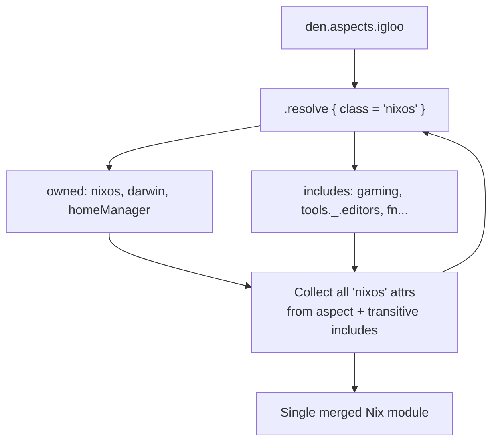

> Use the source, Luke: [`nix/lib.nix`](https://github.com/vic/den/blob/main/nix/lib.nix) · Built on [flake-aspects](https://github.com/vic/flake-aspects)

## The __functor Pattern

In Nix, any attribute set with `__functor` can be called as a function:

```nix
let
  counter = {
    value = 42;
    __functor = self: n: self.value + n;
  };
in counter 8  # => 50
```

The `__functor` receives `self` (the attrset) and an argument.

## Aspects as Functors

Every aspect in `flake-aspects` has a default `__functor`:

```nix
{
  nixos = { a = 1; };
  __functor = self: _context: self;  # ignores context
}
```

By default, it ignores context and returns itself. But you can replace
`__functor` with one that **inspects** context:

```nix
{
  nixos.foo = 24;
  __functor = self: context:
    if context ? host
    then self
    else { includes = [ fallback ]; };
}
```

## Aspect Structure

Aspects have three kinds of attributes:

### Owned Configurations

Direct settings defined under a class name:

```nix
den.aspects.igloo = {
  nixos.networking.hostName = "igloo";
  darwin.nix-homebrew.enable = true;
  homeManager.programs.vim.enable = true;
};
```

### Includes

Dependencies on other aspects — a directed graph:

```nix
den.aspects.igloo.includes = [
   # an static include
  { nixos.programs.vim.enable = true }

  # function includes
  # 
  # activates on both { host, user }, { host }
  ({ host, ... }: { 
    nixos.time.timeZone = "UTC";
  })

  # activates only on { host }
  (den.lib.take.exactly ({ host }: {
    nixos.networking.hostName = host.hostName;
  }))

  # a reference to any other aspect
  den.aspects.tools._.editors
];
```

Includes can be:
- **Static aspects** — always included
- **Functions** — [Parametric Aspects](/explanation/parametric) called with context, included when they match

### Provides

Nested sub-aspects forming a tree:

```nix

den.aspects.gaming.provides.emulation = {
  nixos.programs.retroarch.enable = true;
};

```

## Resolution

When Den needs a NixOS module from an aspect, it calls flake-aspects API `.resolve`:

```nix
module = den.aspects.igloo.resolve {
  class = "nixos";
};
```

flake-aspects does the following to obtain the nixos module:



This collects all `nixos` configs from the aspect and all its transitive
includes into a single Nix module.
