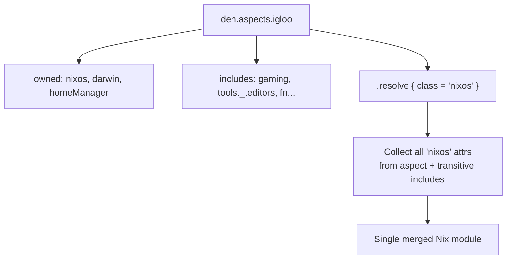

import { Aside } from '@astrojs/starlight/components';

<Aside type="tip">Source: [`nix/lib.nix`](https://github.com/vic/den/blob/main/nix/lib.nix) · Built on [flake-aspects](https://github.com/vic/flake-aspects)</Aside>

## The __functor Pattern

In Nix, any attribute set with `__functor` can be called as a function:

```nix
let
  counter = {
    value = 42;
    __functor = self: n: self.value + n;
  };
in counter 8  # => 50
```

The `__functor` receives `self` (the attrset) and an argument.

## Aspects as Functors

Every aspect in `flake-aspects` has a default `__functor`:

```nix
{
  nixos = { a = 1; };
  __functor = self: _context: self;  # ignores context
}
```

By default, it ignores context and returns itself. But you can replace
`__functor` with one that **inspects** context:

```nix
{
  nixos.foo = 24;
  __functor = self: context:
    if context ? host
    then self
    else { includes = [ fallback ]; };
}
```

## Aspect Structure

Aspects have three kinds of attributes:

### Owned Configurations

Direct class settings:

```nix
den.aspects.igloo = {
  nixos.networking.hostName = "igloo";
  darwin.nix-homebrew.enable = true;
  homeManager.programs.vim.enable = true;
};
```

### Includes

Dependencies on other aspects — a directed graph:

```nix
den.aspects.igloo.includes = [
  den.aspects.gaming
  den.aspects.tools._.editors
  ({ host, ... }: { nixos.time.timeZone = "UTC"; })
];
```

Includes can be:
- **Static aspects** — always included
- **Functions** — called with context, included when they match

### Provides

Nested sub-aspects forming a tree:

```nix
den.aspects.gaming.provides.emulation = {
  nixos.programs.retroarch.enable = true;
};
# Access: den.aspects.gaming._.emulation
```

## Resolution

When Den needs a NixOS module from an aspect, it calls `.resolve`:

```nix
module = den.aspects.igloo.resolve {
  class = "nixos";
  aspect-chain = [];
};
```



This collects all `nixos` configs from the aspect and all its transitive
includes into a single Nix module.

## Functions vs Aspects

Functions in `includes` are **context-aware**:

```nix
den.aspects.igloo.includes = [
  # static — always included
  { homeManager.programs.direnv.enable = true; }

  # parametric — called with context
  ({ host, ... }: { nixos.time.timeZone = "UTC"; })

  # conditional — only called when context has user
  ({ host, user, ... }: {
    homeManager.programs.git.userName = user.userName;
  })
];
```

Den inspects each function's **argument names** to decide whether to call
it with the current context. See [Parametric Aspects](/explanation/parametric/)
for the matching rules.

## The den.default Aspect

[`den.default`](/explanation/context-pipeline/#dendefault-is-an-alias) is an aspect with `parametric.atLeast` functor:

```nix
den.default = den.lib.parametric.atLeast { };
```

It dispatches context to all its includes. Since every host, user, and
home includes `den.default`, it serves as the backbone for global routing.
