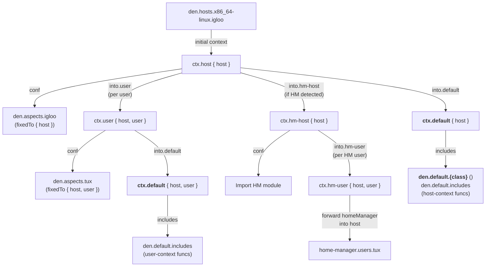
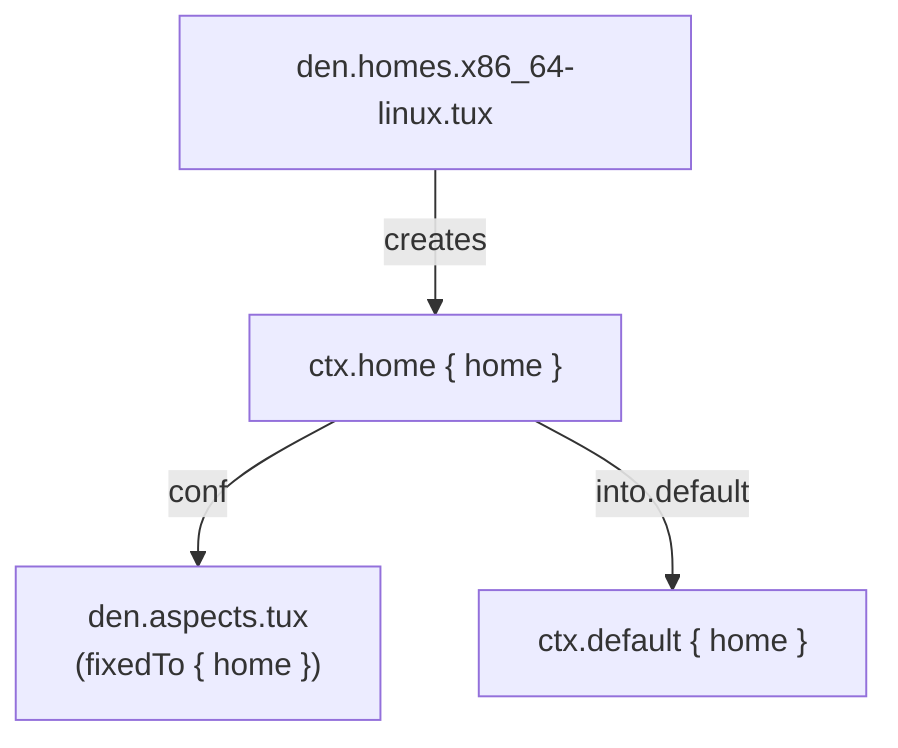

> Use the source, Luke: [`modules/context/types.nix`](https://github.com/vic/den/blob/main/modules/context/types.nix) · [`modules/context/os.nix`](https://github.com/vic/den/blob/main/modules/context/os.nix) · HM: [`hm-os.nix`](https://github.com/vic/den/blob/main/modules/aspects/provides/home-manager/hm-os.nix) · [`hm-integration.nix`](https://github.com/vic/den/blob/main/modules/aspects/provides/home-manager/hm-integration.nix)

## The NixOS/nix-Darwin Pipeline

When Den evaluates a host configuration, data flows through a pipeline
of context transformations. Here is the complete picture:



## Stage by Stage

### 1. Host Entry

Den reads `den.hosts.x86_64-linux.igloo` and applies the initial context `den.ctx.host`:

```nix
den.ctx.host { host = den.hosts.x86_64-linux.igloo; }
```

### 2. Host Aspect Resolution

`den.ctx.host.conf` locates `den.aspects.igloo` and fixes it to the host context.
All owned configs and static includes from the host aspect are collected.

### 3. Default configs (host-level)

`den.ctx.host.into.default` produces `{ host }` for `den.ctx.default`, which
activates `den.default.includes` functions matching `{ host, ... }`.

### 4. User Enumeration

`den.ctx.host.into.user` maps over `host.users`, producing one
`den.ctx.user { host, user }` per user.

### 5. User Aspect Resolution

`den.ctx.user.conf` locates both the user's aspect (`den.aspects.tux`) and the
host's aspect, collecting contributions from both directions.

### 6. Default configs (user-level)

`ctx.user.into.default` activates `den.default.includes` again, this time
with `{ host, user }` — functions needing user context now match.

### 7. Home-Manager Detection

`den.ctx.host.into.hm-host` checks if the host has users with `homeManager`
class and a supported OS. If so, it activates `den.ctx.hm-host`.

### 8. HM Module Import (host-level)

`den.ctx.hm-host.conf` imports the Home-Manager NixOS/Darwin module.

### 9. HM User config collection (user-level)

For each HM user, `ctx.hm-user` uses `den._.forward` to take
`homeManager` class configs and insert them into
`home-manager.users.<name>` on the host.

## Home-Manager Detection Criteria

`ctx.host.into.hm-host` does not always activate. It checks three conditions
(see [`hm-os.nix`](https://github.com/vic/den/blob/main/modules/aspects/provides/home-manager/hm-os.nix)):

1. **OS class is supported** — the host's class is `nixos` or `darwin`
2. **HM users exist** — at least one user has `class = "homeManager"`
3. **HM module available** — `inputs.home-manager` exists, or the host has a custom `hm-module`

All three must be true. Hosts without users, or with only non-HM users,
skip the entire HM pipeline.

## Duplication Caveat with den.default

`den.default` (alias for `den.ctx.default`) is included at **{host}**, **{host, user}**, **{home}**
context stages — once for the host context and once __per each__ user.

This means:

- **Owned** configs and **static** includes from `den.default` can appear
  multiple times in the final configuration
- For `mkMerge`-compatible options (most NixOS options), this is harmless
- For options of **types.listOf** or **types.package**, you may get duplicate entries.

To avoid duplication, use `den.lib.take.exactly` to restrict which
context stages a function matches:

```nix
den.default.includes = [
  (den.lib.take.exactly ({ host }: { nixos.x = 1; }))
];
```

This function runs only in the `{ host }` context, not in `{ host, user }`.

:::tip
Prefer attaching configurations directly to specific host or user aspects, or use
`den.ctx.host` / `den.ctx.user` includes, rather than overloading `den.default`
for everything.
:::

## Standalone Home-Manager

For `den.ctx.home`, the pipeline is shorter:



## den.default Is an Alias

`den.default` is an alias for `den.ctx.default`. When you write:

```nix
den.default.homeManager.home.stateVersion = "25.11";
den.default.includes = [ den._.define-user ];
```

You are actually setting `den.ctx.default.homeManager...` and
`den.ctx.default.includes`. This means `den.default` is a full
context type — it has `conf`, `into`, `includes`, and owned attributes.

### How den.default Receives Data

`host`, `user`, and `home` aspects **do not** include `den.default` directly.
Instead, each context type transforms **into** `default`:

```nix
den.ctx.host.into.default = lib.singleton;  # passes { host }
den.ctx.user.into.default = lib.singleton;  # passes { host, user }
den.ctx.home.into.default = lib.singleton;  # passes { home }
```

This means `den.default` is reached through the declarative context
pipeline, not by direct inclusion. The data flowing into `den.default`
is whatever the source context provides.

### Best Practices

`den.default` is useful for global settings like `home.stateVersion`.
However, prefer attaching parametric includes to the appropriate
context type instead:

| Instead of | Use |
|-----------|-----|
| `den.default.includes = [ hostFunc ]` | `den.ctx.host.includes = [ hostFunc ]` |
| `den.default.includes = [ hmFunc ]` | `den.ctx.hm-host.includes = [ hmFunc ]` |
| `den.default.nixos.x = 1` | `den.ctx.host.nixos.x = 1` |

## Why This Design?

Each context type is **independent** and **composable**. You can:

- Add new context types without modifying existing ones
- Attach aspects to any stage of the pipeline
- Create custom transformations for domain-specific needs
- Override any built-in context behavior

The pipeline is not hardcoded — it's declared through `den.ctx` definitions
that you can inspect, extend, and customize.
