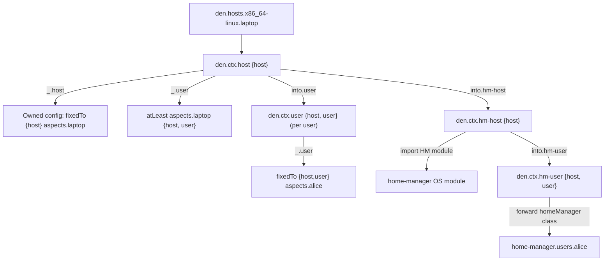

import { Steps, Aside } from '@astrojs/starlight/components';

<Aside title="Source" icon="github">
[`modules/context/os.nix`](https://github.com/vic/den/blob/main/modules/context/os.nix) --
[`modules/context/types.nix`](https://github.com/vic/den/blob/main/modules/context/types.nix) --
[`modules/config.nix`](https://github.com/vic/den/blob/main/modules/config.nix)
</Aside>

## Pipeline Overview

When Den evaluates a host, it walks a pipeline of context transformations:



<Steps>
1. Host Context

	For each entry in `den.hosts.<system>.<name>`, Den creates a `{host}` context.
	The host context type (`den.ctx.host`) contributes:

	- `_.host` -- Applies the host's own aspect with `fixedTo { host }`, making
	  all owned configs available for the host's class.
	- `_.user` -- For each user, applies the host's aspect with `atLeast { host, user }`,
	  activating parametric includes that need both host and user.

2. User Context

	`into.user` maps each `host.users` entry into a `{host, user}` context.
	The user context type (`den.ctx.user`) contributes:

	- `_.user` -- Applies the user's own aspect with `fixedTo { host, user }`.

3. Derived Contexts

	Batteries register additional `into.*` transformations on the host context:

	| Transition | Condition | Produces |
	|---|---|---|
	| `into.hm-host` | `host.home-manager.enable && hasHmUsers` | `{host}` hm-host |
	| `into.hm-user` | Per HM-class user on hm-host | `{host, user}` hm-user |
	| `into.wsl-host` | `host.class == "nixos" && host.wsl.enable` | `{host}` wsl-host |
	| `into.hjem-host` | `host.hjem.enable && hasHjemUsers` | `{host}` hjem-host |
	| `into.hjem-user` | Per hjem-class user | `{host, user}` hjem-user |
	| `into.maid-host` | `host.nix-maid.enable && hasMaidUsers` | `{host}` maid-host |
	| `into.maid-user` | Per maid-class user | `{host, user}` maid-user |

	Each derived context can contribute its own aspect definitions and import
	the necessary OS-level modules (e.g., `home-manager.nixosModules.home-manager`).

3. Deduplication

	`dedupIncludes` in `modules/context/types.nix` ensures:

	- **First occurrence** of a context type uses `parametric.fixedTo`, which includes
	  owned configs + statics + parametric matches.
	- **Subsequent occurrences** use `parametric.atLeast`, which only includes
	  parametric matches (owned/statics already applied).

	This prevents `den.default` configs from being applied twice when the same
	aspect appears at multiple pipeline stages.

4. Home Configurations

	Standalone `den.homes` entries go through a separate path:

	```mermaid
	flowchart TD
	  home["den.homes.x86_64-linux.alice"] --> homectx["den.ctx.home {home}"]
	  homectx --> resolve["fixedTo {home} aspects.alice"]
	  resolve --> hmc["homeConfigurations.alice"]
	```

	Home contexts have no host, so functions requiring `{ host }` are not activated.
	Functions requiring `{ home }` run instead.

5. Output

	`modules/config.nix` collects all hosts and homes, calls `host.instantiate`
	(defaults to `lib.nixosSystem`, `darwinSystem`, or `homeManagerConfiguration`
	depending on class), and places results into `flake.nixosConfigurations`,
	`flake.darwinConfigurations`, or `flake.homeConfigurations`.

</Steps>
