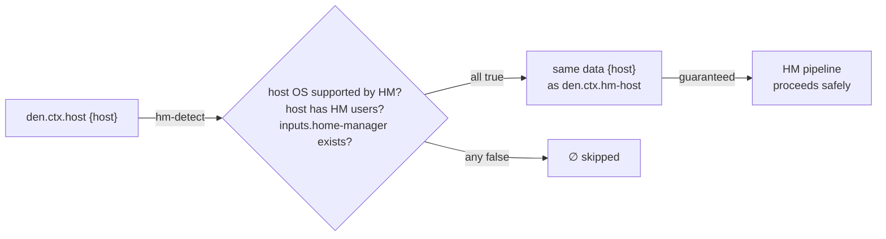
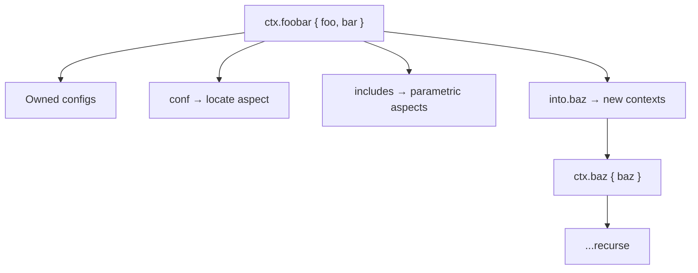
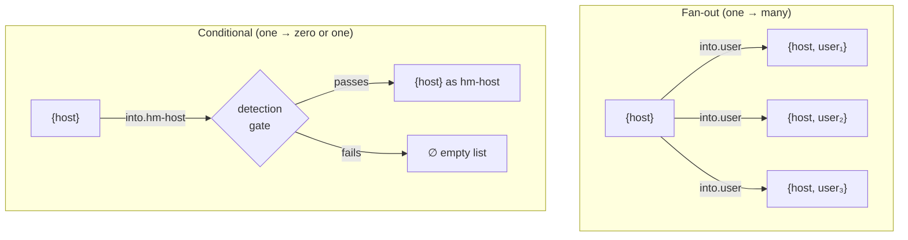

> Use the Source, Luke: [`modules/context/types.nix`](https://github.com/vic/den/blob/main/modules/context/types.nix) · [`modules/context/os.nix`](https://github.com/vic/den/blob/main/modules/context/os.nix)

## What Is a Context?

In Den, a **context** is an attribute set whose **names** (not values) determine
which functions get called. When Den applies a context `{ host, user }` to a
function `{ host, ... }: ...`, the function matches. A function `{ never }: ...`
does not match and is ignored.

## Why Named Contexts?

Named contexts `ctx.host { host }` and `ctx.hm-host { host }`
hold the same data, but `hm-host` **guarantees** that home-manager support was
validated. This follows the [**parse-don't-validate**](https://lexi-lambda.github.io/blog/2019/11/05/parse-don-t-validate/) principle: you cannot
obtain an `hm-host` context unless all detection criteria passed.



## Context Types: den.ctx

Each context type is defined in `den.ctx` with four components:

```nix
den.ctx.foobar = {
  desc = "The {foo, bar} context";
  conf = { foo, bar }: den.aspects.${foo}._.${bar};
  includes = [ /* parametric aspects */ ];
  into = {
    baz = { foo, bar }: [{ baz = computeBaz foo bar; }];
  };
};
```

| Component | Purpose |
|-----------|---------|
| `desc` | Human-readable description |
| `conf` | Given context values, locate the configuration aspect |
| `includes` | Parametric aspects activated for this context (aspect cutting-point) |
| `into` | Transformations fan-out to other context types |

## Context Application

A context type is callable — it's a functor:

```nix
aspect = den.ctx.foobar { foo = "hello"; bar = "world"; };
```

When applied, Den:

1. **Produces owned configs** from the context type itself
2. **Locates the aspect** via `conf` (e.g., `den.aspects.hello._.world`)
3. **Applies includes** — parametric aspects matching this context
4. **Transforms** — calls each `into` function, producing new contexts
5. **Recurses** — applies each produced context through its own pipeline



## Transformation Types

Transformations have the type `source → [ target ]` — they return a **list**.
This enables two patterns:



**Fan-out** — one context producing many:

```nix
den.ctx.host.into.user = { host }:
  map (user: { inherit host user; }) (attrValues host.users);
```

One host fans out to N user contexts.

**Conditional propagation** — zero or one:

```nix
den.ctx.host.into.hm-host = { host }:
  lib.optional (isHmSupported host) { inherit host; };
```

If the condition fails, the list is empty and no `hm-host` context is created.
The data is the same `{ host }`, but the named context guarantees the validation
passed.

## Contexts as Aspect Cutting-Points

Contexts are aspect-like themselves. They have owned configs and `.includes`:

```nix
den.ctx.hm-host.nixos.home-manager.useGlobalPkgs = true;

den.ctx.hm-host.includes = [
  ({ host, ... }: { nixos.home-manager.backupFileExtension = "bak"; })
];
```

This is like `den.default.includes` **but scoped** — it only activates for
hosts with validated home-manager support. Use context includes to attach
aspects to specific pipeline stages instead of the catch-all `den.default`.

## Extending Context Flow

Add new transformations to existing context types from any module:

```nix
den.ctx.hm-host.into.foo = { host }: [ { foo = host.name; } ];
den.ctx.foo.conf = { foo }: { funny.names = [ foo ]; };
```

The module system merges these definitions. You can extend the pipeline
without modifying any built-in file.

## Built-in Context Types

Den defines these context types for its NixOS/Darwin/HM framework:

### host — `{ host }`

The entry point. Created when evaluating `den.hosts.<system>.<name>`:

```nix
den.ctx.host.conf = { host }:
  parametric.fixedTo { inherit host; } den.aspects.${host.aspect};

den.ctx.host.into.default = lib.singleton;
den.ctx.host.into.user = { host }:
  map (user: { inherit host user; }) (attrValues host.users);
```

Transforms **into** `default` (for global aspects) and `user` (for each user).

### user — `{ host, user }`

Created for each user on a host:

```nix
den.ctx.user.conf = { host, user }@ctx: {
  includes = [
    (fixedTo ctx userAspect)
    (atLeast hostAspect ctx)
  ];
};

den.ctx.user.into.default = lib.singleton;
```

### default — catch-all

`den.default` is an alias for `den.ctx.default`. Every context type
transforms into `default` via `.into.default`:

```nix
den.ctx.default.conf = _: { };
```

This is how `den.default.includes` functions receive their context data —
host, user, or home contexts all flow through here.

### hm-host — `{ host }` (when HM detected)

Activates only for hosts with Home-Manager users. Imports the HM module.
See [Context Pipeline](/explanation/context-pipeline/) for detection criteria.

### hm-user — `{ host, user }` (HM users)

Created for each HM user, forwards `homeManager` class into the host.

### home — `{ home }` (standalone HM)

Entry point for standalone Home-Manager configurations.

## Custom Context Types

Create your own for domain-specific pipelines:

```nix
den.ctx.greeting.conf = { hello }:
  { funny.names = [ hello ]; };

den.ctx.greeting.into.shout = { hello }:
  [{ shout = lib.toUpper hello; }];

den.ctx.shout.conf = { shout }:
  { funny.names = [ shout ]; };
```

Applying `den.ctx.greeting { hello = "world"; }` produces both
`"world"` and `"WORLD"` through the transformation chain.

See the [Context Pipeline](/explanation/context-pipeline/) for the complete data flow.
See the [`den.ctx` Reference](/reference/ctx/) for all built-in types.
