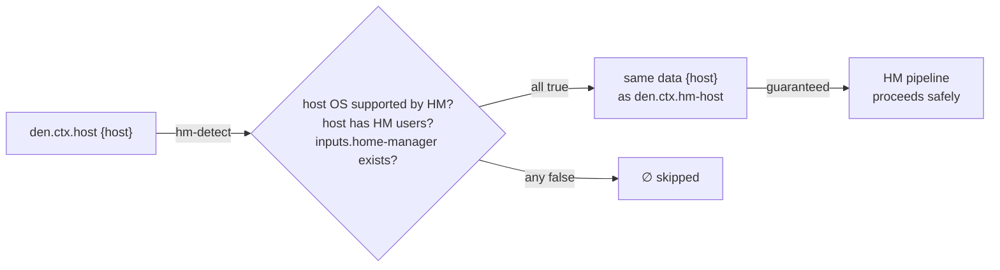
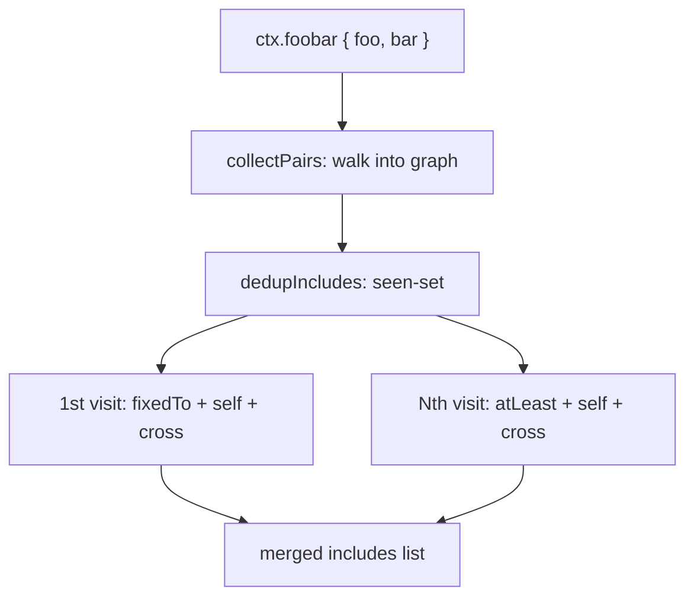
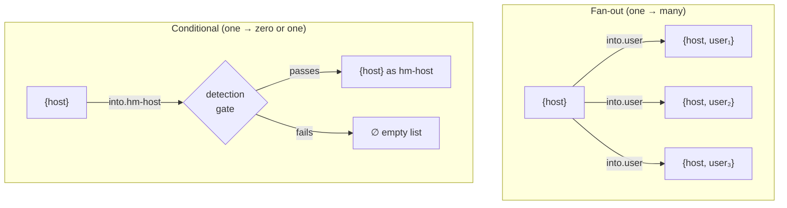

import { Aside } from '@astrojs/starlight/components';


<Aside title="Use the Source, Luke" icon="github">
[`modules/context/types.nix`](https://github.com/vic/den/blob/main/modules/context/types.nix) · [`modules/context/os.nix`](https://github.com/vic/den/blob/main/modules/context/os.nix)
</Aside>

## What Is a Context?

In Den, a **context** is an attribute set whose **names** (not values) determine
which functions get called. When Den applies a context `{ host, user }` to a
function `{ host, ... }: ...`, the function matches. A function `{ never }: ...`
does not match and is ignored.

## Why Named Contexts?

Named contexts `ctx.host { host }` and `ctx.hm-host { host }`
hold the same data, but `hm-host` **guarantees** that home-manager support was
validated. This follows the [**parse-don't-validate**](https://lexi-lambda.github.io/blog/2019/11/05/parse-don-t-validate/) principle: you cannot
obtain an `hm-host` context unless all detection criteria passed.



## Context Types: den.ctx

Each context type is defined in `den.ctx`. Context types are
[aspect submodules](/explanation/aspects/) — they inherit `includes`, `provides`,
`description`, and owned freeform configs from `flake-aspects`'s `aspect` type.
**Den adds only the `into` option for context transformations**

```nix
den.ctx.foobar = {
  description = "The {foo, bar} context";

  # the aspect responsible for configuring the foobar context
  provides.foobar = { foo, bar }: den.aspects.${foo}._.${bar};

  # foobar contributions to the baz context
  provides.baz = { baz }: {  };

  # cutting-point for including other aspects
  includes = [ /* parametric aspects */ ];

  # context transformations
  into = {
    # how to produce baz context from a foobar one.
    baz = { foo, bar }: [{ baz = computeBaz foo bar; }];
  };
};
```


| Component | Purpose |
|-----------|---------|
| `description` | Human-readable description |
| `provides.${name}` | Self-named provider: given a context, find aspect responsible for configuration |
| `provides.${target}` | Cross-provider: source's contribution to a target context (called per transformation) |
| `includes` | Parametric aspects activated for this context (aspect cutting-point) |
| `into` | Transformations fan-out into other context types |

## Context Application

A context type is callable — it's a functor:

```nix
aspect = den.ctx.foobar { foo = "hello"; bar = "world"; };
```

When applied, `ctxApply` walks the full `into` graph depth-first,
collecting `(source, ctxDef, ctx)` triples, then deduplicates:

1. **First visit** to a context type — `fixedTo`: owned + static + parametric dispatch
2. **Subsequent visits** — `atLeast`: parametric dispatch only, **user must take care**
3. **Self-named provider** (`provides.${name}`) is always called when context is used
4. **Cross-provider** (`source.provides.${target}`) is called if the source defines one



## Transformation Types

Transformations have the type `source → [ target ]` — they return a **list**.
This enables two patterns:



**Fan-out** — one context producing many:

```nix
den.ctx.host.into.user = { host }:
  map (user: { inherit host user; }) (attrValues host.users);
```

One host fans out to N user contexts.

**Conditional propagation** — zero or one:

```nix
den.ctx.host.into.hm-host = { host }:
  lib.optional (isHmSupported host) { inherit host; };
```

If the condition fails, the list is empty and no `hm-host` context is created.
The data is the same `{ host }`, but the named context guarantees the validation
passed.

## Contexts as Aspect Cutting-Points

Since context types **are** aspect submodules, they naturally have owned
configs and `.includes`:

```nix
den.ctx.hm-host.nixos.home-manager.useGlobalPkgs = true;

den.ctx.hm-host.includes = [
  ({ host, ... }: { nixos.home-manager.backupFileExtension = "bak"; })
];
```

This is like `den.default.includes` **but scoped** — it only activates for
hosts with validated home-manager support. Use context includes to attach
aspects to specific pipeline stages instead of the catch-all `den.default`.

## Extending Context Flow

You can define new context types or new transformations into existing contexts from any module:

```nix
den.ctx.hm-host.into.foo = { host }: [ { foo = host.name; } ];
den.ctx.foo._.foo = { foo }: { funny.names = [ foo ]; };
```

The module system merges these definitions. You can extend the pipeline
without modifying any built-in file.

## Built-in Context Types

Den defines these context types for its NixOS/Darwin/HM framework:

### den.ctx.host — `{ host }`

This is how NixOS configurations get created:

```nix
# use den API to apply the context to data
aspect = den.ctx.host {
  # value is `den.hosts.<system>.<name>`.
  host = den.hosts.x86_64-linux.igloo;
};

# use flake-aspects API to resolve nixos module
nixosModule = aspect.resolve { class = "nixos"; };

# use NixOS API to build the system
nixosConfigurations.igloo = lib.nixosSystem {
  modules = [ nixosModule ];
};
```

### den.ctx.user — `{ host, user }`

A host fan-outs a new context for each user.

### den.ctx.default

Aliased as `den.default`, used to define static global settings for hosts, users and homes.

### den.ctx.hm-host — `{ host }` 

Home Manager enabled host.

A den.ctx.host gets transformed into den.ctx.hm-host only if the [host supports home-manager](/explanation/context-pipeline/).

When activated, it imports the HM module.

### den.ctx.hm-user — `{ host, user }`

For each user that has its class value set to homeManager.

When activated enables the `homeManager` user configuration class.

### den.ctx.home — `{ home }`

Entry point for standalone Home-Manager configurations.

## Custom Context Types

Create your own for domain-specific pipelines:

```nix
den.ctx.greeting._.greeting = { hello }:
  { funny.names = [ hello ]; };

den.ctx.greeting.into.shout = { hello }:
  [{ shout = lib.toUpper hello; }];

den.ctx.shout._.shout = { shout }:
  { funny.names = [ shout ]; };
```

Applying `den.ctx.greeting { hello = "world"; }` produces both
`"world"` and `"WORLD"` through the transformation chain.

See the [Context Pipeline](/explanation/context-pipeline/) for the complete data flow.
See the [`den.ctx` Reference](/reference/ctx/) for all built-in types.
