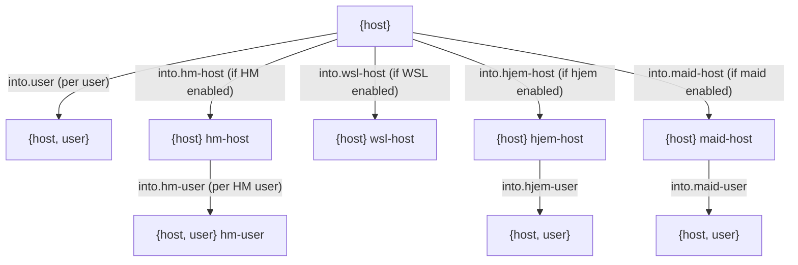

import { Aside } from '@astrojs/starlight/components';

<Aside title="Source" icon="github">
[`modules/context/types.nix`](https://github.com/vic/den/blob/main/modules/context/types.nix) --
[`modules/context/os.nix`](https://github.com/vic/den/blob/main/modules/context/os.nix)
</Aside>

## What is a Context

A **context** is a named stage in Den's evaluation pipeline. Each context type is declared
under `den.ctx.<name>` and carries:

- **Aspect definitions** (`provides.<name>`) -- what this context contributes to the resolved aspect.
- **Transformations** (`into.<other>`) -- functions that produce new contexts from the current one.
- **Provides** (`provides.<other>`) -- cross-context providers injected by other context definitions.

## Built-in Context Types


```mermaid
flowchart TD
  host["{host}"] -->|"into.user (per user)"| user["{host, user}"]
  host -->|"into.hm-host (if HM enabled)"| hmhost["{host} hm-host"]
  hmhost -->|"into.hm-user (per HM user)"| hmuser["{host, user} hm-user"]
  host -->|"into.wsl-host (if WSL enabled)"| wslhost["{host} wsl-host"]
  host -->|"into.hjem-host (if hjem enabled)"| hjemhost["{host} hjem-host"]
  hjemhost -->|"into.hjem-user"| hjemuser["{host, user}"]
  host -->|"into.maid-host (if maid enabled)"| maidhost["{host} maid-host"]
  maidhost -->|"into.maid-user"| maiduser["{host, user}"]
```

The framework defines these contexts in `modules/context/os.nix` and the various battery modules.
Each battery (Home Manager, hjem, nix-maid, WSL) registers its own `into.*` transitions on the `host` context.

## Context Type Anatomy

A context type at `den.ctx.host`:

```nix
den.ctx.host = {
  description = "OS";

  # The main aspect activated by this context
  provides.host = { host }: den.aspects.${host.aspect};

  # How this context contributes an aspect to other derived contexts
  provides.user = { host, user }: den.aspects.other-aspect;

  # How to derive other contexts from this one
  into.user = { host }: 
    map (user: { inherit host user; }) (lib.attrValues host.users);
};
```

The `_` (or `provides`) attrset maps context names to functions that take the current
context data and return aspect fragments. The `into` attrset maps to functions that
produce lists of new context values.

## Context Resolution

When Den processes a host, it calls `den.ctx.host { host = ...; }`. This triggers:

1. `collectPairs` walks the context type's `into.*` transitions recursively,
   building a list of `{ ctx, ctxDef, source }` pairs.
2. `dedupIncludes` processes these pairs, applying `parametric.fixedTo` for the
   first occurrence of each context type and `parametric.atLeast` for subsequent
   ones, preventing duplicate owned configs.
3. The result is a flat list of aspect fragments merged into one `deferredModule`.

## Custom Contexts

You can define your own alternative context piplelines outside of `den.ctx.host` or 
create custom context types for domain-specific needs like cloud infrastructure:

```nix
den.ctx.my-service = {
  description = "Custom service context";
  provides.my-service = den.aspects.my-service;
};

den.ctx.host.into.my-service = { host }:
  lib.optional host.my-service.enable { inherit host; };

den.aspects.my-service = { host }: {
  nixos.services.my-service.hostName = host.hostName;
};


```

This creates a new stage in the pipeline that only activates for hosts
with `my-service.enable = true`, and contributes NixOS config.
