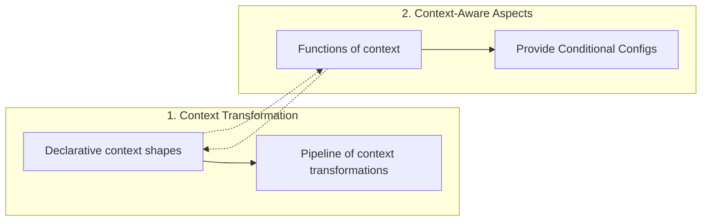
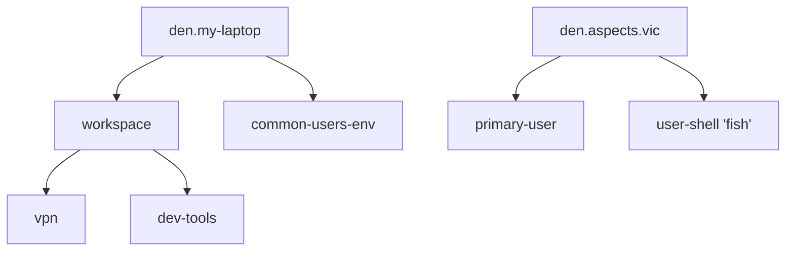

## The Two Pillars

Den is built on two intertwined principles that together enable a new way
of thinking about Nix configurations:



### 1. Context Transformation

Traditional Nix setups wire modules directly: this NixOS module imports
that file, this Home-Manager config hardcodes that username.

Den replaces this with a **declarative pipeline**. You declare entities
(hosts, users, homes) and context types (shapes holding them). Den transforms these through
a graph of context stages, each producing richer or conditioned data.

**the flow of data is declared separately from the configurations it produces**.

### 2. Context-Aware Aspects

Aspects are not just bundles of configs — they are **functions** that inspect
context to decide what to produce. A function taking `{ host, user }` naturally
adapts to every host-user combination. A function requiring `{ other }` is
not used.

**the shape of the function arguments determines when configs are produced, without explicit conditionals**.

## Why This Matters

### Re-usability

An aspect like [`define-user`](/reference/batteries/#define-user) works on NixOS, Darwin, and standalone
Home-Manager — not because it checks the platform, but because it produces
configs for multiple classes and Den picks the relevant class module according to the configuration domain:

```nix
{ host, user, ... }: {
  nixos.users.users.${user.userName}.isNormalUser = true;
  darwin.users.users.${user.userName}.home = "/Users/${user.userName}";
  homeManager.home.username = user.userName;
}
```

### Composability

Aspects compose through `includes` — a directed dependency graph.
The [`parametric`](/explanation/parametric/) functor ensures context flows through the entire graph:



### Separation of Concerns

Each Dendritic file is focused on a single responsability. Configuring it across all different domains. Configurations are parametrized by data outside of their module config.

## The Result

A system where:
- **Declaring** entities is separate from **configuring** them
- **Configurations** are separate from **when they apply**
- [**Aspects**](/explanation/aspects/) compose without knowing each other’s details
- [**Context**](/explanation/context-system/) flows declaratively through a [typed pipeline](/explanation/context-pipeline/)
