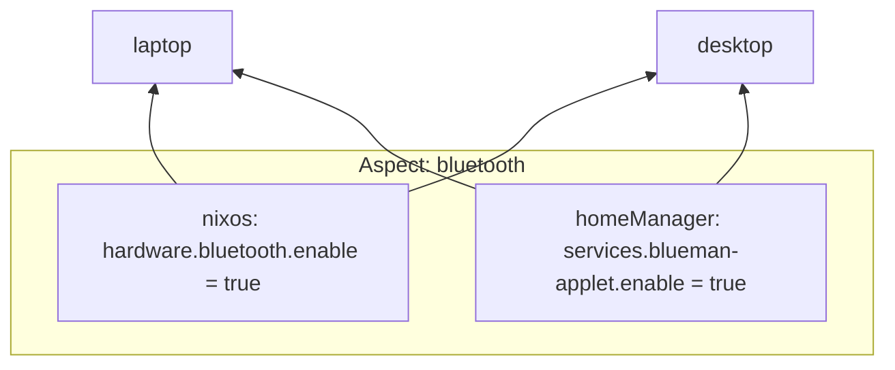

import { Aside } from '@astrojs/starlight/components';

**Aspects** and **Contexts** are Den core arquitectural principles.

It is how Den supports different platform configurations, packages/checks flake outputs, different home environments suppport, 
wsl support, third-party flake-parts perSystem modules, microvm guests, and pretty much everything.

It is also how more complex entities, like machine fleets, terraform or cloud infra can be configured with Den.

<Aside title="Aspect-Oriented">
If you are familiar with Aspect-Oriented-Programming you will recognize how Den uses pointcuts to define where configurations get applied at each context stage.

> Pointcuts in **Aspect-Oriented-Programming** determine where additional behavior (advice) should be applied in your code, typically at method execution points.
</Aside>

<Aside title="Context-Driven">
Den is, fundamentally, a _data transformation_ pipeline (of your infra entities) to which _functions_ (producing configurations) are applied.


> A context transformation pipeline takes initially `{host}` and traverses its topology
> `host`->`[users]`->`[homes]` aggregating dependencies, optionally branching to suport
> feature detection `host`->`wsl-host` or `host`->`[microvm-guest]`.
</Aside>

From our README header example:

```nix
# These three lines is how Den instantiates a configuration.
# Other Nix configuration domains outside NixOS/nix-Darwin
# can use the same pattern. demo: templates/nvf-standalone

# A context transformation pipeline takes initially {host}
# and traverses its topology (host->[users]->[homes]) aggregating deps
aspect = den.ctx.host { host = den.hosts.x86_64-linux.my-laptop; };

# obtain the final module for nixos class
nixosModule = den.lib.aspects.resolve "nixos" aspect;

# Use NixOS API to instantiate or mix-in with other custom modules
nixosConfigurations.my-laptop = lib.nixosConfiguration {  modules = [ nixosModule ]; };
```

Anything that you can describe via a data structure that can be traversed, can be configured like we do for NixOS. 

### Den is Aspect-oriented

<Aside icon="nix" title="Dendritic Aspects">

A Dendritic aspect is an attrset that contains modules of different Nix `class`.

```nix
gaming = { host, user }: { nixos = ...; homeManager = ...; hjem = ...; darwin = ...; }
```

Such an attrset is said to be [**Dendritic**](https://dendrix.oeiuwq.com/Dendritic.html) because it allows configuring a single cross-cutting concern (`gaming`) over different configuration domains.

Nix classes are NOT an artificial concept created by Den. There are [many nix classes in the wild](https://github.com/search?q=language%3ANix+%28%22+class+%3D+%22+AND+%22evalModules%22%29&type=code), the most common are [`nixos`](https://github.com/search?q=repo%3ANixOS%2Fnixpkgs+%22class+%3D+%5C%22nixos%5C%22%22&type=code), [`darwin`](https://github.com/nix-darwin/nix-darwin/blob/da529ac9e46f25ed5616fd634079a5f3c579135f/eval-config.nix#L81), [`homeManager`](https://github.com/nix-community/home-manager/blob/5be5d8245cbc7bc0c09fbb5f38f23f223c543f85/nixos/common.nix#L27).
</Aside>

Most importantly, the context `{host,user}` here are **not** `_module.args` **nor** `specialArgs`, it is an actual function, not a module-looking-as-a-function. This means config can depend on context without Nix infinite loops.


### Den is Context-driven

Den uses `den.ctx.<name>.provides.<name>` as **Aspect Pointcuts** where configuration is applied to data in that context stage. 
Say you have a data shape: `{ x }`, that you name as a `foo` context stage:

```nix
# This says how to move from one context stage `foo` into another stage `bar`
den.ctx.foo.into.bar = { x }: [ { y = x; } ] 
```

The following `den.ctx.bar.provides.bar` is the actual pointcut that **locates** the aspect responsible for configuring 
using data `{ y }` available at `bar` context stage.

```nix
# inlined aspect for this example, but can locate the aspect by any means
den.ctx.bar.provides.bar = { y }: { nixos.something = y; }
```

and since `den.ctx.bar` **is** itself an aspect, it can be used to include
additional configurations at that particular stage:

```nix
den.ctx.bar.nixos.something-else = true;
den.ctx.bar.includes = [ den.aspects.other ];
```

### `den.ctx.host` pipeline

This is how everything works in Den, the following is the context transitions
that happen when applying `den.ctx.host { host }`

```nix
# host configuration: THIS is where your host-aspect is hooked into the pipeline
den.ctx.host.provides.host = { host }: den.aspects.${host.aspect};

# host -> users context transformation
den.ctx.host.into.user = { host }: map (user: { inherit host user; }) (lib.attrValues host.users); # transition into many { host, user }

# user configuration: Lookup user aspect.
den.ctx.user.provides.user = { host, user }: den.aspects.${user.aspect}; # Hook for the user-aspect.

# conditional transition ONLY if hm is enabled for user and host.
den.ctx.user.into.hm-user = { host, user }: lib.optional (host.hm.enable && lib.elem "homeManager" user.classes) { inherit host user; }

# host -> wsl-host: Same data shape, different context stage.
den.ctx.host.into.wsl-host = { host }: lib.optional host.wsl.enable { inherit host; }
```

**people can define their own extensions to Den's NixOS pipeline, or define other pipelines enterely**.

<Aside title="Real world examples">
Minimal real-life example: [wsl support](https://github.com/vic/den/blob/main/modules/aspects/provides/wsl.nix)

[home-env](https://github.com/vic/den/blob/main/nix/lib/home-env.nix#L97) is how Den implements homeManager/hjem/maid support

[flake-parts perSystem classes](https://github.com/vic/den/blob/main/templates/flake-parts-modules/modules/custom-classes.nix)

[microvm guests support](https://github.com/vic/den/blob/main/templates/microvm/modules/microvm-integration.nix#L46)
</Aside>

## Feature-First, Not Host-First

<Aside title="Recommended Read">
[Flipping the Configuration Matrix](https://not-a-number.io/2025/refactoring-my-infrastructure-as-code-configurations/#flipping-the-configuration-matrix) by [Pol Dellaiera](https://github.com/drupol) was very influential in Den design and is a very recommended read.

See also my [dendrix article](https://dendrix.oeiuwq.com/Dendritic.html) about the advantages of Dendritic Nix.
</Aside>

Traditional Nix configurations start from hosts and push modules downward.
Den follows a Dendritic model that inverts this: **aspects** (features) are the primary organizational unit.
Each aspect declares its behavior per Nix class, and hosts simply select which
aspects apply to them.


```mermaid
flowchart BT
  subgraph "Aspect: bluetooth"
    nixos["nixos: hardware.bluetooth.enable = true"]
    hm["homeManager: services.blueman-applet.enable = true"]
  end
  nixos --> laptop
  nixos --> desktop
  hm --> laptop
  hm --> desktop
```

An aspect consolidates all class-specific configuration for a single concern.
Adding bluetooth to a new host is one line: include the aspect.
Removing it is deleting that line.

## Context-Driven Dispatch

Den uses function **parametric dispatch**:
aspect functions declare which context parameters they need via their
argument pattern.

```nix
# Runs in every context (host, user, home)
{ nixos.networking.firewall.enable = true; }

# Runs only when a {host} context exists
({ host, ... }: { nixos.networking.hostName = host.hostName; })

# Runs only when both {host, user} are present
({ host, user, ... }: {
  nixos.users.users.${user.userName}.extraGroups = [ "wheel" ];
})
```

Den introspects function arguments at evaluation time. A function requiring
`{ host, user }` is silently skipped in contexts that only have `{ host }`.
No conditionals, no `mkIf`, no `enable` -- the context shape **is** the condition.

## Composition via Includes

Aspects form a directed acyclic graph through `includes` and form a tree of related aspects using `provides`.

```nix
den.aspects.workstation = {
  includes = [
    den.aspects.dev-tools
    den.aspects.gaming.provides.emulation
    den.provides.primary-user
  ];
  nixos.services.xserver.enable = true;
};
```


## Separation of Concerns

Den separates **what exists** (schema) from **what it does** (aspects):

| Layer | Purpose | Example |
|-------|---------|---------|
| Schema | Declare entities | `den.hosts.x86_64-linux.laptop.users.alice = {}` |
| Aspects | Configure behavior | `den.aspects.laptop.nixos.networking.hostName = "laptop"` |
| Context | Transform data flow | `den.ctx.host` produces `{host}`, then `{host, user}` per user |
| Batteries | Reusable patterns | `den.provides.primary-user`, `den.provides.user-shell` |

This separation means you can reorganize files, rename aspects, or add platforms
without restructuring your configuration logic.
