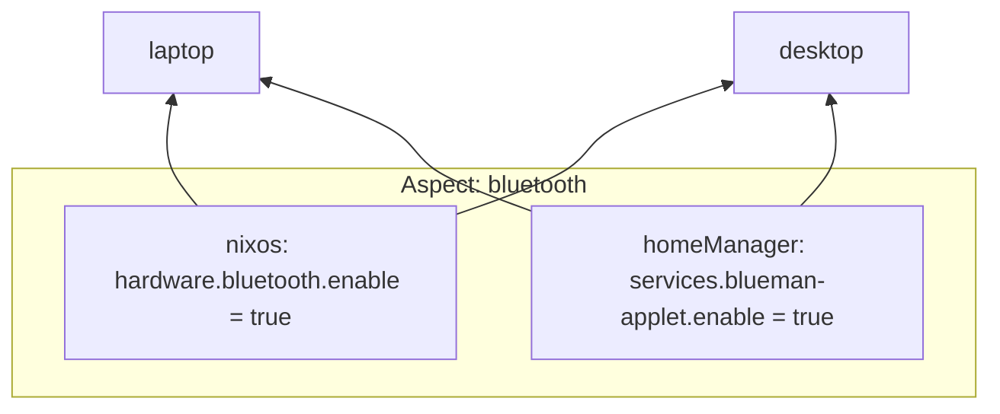

import { Aside } from '@astrojs/starlight/components';

## Feature-First, Not Host-First

<Aside title="Recommended Read">
[Flipping the Configuration Matrix](https://not-a-number.io/2025/refactoring-my-infrastructure-as-code-configurations/#flipping-the-configuration-matrix) by [Pol Dellaiera](https://github.com/drupol) was very influential in Den design and is a very recommended read.

See also my [dendrix article](https://dendrix.oeiuwq.com/Dendritic.html) about the advantages of Dendritic Nix.
</Aside>

Traditional Nix configurations start from hosts and push modules downward.
Den follows a Dendritic model that inverts this: **aspects** (features) are the primary organizational unit.
Each aspect declares its behavior per Nix class, and hosts simply select which
aspects apply to them.


```mermaid
flowchart BT
  subgraph "Aspect: bluetooth"
    nixos["nixos: hardware.bluetooth.enable = true"]
    hm["homeManager: services.blueman-applet.enable = true"]
  end
  nixos --> laptop
  nixos --> desktop
  hm --> laptop
  hm --> desktop
```

An aspect consolidates all class-specific configuration for a single concern.
Adding bluetooth to a new host is one line: include the aspect.
Removing it is deleting that line.

## Context-Driven Dispatch

Den uses function **parametric dispatch**:
aspect functions declare which context parameters they need via their
argument pattern.

```nix
# Runs in every context (host, user, home)
{ nixos.networking.firewall.enable = true; }

# Runs only when a {host} context exists
({ host, ... }: { nixos.networking.hostName = host.hostName; })

# Runs only when both {host, user} are present
({ host, user, ... }: {
  nixos.users.users.${user.userName}.extraGroups = [ "wheel" ];
})
```

Den introspects function arguments at evaluation time. A function requiring
`{ host, user }` is silently skipped in contexts that only have `{ host }`.
No conditionals, no `mkIf`, no `enable` -- the context shape **is** the condition.

## Composition via Includes

Aspects form a directed acyclic graph through `includes` and form a tree of related aspects using `provides`.

```nix
den.aspects.workstation = {
  includes = [
    den.aspects.dev-tools
    den.aspects.gaming.provides.emulation
    den.provides.primary-user
  ];
  nixos.services.xserver.enable = true;
};
```


## Separation of Concerns

Den separates **what exists** (schema) from **what it does** (aspects):

| Layer | Purpose | Example |
|-------|---------|---------|
| Schema | Declare entities | `den.hosts.x86_64-linux.laptop.users.alice = {}` |
| Aspects | Configure behavior | `den.aspects.laptop.nixos.networking.hostName = "laptop"` |
| Context | Transform data flow | `den.ctx.host` produces `{host}`, then `{host, user}` per user |
| Batteries | Reusable patterns | `den.provides.primary-user`, `den.provides.user-shell` |

This separation means you can reorganize files, rename aspects, or add platforms
without restructuring your configuration logic.
