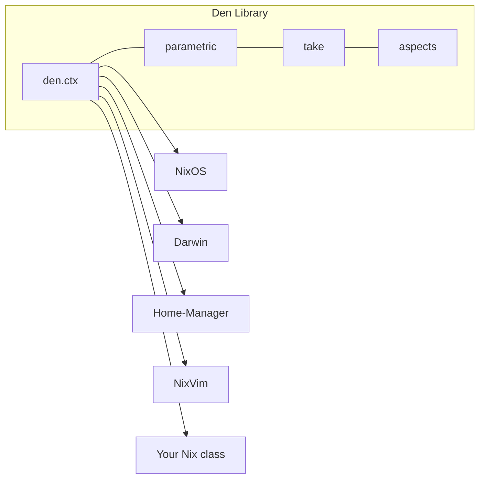
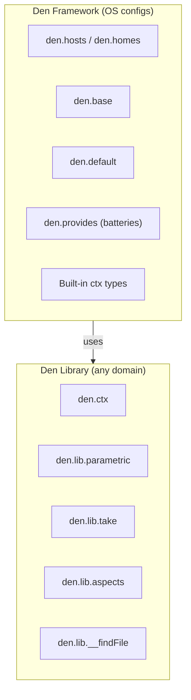

## Den the Library

At its core, Den is a **library** for context-driven Nix configurations.
The library provides:

- [**`den.ctx`**](/reference/ctx/) — Declarative context types with transformations
- [**`den.lib.parametric`**](/reference/lib/#denlibparametric) — Functors for context-aware dispatch
- [**`den.lib.take`**](/reference/lib/#denlibtake) — Argument matching (`atLeast`, `exactly`)
- [**`den.lib.aspects`**](/reference/lib/#denlibaspects) — Aspect composition (via [flake-aspects](https://github.com/vic/flake-aspects))
- **`den.lib.canTake`** — Function signature introspection
- [**`den.lib.__findFile`**](/guides/angle-brackets/) — Angle-bracket resolution

These tools work with **any Nix class**. You can define context types
for terraform modules, NixVim configs, container definitions, or anything
else configurable through Nix.



## Den the Framework

On top of the library, Den provides a **framework** for the common case
of managing NixOS/Darwin/Home-Manager configurations:

- [**`den.hosts`**](/reference/schema/#denhosts) — Host declaration with freeform schema
- [**`den.homes`**](/reference/schema/#denhomes) — Standalone Home-Manager declaration
- [**`den.base`**](/reference/schema/#denbase) — Base modules for entities
- [**`den.default`**](/explanation/context-pipeline/#dendefault-is-an-alias) — Global aspect backbone
- [**`den.provides`**](/reference/batteries/) — Batteries (define-user, unfree, etc.)
- **Built-in `den.ctx` types** — [host, user, hm-host, hm-user, home](/reference/ctx/#built-in-context-types)

The framework is the **first implementation** using the library, not
the only possible one.

## Using Den as a Library

Context types are independent of NixOS or OS configurations. Den can
configure network topologies, declarative cloud infrastructure, container
orchestration — anything describable as data transformations over
Nix-configurable systems.

Here is a deployment pipeline example:

```nix
den.ctx.deploy.conf = { target }:
  den.aspects.${target.name};

den.ctx.deploy.into.service = { target }:
  map (s: { service = s; target = target; })
    target.services;

den.ctx.service.conf = { service, target }:
  { terraform.resource.${service.name} = { ... }; };
```

This creates a deployment pipeline where:
1. Each deploy target has an aspect
2. Targets enumerate their services
3. Each service produces Terraform configurations

The same `ctxApply` mechanics — owned configs, `conf` lookup,
`into` transformations — drive this pipeline without any OS-specific code.

You can even design and test custom context flows independently of
building any configuration, using Den's test infrastructure.

## The Boundary



| Concern | Library | Framework |
|---------|:-------:|:---------:|
| Context types | ✓ | provides built-in types |
| Parametric dispatch | ✓ | uses for host/user routing |
| Aspect composition | ✓ | adds default + batteries |
| Host/user schema | — | ✓ |
| HM integration | — | ✓ |
| Configuration building | — | ✓ |

## No Lock-in

Because the framework is built on the library:

- You can use the library without the framework
- You can replace any framework component
- You can mix Den-managed and non-Den configs
- You can extend the framework with custom context types
- You can adopt incrementally — one host at a time

Den doesn't force a project structure, a dependency manager, or a
build system. It plays well with flakes, flake-parts, npins, or
plain `fetchTarball`.
