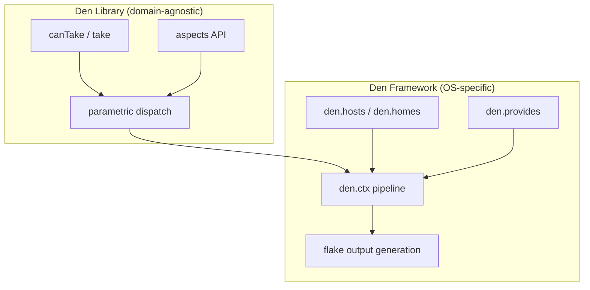

import { Aside } from '@astrojs/starlight/components';

## Den as a Library

Den's core (`/default.nix`) is domain-agnostic. It provides:

| Function | Purpose |
|---|---|
| `parametric` | Wrap an aspect with context-aware dispatch |
| `parametric.atLeast` | Match functions with at least the given params |
| `parametric.exactly` | Match functions with exactly the given params |
| `parametric.fixedTo` | Apply an aspect with a fixed context |
| `parametric.expands` | Extend context before dispatch |
| `canTake` | Check if a function accepts given arguments |
| `take.atLeast` / `take.exactly` | Conditionally apply functions |
| `statics` | Extract only static includes from an aspect |
| `owned` | Extract only owned configs (no includes, no functor) |
| `isFn` | Check if value is a function or has `__functor` |
| `__findFile` | Angle bracket resolution for deep aspect paths |
| `aspects` | Den aspects API (resolve, types) |

These primitives compose into context transformation pipelines for any domain.

## Using Den for Non-OS Domains

<Aside title="Source" icon="github">
[default.nix](https://github.com/vic/den/tree/main/default.nix) - [CI test: den-as-lib.nix](https://github.com/vic/den/tree/main/templates/ci/modules/features/den-as-lib.nix)
</Aside>

Nothing about `den.lib` assumes NixOS, Darwin, or Home Manager. You can build
context pipelines for any Nix module system:

```nix
# see den-as-lib.nix CI test for working example

# Define aspects for a custom domain
den.aspects = {
  web-server = den.lib.parametric {
    terranix.resource.aws_instance.web = { ami = "..."; };
    includes = [
      # configures using the terranix Nix class
      ({ env, ... }: { terranix.resource.aws_instance.web.tags.Env = env; })
    ];
  };
};

# Resolve for your custom class
aspect = den.aspects.web-server { env = "production"; };
module = den.lib.aspects.resolve "terranix" [] aspect;
```

## Den as a Framework

On top of the library, Den provides `modules/` which implement:

- **Schema types** (`den.hosts`, `den.homes`) for declaring NixOS/Darwin/HM entities
- **Context pipeline** (`den.ctx.host`, `den.ctx.user`, `den.ctx.home`) for OS configurations
- **Batteries** (`den.provides.*`) for common OS configuration patterns
- **Output generation** (`modules/config.nix`) instantiating configurations into flake outputs

The framework is entirely optional. You can use `den.lib` directly without
any of the `den.hosts`/`den.aspects` machinery.



## When to Use What

- **Library only**: You have a custom Nix module system (Terranix, NixVim, system-manager)
  and want parametric aspect dispatch without Den's host/user/home framework.
- **Framework**: You configure NixOS/Darwin/Home Manager hosts and want the full
  pipeline with batteries, schema types, and automatic output generation.
- **Both**: Use the framework for OS configs and the library for additional domains
  within the same flake.
