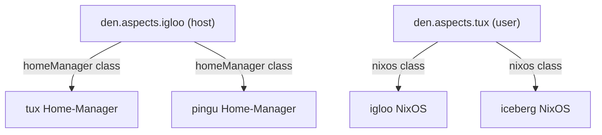

## Host → User Configuration

A host aspect's `homeManager` settings apply to **all users** on that host:

```nix
den.aspects.igloo.homeManager.programs.direnv.enable = true;
```

If `igloo` has users `tux` and `pingu`, both get direnv enabled.

This also works with static includes:

```nix
den.aspects.igloo.includes = [
  { homeManager.programs.direnv.enable = true; }
];
```

And with parametric includes that receive context:

```nix
den.aspects.igloo.includes = [
  ({ host, user }: {
    homeManager.programs.direnv.enable = true;
  })
];
```

## User → Host Configuration

A user aspect's `nixos` or `darwin` settings apply to **every host** with that user:

```nix
den.aspects.tux.nixos.programs.fish.enable = true;
```

If `tux` is on both `igloo` and `iceberg`, both hosts get fish enabled.

User includes work the same way:

```nix
den.aspects.tux.includes = [
  ({ host, ... }: {
    nixos.users.users.tux.description = "Tux on ${host.name}";
  })
];
```

## Context-Conditional Bidirectional

Combine host and user context for precise control:

```nix
let
  git-on-linux = { user, host, ... }:
    if !lib.hasSuffix "darwin" host.system
    then { homeManager.programs.git.enable = true; }
    else { };
in {
  den.aspects.tux.includes = [ git-on-linux ];
}
```

User `tux` gets git only on Linux hosts, not on Darwin.

## How It Works



Den’s [context system](/explanation/context-system/) handles the routing:
- Host aspect configs flow to all users via `ctx.host.provides.user` (cross-provider)
- User aspect configs flow to all hosts with that user
- Context functions get called with the specific `{ host, user }` pair

## The `den.default` Backbone

Settings in [`den.default`](/explanation/context-pipeline/#dendefault-is-an-alias) apply to **everything** — all hosts and all users:

```nix
den.default.homeManager.home.stateVersion = "25.11";
den.default.includes = [
  ({ host, ... }: { ${host.class}.networking.hostName = host.name; })
];
```
