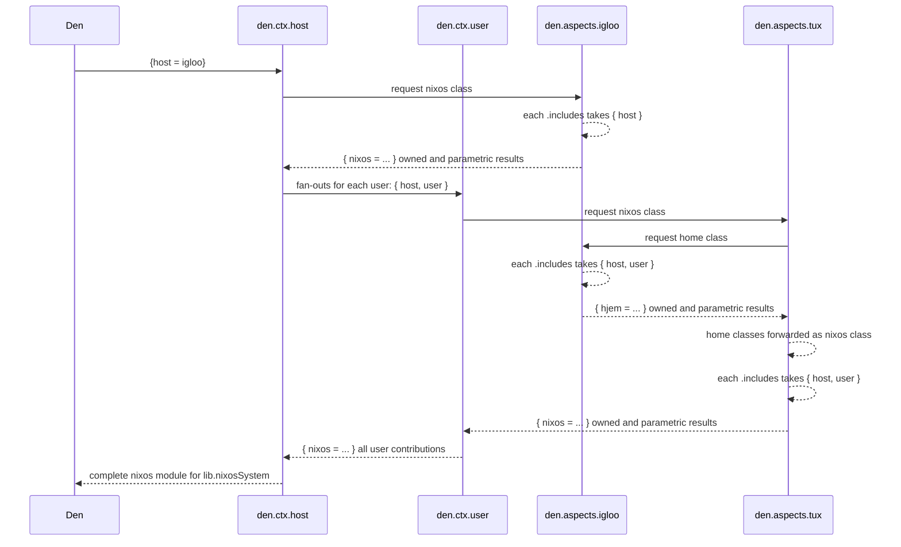
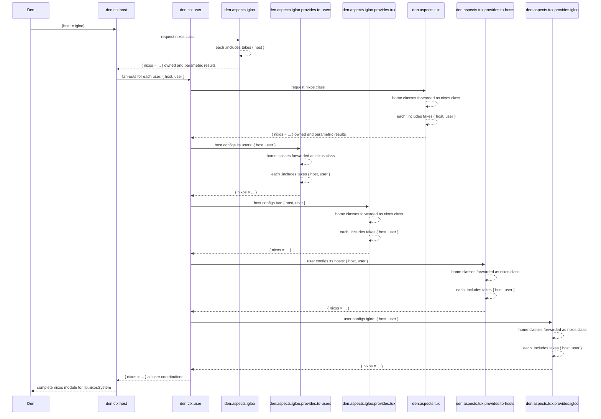

import { Aside } from '@astrojs/starlight/components';

<Aside title="Source" icon="github">
[`context/user.nix`](https://github.com/vic/den/blob/main/modules/context/user.nix) ·
[`context/host.nix`](https://github.com/vic/den/blob/main/modules/context/host.nix) ·
[`bidirectional.nix`](https://github.com/vic/den/blob/main/modules/aspects/provides/bidirectional.nix) ·
[`mutual-provider.nix`](https://github.com/vic/den/blob/main/modules/aspects/provides/mutual-provider.nix)
</Aside>

## What Bidirectionality Means

__Bidirectionality__ means that not only a User contributes
configuration to a Host, but **also** that a Host contributes
configurations to a User.

This is useful when you wish for a Host to provide a common 
_home environment_ for all its users, or for a User to require
common _os environment_ everywhere it is defined.

There are at least two (built-in) ways to achieve this in Den.
The `den._.bidirectional` and `den._.mutual-provider`, the
first one was extracted from den-core and the second started
life as an **aspect routing** example, but made it to become
proper battery itself and even safer to use.


## Default, *unidirectional* OS configuration

Den framework is built around **context pipeline** transformations. 
In order to create a full OS configuration, everything starts with a host definition:

```nix "igloo" "tux"
den.hostx.x86_64-linux.igloo.users.tux = {}
```

We need to build the `nixos` Nix module that will later be used by `lib.nixosSystem`.
To do so, Den invokes the `den.ctx.host` pipeline like this: 

> `Tip: Zoom diagrams using your mouse wheel or drag to move.`


This is the normal NixOS pipeline an __Not Bidirectional__. All OS contributions come from
the host itself and from each of its user.


## `den.provides.bidirectional`

Bidirectionality is enabled __per-user__ or for _all_ of them.

```nix
# only tux takes configurations from its hosts
den.aspects.tux.includes = [ den._.bidirectional ];

# for ALL users
den.ctx.user.includes = [ den._.bidirectional ];
```

When Bidirectionality is enabled, the interaction looks like this:

> `Tip: Zoom diagrams using your mouse wheel or drag to move.`



<Aside title="Potential Duplicates by Host Aspect" type="caution">
**Under Bidirectionality**, the igloo aspect is activated more than once!

Notice that `den.aspects.igloo.includes` functions are called **with** `{ host }` and **later with** `{ host, user }` **per-user**.

Because the list of functions at `igloo.includes` get invoked more than once, with different contexts,
they must take care of the following:

```nix
# avoid being called with `{host, user}`
den.lib.perHost ({ host }: ...)

# avoid being called with `{host}`
den.lib.perUser ({ host, user }: ...)
```

Static aspects (plain-attrsets) or host-owned classes at a Host-aspect
have **no way** to distinguish when the calling context is 
`{host}` or `{host,user}`, **only functions** are context-aware.

```
# Lists, packages, options at host-level would cause duplicates
# den.aspects.igloo.nixos.options.foo = lib.mkOption {};

# Instead, use perHost to define unique values:
den.aspects.igloo.includes = [
  (perHost { nixos.options.foo = lib.mkOption {}; })
];
```

Read the documentation at [`context/user.nix`](https://github.com/vic/den/blob/main/modules/context/user.nix) for all the details.
</Aside>

## `den.provides.mutual-provider`

An alternative to bidirectionality is [`den.provides.mutual-provider`](https://github.com/vic/den/blob/main/modules/aspects/provides/mutual-provider.nix).

This battery is safer, instead of using the host aspect directly, it requires you to define other named aspects under `.provides.` to create an explicit relationship between users and hosts.

```nix
# mutual-provider is activated at a `{host,user}` context
den.ctx.user.includes = [ den._.mutual-provider ];

# user aspect provides to specific host or to all where it lives
den.aspects.tux = {
  provides.igloo.nixos.programs.emacs.enable = true;
  provides.to-hosts = { host, ... }: {
    nixos.programs.nh.enable = host.name == "igloo";
  };
};

# host aspect provides to specific user or to all its users
den.aspects.igloo = {
  provides.alice.homeManager.programs.vim.enable = true;
  provides.to-users = { user, ... }: {
    homeManager.programs.helix.enable = user.name == "alice";
  };
};
```

> `Tip: Zoom diagrams using your mouse wheel or drag to move.`



