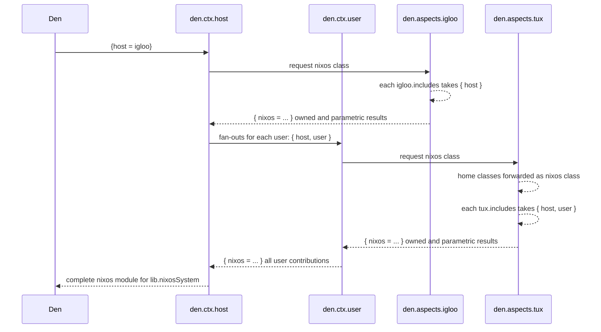

import { Aside } from '@astrojs/starlight/components';

<Aside title="Source" icon="github">
[`context/user.nix`](https://github.com/vic/den/blob/main/modules/context/user.nix) ·
[`context/host.nix`](https://github.com/vic/den/blob/main/modules/context/host.nix) ·
[`bidirectional.nix`](https://github.com/vic/den/blob/main/modules/aspects/provides/bidirectional.nix) ·
[`mutual-provider.nix`](https://github.com/vic/den/blob/main/modules/aspects/provides/mutual-provider.nix)
</Aside>


## Normal, non-bidirectional OS configuration

Den framework is built around **context pipeline** transformations. 
In order to create a full OS configuration, everything starts with a host definition:

```nix "igloo" "tux"
den.hostx.x86_64-linux.igloo.users.tux = {}
```

We need to build the `nixos` Nix module that will later be used by `lib.nixosSystem`.
To do so, Den invokes the `den.ctx.host` pipeline like this: 




This is the normal NixOS pipeline an __Not Bidirectional__. All OS contributions come from
the host itself and from each of its user.


## What Bidirectionality means

__Bidirectionality__ means that not only a User contributes
configuration to a Host, but **also** that a Host contributes
configurations to a User.

This is useful when the Host wishes to provide a
commmon home environment for its users.

## `den.provides.bidirectional`

Bidirectionality is enabled __per-user__ or for _all_ of them.

```nix
# only tux takes configurations from its hosts
den.aspects.tux.includes = [ den._.bidirectional ];

# for ALL users
den.ctx.user.includes = [ den._.bidirectional ];
```

When Bidirectionality is enabled, the interaction looks like this:


Crucial points here are `igloo.includes takes { host }` and `igloo.includes takes { host, user }`.

Because the list of aspects at `igloo.includes` get invoked twice, with different contexts,
functions at `igloo.includes` must take care of the following:

```nix
# use den.lib.take.exactly to avoid being called with `{host, user}`
take.exactly ({ host }: ...)

# use den.lib.take.atLeast to avoid being called with `{host}`
take.atLeast ({ host, user }: ...)
```

Read the documentation at [`context/user.nix`](https://github.com/vic/den/blob/main/modules/context/user.nix) for all the details.

## `den.provides.mutual-provider`

An alternative to bidirectionality is [`den.provides.mutual-provider`](https://github.com/vic/den/blob/main/modules/aspects/provides/mutual-provider.nix).

This battery is more explicit, since it requires an explicit `.provides.` relationship between users and hosts.

```nix
# Host provides to a particular user
den.aspects.igloo.provides.tux = {
  hjem = ...; 
};

# User provides to a particular host
den.aspects.tux.provides.igloo = {
  nixos = ...;
};
```

To enable it for both users and hosts, include at default:

```nix
den.default.includes = [ den._.mutual-provider ];
```