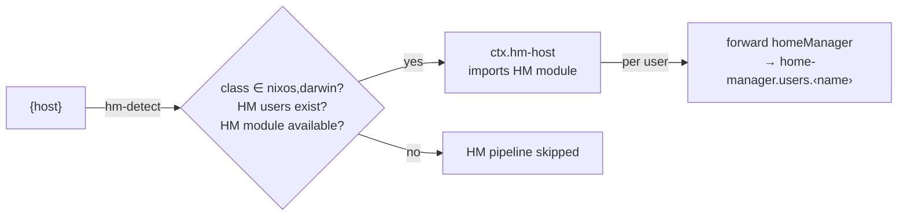

import { Aside } from '@astrojs/starlight/components';

<Aside title="Use the Source, Luke" icon="github">
[`hm-os.nix`](https://github.com/vic/den/blob/main/modules/aspects/provides/home-manager/hm-os.nix) · [`hm-integration.nix`](https://github.com/vic/den/blob/main/modules/aspects/provides/home-manager/hm-integration.nix)
</Aside>

## Automatic HM Detection

Den automatically detects hosts that need Home-Manager. When a host has
users with `class = "homeManager"` (the default), Den:

1. Imports the Home-Manager NixOS/Darwin module
2. Creates a `homeManager` class for each user
3. Forwards `homeManager` configs into `home-manager.users.<name>`

No explicit opt-in needed — just declare users.



## Host-Managed Users

```nix
den.hosts.x86_64-linux.igloo.users.tux = { };
den.default.homeManager.home.stateVersion = "25.11";

den.aspects.tux.homeManager.programs.vim.enable = true;
```

The vim config is forwarded into `igloo.home-manager.users.tux`.

## Standalone Home-Manager

For Home-Manager without an OS host:

```nix
den.homes.aarch64-darwin.vic = { };
den.default.homeManager.home.stateVersion = "25.11";
den.aspects.vic.homeManager.programs.fish.enable = true;
```

Build with `home-manager switch --flake .#vic`.

## The define-user Battery

Use `den._.define-user` to automatically set username and home directory:

```nix
den.default.includes = [ den._.define-user ];
```

This sets `home.username`, `home.homeDirectory`, and
`users.users.<name>` on both NixOS and Darwin.

## useGlobalPkgs

Configure Home-Manager to use the host's nixpkgs:

```nix
den.ctx.hm-host.nixos.home-manager.useGlobalPkgs = true;
```

This only activates for hosts that actually have Home-Manager users.
Hosts without users are unaffected.

## Custom HM Module

Override the Home-Manager module source:

```nix
den.hosts.x86_64-linux.igloo = {
  hm-module = inputs.home-manager-unstable.nixosModules.home-manager;
  users.tux = { };
};
```

## Standalone with osConfig

Access NixOS config from standalone Home-Manager:

```nix
den.homes.x86_64-linux.pingu = {
  instantiate = { pkgs, modules }:
    inputs.home-manager.lib.homeManagerConfiguration {
      inherit pkgs modules;
      extraSpecialArgs.osConfig =
        config.flake.nixosConfigurations.igloo.config;
    };
};

den.aspects.pingu.homeManager = { osConfig, ... }: {
  programs.emacs.enable = osConfig.programs.vim.enable;
};
```

## Context Hooks

Use `den.ctx.hm-host` to configure things only when HM is active:

```nix
den.ctx.hm-host.nixos.home-manager.useGlobalPkgs = true;
den.ctx.hm-host.includes = [
  { nixos.home-manager.backupFileExtension = "bak"; }
];
```

These only apply to hosts that have Home-Manager users with
a supported OS (NixOS or Darwin).
