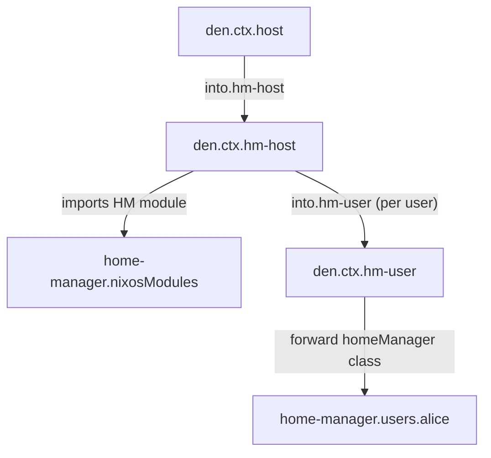

import { Aside } from '@astrojs/starlight/components';


<Aside title="Source" icon="github">
[`home-manager.nix`](https://github.com/vic/den/blob/main/modules/aspects/provides/home-manager.nix) ·
[`hjem.nix`](https://github.com/vic/den/blob/main/modules/aspects/provides/hjem.nix) ·
[`maid.nix`](https://github.com/vic/den/blob/main/modules/aspects/provides/maid.nix) ·
[`home-env.nix`](https://github.com/vic/den/blob/main/nix/home-env.nix)
</Aside>

## Enabling Homes

Den supports several Home Nix classes:

- `homeManager`
- `hjem`
- `maid`
- `user`

All Home integrations are opt-in and must be enabled explicitly, except for `user` which is the built-in user environment on NixOS and nix-Darwin.

```nix
# Per user
den.hosts.x86_64-linux.igloo.users.tux.classes = [ "homeManager" "hjem" ];

# As default for all users, unless they specify other classes.
den.schema.user.classes = lib.mkDefault [ "homeManager" ];
```

Home integration contexts, like `den.ctx.hm-host` only activate when
at least one host user has `homeManager` in their `classes`.
If so, the integration imports the HomeManager OS module, 
and forwards each user's `homeManager` class into `home-manager.users.<userName>`.

Same details regarding `home-manager` apply to other home types like `hjem` and `maid`.

### Requirements

- `inputs.home-manager` must exist in your flake inputs or have custom `host.home-manager.module`.
- At least one user must have `homeManager` in their `classes`.

### How it Works


```mermaid
flowchart TD
  host["den.ctx.host"] -->|"into.hm-host"| hmhost["den.ctx.hm-host"]
  hmhost -->|"imports HM module"| mod["home-manager.nixosModules"]
  hmhost -->|"into.hm-user (per user)"| hmuser["den.ctx.hm-user"]
  hmuser -->|"forward homeManager class"| target["home-manager.users.alice"]
```

1. `hm-os.nix` detects hosts with HM-enabled users and supported OS class.
2. It produces `den.ctx.hm-host`, which imports the HM OS-level module.
3. `hm-integration.nix` creates `den.ctx.hm-user` per HM user, forwarding
   the `homeManager` class into `home-manager.users.<userName>`.

### Configuring Home Manager

```nix
den.aspects.alice = {
  homeManager = { pkgs, ... }: {
    home.packages = [ pkgs.htop ];
    programs.git.enable = true;
  };
};
```

The `homeManager` class contents are forwarded to the OS-level
`home-manager.users.alice` automatically.

### Custom HM Module

Override the HM module per host if needed:

```nix
den.hosts.x86_64-linux.laptop = {
  users.vic.classes = [ "home-manager" ];
  home-manager.module = inputs.home-manager-unstable.nixosModules.home-manager;
};
```

## Standalone Homes (homeManager)

For machines without root access:

```nix
den.homes.x86_64-linux.tux = { };
```

This produces a `homeConfigurations.tux` that can be built with the `home-manager` CLI.

### Standalone Homes bound to Host OS

Also, if you define an standalone home with `tux@igloo` name _and_ you also
have a host named `igloo` in the same platform with user `tux`,

```
den.homes.x86_64-linux."tux@igloo" = {};
den.hosts.x86_64-linux.igloo.users.tux = {};
```
Den will:

- Correctly set `<home>.userName` so that batteries like `define-user` work.
- Automatically bind the standalone HM instance to the OS host configuration.

This means that by declaring `tux@igloo` you can quickly rebuild your home
environment without rebuilding the whole `igloo` OS.

## hjem

[hjem](https://github.com/feel-co/hjem) is an alternative, lightweight home environment manager.

### Enabling

```nix
# Per host
den.hosts.x86_64-linux.laptop = {
  users.alice.classes = [ "hjem" ];
};

# On all hosts
den.schema.host.hjem.enable = true;
```

### Requirements

- `inputs.hjem` must exist.
- Users must have `hjem` in their `classes`.

### Using

```nix
den.aspects.alice.hjem = { };
```

## nix-maid

[nix-maid](https://github.com/nix-maid) is another user-environment manager for NixOS.

### Enabling

```nix
den.hosts.x86_64-linux.laptop = {
  users.alice.classes = [ "maid" ];
};
```

### Requirements

- `inputs.nix-maid` must exist.
- Host class must be `"nixos"`.
- Users must have `maid` in their `classes`.

### Using

```nix
den.aspects.alice.maid = {
  # nix-maid configuration
};
```

## Multiple User Environments

A user can participate in multiple environments:

```nix
den.hosts.x86_64-linux.laptop = {
  users.alice.classes = [ "homeManager" "hjem" ];
  home-manager.enable = true;
  hjem.enable = true;
};
```

Both `homeManager` and `hjem` configurations from `den.aspects.alice` will
be forwarded to their respective targets.
