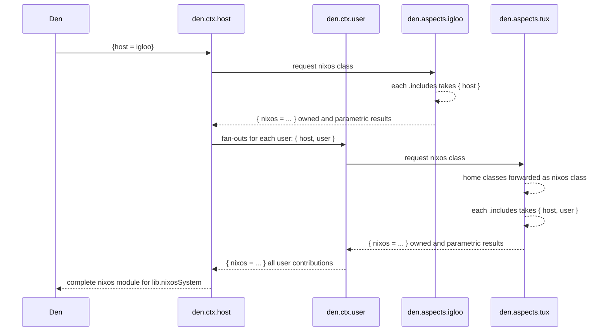
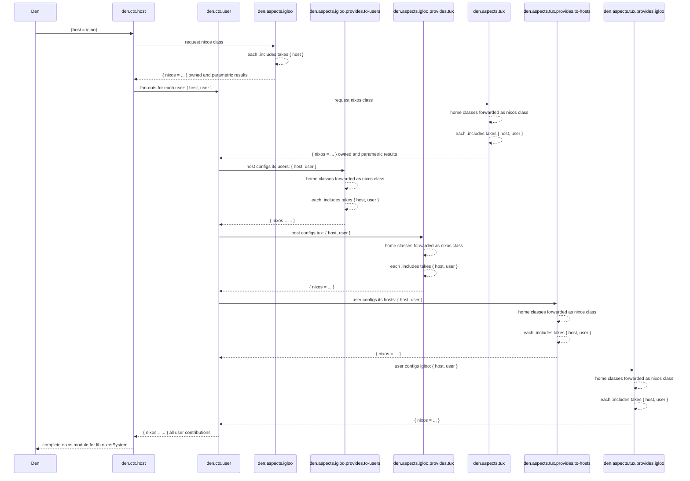

import { Aside } from '@astrojs/starlight/components';

<Aside title="Source" icon="github">
[`context/user.nix`](https://github.com/vic/den/blob/main/modules/context/user.nix) ·
[`context/host.nix`](https://github.com/vic/den/blob/main/modules/context/host.nix) ·
[`mutual-provider.nix`](https://github.com/vic/den/blob/main/modules/aspects/provides/mutual-provider.nix)
</Aside>

## What Mutual-Config Mean

__Mutual Configs__ means that not only a User contributes
configuration to a Host, but **also** that a Host contributes
configurations to a User.


## Default, *unidirectional* OS configuration

Den framework is built around **context pipeline** transformations.
In order to create a full OS configuration, everything starts with a host definition:

```nix "igloo" "tux"
den.hostx.x86_64-linux.igloo.users.tux = {}
```

We need to build the `nixos` Nix module that will later be used by `lib.nixosSystem`.
To do so, Den invokes the `den.ctx.host` pipeline like this:

> `Tip: Zoom diagrams using your mouse wheel or drag to move.`



This is the normal `den.ctx.host` pipeline. All OS contributions come from the host itself and from each of its user.


## `den.provides.mutual-provider`

The [`den.provides.mutual-provider`](https://github.com/vic/den/blob/main/modules/aspects/provides/mutual-provider.nix) battery allows you to define mutual configurations by letting you to define named aspects under `.provides.` to create explicit relationship between users and hosts.

```nix
# mutual-provider is activated at a `{host,user}` context
# either per-user or for all of them.
den.ctx.user.includes = [ den._.mutual-provider ];

# user aspect provides to specific host or to all where it lives
den.aspects.tux = {
  provides.igloo.nixos.programs.emacs.enable = true;
  provides.to-hosts = { host, ... }: {
    nixos.programs.nh.enable = host.name == "igloo";
  };
};

# host aspect provides to specific user or to all its users
den.aspects.igloo = {
  provides.alice.homeManager.programs.vim.enable = true;
  provides.to-users = { user, ... }: {
    homeManager.programs.helix.enable = user.name == "alice";
  };
};
```

> `Tip: Zoom diagrams using your mouse wheel or drag to move.`



### User Peers Configuration

A user `alice` can provide configurations for other users in the same system,
either by name or for all of them (exluding alice itself).

```nix
den.ctx.user.includes = [ den._.mutual-provider ];

den.aspects.alice = {
  provides.bob = { homeManager.programs.vim.enable = true; };
  provides.to-users = { user, ... }: {
    homeManager.programs.tmux.enable = lib.elem user.userName [ "carl" "david" ];
  };
};
```

### Standalone HomeManager - Host Specific Configuration

If you have two standalone homes sharing same user aspect, you can provide host specific
configuration even if the Host is not a NixOS system managed by you.

```nix
den.ctx.home.includes = [ den._.mutual-provider ];

den.homes.x86_64-linux."tux@igloo" = {};
den.homes.x86_64-linux."tux@iceberg" = {};

den.aspects.tux = {
  homeManager.programs.vim.enable = true; # tux on ALL homes and hosts.

  provides.igloo = {
    homeManager.programs.helix.enable = true; # ONLY at igloo
  };

  provides.iceberg = {
    homeManager.programs.emacs.enable = true; # ONLY at iceberg
  };
};
```
