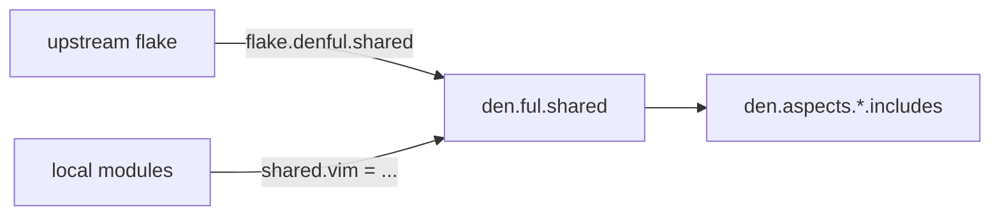

import { Aside } from '@astrojs/starlight/components';

<Aside title="Source" icon="github">
[`nix/namespace.nix`](https://github.com/vic/den/blob/main/nix/namespace.nix)
</Aside>

## What are Namespaces

A **namespace** creates a scoped aspect library under `den.ful.<name>`.
Namespaces can be:
- **Local**: defined in your flake, consumed internally.
- **Exported**: exposed via `flake.denful.<name>` for other flakes to consume.
- **Imported**: merged from upstream flakes into your local `den.ful`.

## Creating a Namespace

```nix
# modules/namespace.nix
{ inputs, den, ... }: {
  # Create "my" namespace (not exported to flake outputs)
  imports = [ (inputs.den.namespace "my" false) ];

  # Or create and export "eg" namespace
  imports = [ (inputs.den.namespace "eg" true) ];
}
```

This creates:
- `den.ful.eg` -- the namespace attrset (aspects type).
- `eg` -- a module argument alias to `den.ful.eg`.
- `flake.denful.eg` -- flake output (if exported).

## Populating a Namespace

Define aspects under the namespace using any module:

```nix
# modules/aspects/vim.nix
{
  eg.vim = {
    homeManager.programs.vim.enable = true;
  };
}
```

```nix
# modules/aspects/desktop.nix
{ eg, ... }: {
  eg.desktop = {
    includes = [ eg.vim ];
    nixos.services.xserver.enable = true;
  };
}
```

## Using Namespaced Aspects

Reference them by their namespace:

```nix
{ eg, ... }: {
  den.aspects.laptop.includes = [
    eg.desktop
    eg.vim
  ];
}
```

## Importing from Upstream

Merge aspects from other flakes:

```nix
# modules/namespace.nix
{ inputs, ... }: {
  # Import "shared" namespace from upstream, merging with local definitions
  imports = [ (inputs.den.namespace "shared" [ inputs.team-config ]) ];
}
```

The namespace function accepts:
- A **boolean** (`true`/`false`) for local/exported namespaces.
- A **list of sources** to merge from upstream flakes.
  Each source's `flake.denful.<name>` is merged into `den.ful.<name>`.

## Enabling Angle Brackets

When using namespaces, enable angle bracket syntax for terser references:

```nix
{ den, ... }: {
  _module.args.__findFile = den.lib.__findFile;
}
```

Then reference deep aspects with `<namespace/path>`:

```nix
den.aspects.laptop.includes = [ <eg/desktop> ];
```

## Architecture


