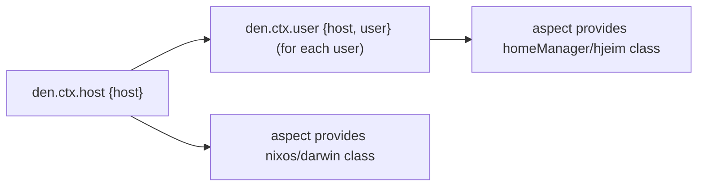

import { Card, CardGrid } from '@astrojs/starlight/components';

## Two Core Principles

Den builds on [flake-aspects](https://github.com/vic/flake-aspects)' **parametric aspects**,
and provides a declarative **context-pipeline** as cutting-points for these aspects.

<CardGrid>
  <Card title="Context Transformation" icon="random">
    Data flows through a declarative [pipeline](/explanation/context-pipeline/) of
    [contexts](/explanation/context-system/). Each stage enriches the context — from
    host definitions through user enumeration to domain-specific requirements.
  </Card>
  <Card title="Context-Aware Aspects" icon="puzzle">
    [Aspects](/explanation/aspects/) are composable bundles of cross-class Nix configs.
    They inspect context to produce conditional, [parametric](/explanation/parametric/)
    configurations — and are activated by a matching context.
  </Card>
</CardGrid>

### 1. Context Transformation

Data flows through a declarative pipeline. You declare the entities (data) that exists in your universe, Den transforms them into progressively richer contexts to which aspects are attached, providing configuration for each context:

Each stage of the pipeline is a [**context type**](/reference/ctx/) defined in `den.ctx`. Context types
declare how to find [aspects](/explanation/aspects/), how to transform into other contexts, and which
[parametric](/explanation/parametric/) includes to activate.

### 2. Context-Aware Aspects

Aspects are composable bundles that inspect their context parameters to decide
what to produce. A function taking `{ host, ... }` only runs when a host context
exists. A function taking `{ host, user, ... }` runs once per user on each host.

Functions that require parameters not present in the current context are
not included. Den introduces pattern matching on context shape.

## Den as a Library

All parts of Den are optional, re-usable and replaceable. Even the default NixOS configuration
pipeline is opt-in, and you can use Den lib to configure anything supporting Nix modules.

<CardGrid>
  <Card title="Any Nix Class" icon="none">
    NixOS, Darwin, Home-Manager, Terraform, NixVim — Den
    works with [anything configurable through Nix](/explanation/library-vs-framework/).
  </Card>
  <Card title="Context Pipeline" icon="right-arrow">
    Define custom [context types](/reference/ctx/) with `den.ctx`. Declarative
    [transformations](/explanation/context-pipeline/) propagate data through your config graph.
  </Card>
  <Card title="No Lock-in" icon="open-book">
    Works [with flakes, without flakes](/guides/no-flakes/), with flake-parts, or
    standalone. Den plays well with your existing Nix choices. And integrates with your existing infra.
  </Card>
  <Card title="Sharable Aspects" icon="star">
    Re-usablity is one of the goals of Den. Allowing people to create truly-generic configuration modules.
    [Namespaces](/guides/namespaces/) let you publish and consume aspect libraries
    across repositories and flakes.
  </Card>
</CardGrid>

## Den as a Framework

Built upon `den.lib`, Den provides ready-made facilities for the common use-case of OS and User configurations.

<CardGrid>
  <Card title="Declare Systems" icon="laptop">
    One-liner [host and user](/guides/declare-hosts/) definitions with
    [freeform schemas](/reference/schema/). NixOS, Darwin, Home-Manager —
    all from a single source.
  </Card>
  <Card title="Bidirectional" icon="right-arrow">
    Hosts configure their users. Users contribute to their
    hosts. [Aspects flow in both directions](/guides/bidirectional/) automatically.
  </Card>
  <Card title="Batteries Included" icon="add-document">
    Opt-in [aspects for common tasks](/guides/batteries/): define-user, primary-user,
    user-shell, unfree packages, import-tree, and more.
  </Card>
  <Card title="Community" icon="heart">
    Share configurations through [namespaces](/guides/namespaces/). Real-world setups
    and a growing ecosystem at [denful](https://github.com/vic/denful) (wip).
  </Card>
</CardGrid>
