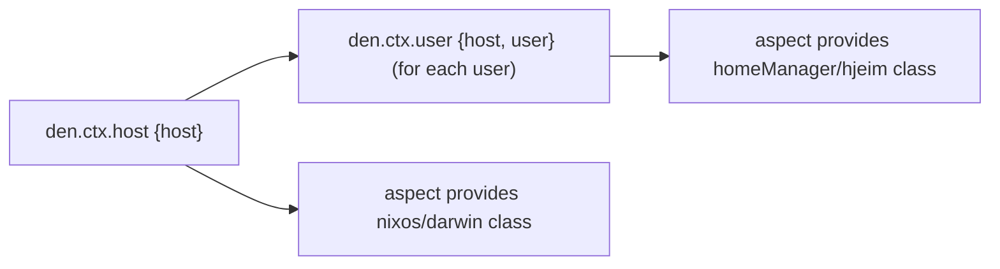
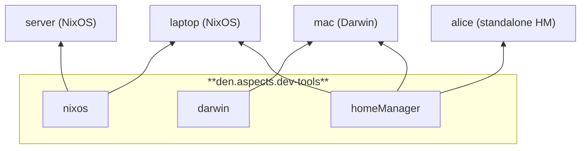
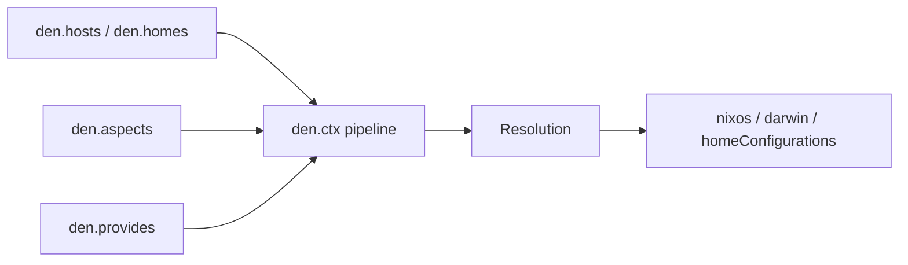

import { Steps, LinkButton, Card, CardGrid } from '@astrojs/starlight/components';

## Testimonials

<div class="testimonials">

> Den takes the Dendritic pattern to a whole new level, and I cannot imagine going back.\
> — `@adda` - Very early Den adopter after using Dendritic flake-parts and Unify. [\[repo\]](https://codeberg.org/Adda/nixos-config)

> I’m super impressed with den so far, I’m excited to try out some new patterns that Unify couldn’t easily do.\
> — `@quasigod` - Author of [_Unify_](https://codeberg.org/quasigod/unify) dendritic-framework, on adopting Den. [\[repo\]](https://tangled.org/quasigod.xyz/nixconfig)

> Massive work you did here!\
> — `@drupol` - Author of [_“Flipping the Configuration Matrix”_](https://not-a-number.io/2025/refactoring-my-infrastructure-as-code-configurations/#flipping-the-configuration-matrix) Dendritic blog post.

> Thanks for the awesome library and the support for non-flakes… it’s positively brilliant!. I really hope this gets wider adoption.\
> — `@vczf` - At [`#den-lib:matrix.org`](https://matrix.to/#/#den-lib:matrix.org) channel.

> Den is a playground for some very advanced concepts. I’m convinced that some of its ideas will play a role in future Nix areas. In my opinion there are some raw diamonds in Den.\
> — `@Doc-Steve` - Author of [_Dendritic Design Guide_](https://github.com/Doc-Steve/dendritic-design-with-flake-parts)

</div>


## What is Den


At its core, Den is a **library** for activating Nix configuration aspects via context transformations.  

On top of the library, Den provides a **framework** for the common case
of NixOS/nix-Darwin/Home-Manager.  

Den embraces your Nix choices and does not impose itself. All parts of Den are optional and replaceable.

## How Den works

Den uses a Dendritic configuration model. Features are organized as **aspects** -- composable attrsets with per-class modules and a dependency graph (`provides`/`includes`).

A **context transformation pipeline** traverses configurable entities, activating corresponding aspects on each context stage, ultimately producing a single, unified system configuration.

<div style="display: grid; grid-template-columns: 1fr 1fr; grid-gap: 20px;">
<div>

```mermaid
graph LR
  H["den.ctx.host {host}"] --> U["den.ctx.user {host, user} (for each user)"]
  U --> HM["aspect provides homeManager/hjeim class"]
  H --> OS["aspect provides nixos/darwin class"]
```
</div>
<div>

```mermaid
flowchart BT
  subgraph "**den.aspects.dev-tools**"
    n["nixos"]
    h["homeManager"]
    d["darwin"]
  end
  n --> server["server (NixOS)"]
  n --> laptop["laptop (NixOS)"]
  d --> mac["mac (Darwin)"]
  h --> laptop
  h --> mac
  h --> standalone["alice (standalone HM)"]
```
</div>
</div>


## Den as a *library*

<CardGrid>
  <Card title="Any Nix Configuration Class" icon="puzzle">
    NixOS, Darwin, system-manager, Terraform,
    or [custom classes](/guides/custom-classes/)

    Den works with anything configurable through Nix modules and any
    topology you can describe with Nix data and function transformations.
  </Card>
  <Card title="Context Pipeline" icon="right-arrow">
    Declarative [context types](/reference/ctx/) with `den.ctx`.

    Each context stage can [transform](/explanation/context-pipeline/) into other contexts,
    using a type-driven design, ensuring only valid contexts exist via
    principles like [parse don't validate](https://lexi-lambda.github.io/blog/2019/11/05/parse-don-t-validate/)
  </Card>
  <Card title="No Lock-in" icon="open-book">
    Works with flake-parts, without flake-parts, or [without flakes at all](/tutorials/noflake/).

    Den never uses `lib.evalModules` directly, but provides APIs and modules for use with your favorite Nix module system.
  </Card>
  <Card title="Sharable Aspects" icon="star">
    [Namespaces](/guides/namespaces/) let you publish and consume aspect
    libraries across flakes or non-flakes. 

    Den is social, trying to bring re-usability across stable and unstable Nix boundaries.
    No Flakes mandated.
  </Card>
</CardGrid>

The following three lines is how a NixOS configuration is built.
The very same process can be used for other Nix configuration domains outside
of NixOS.

```nix
# Use Den API -- Context transformations happen here, nothing is configured yet.
aspect = den.ctx.host { host = den.hosts.x86_64-linux.igloo; };

# We enter the NixOS domain by resolving for the "nixos" class.
nixosModule = den.lib.aspects.resolve "nixos" aspect;

# Use NixOS API -- Instantiate using nixosSystem with the resolved module.
nixosConfigurations.igloo = lib.nixosSystem { modules = [ nixosModule ]; };
```


## Den as a _framework_.

Built on top of `den.lib`, Den provides a framework with ready-made facilities for 
NixOS/nix-Darwin/homes configurations.


```mermaid
flowchart LR
  Schema["den.hosts / den.homes"] --> Ctx["den.ctx pipeline"]
  Aspects["den.aspects"] --> Ctx
  Batteries["den.provides"] --> Ctx
  Ctx --> Resolve["Resolution"]
  Resolve --> Out["nixos / darwin / homeConfigurations"]
```

<Steps>
1. **Schema** -- `den.hosts` and `den.homes` declare machines, users, and their properties with `den.schema` modules and extensible freeform types.
2. **Aspects** -- `den.aspects.*` bundles per-class configs (`nixos`, `darwin`, `homeManager`, or any custom class) with `.includes` and `.provides` forming a DAG.
3. **Context pipeline** -- `den.ctx` transforms schema entries into context pairs (`{host}`, `{host, user}`, `{home}`), walking `into.*` transitions for derived contexts like `hm-host`, `hm-user`, `wsl-host` or any other custom context stage.
4. **Resolution** -- Parametric dispatch via `__functor` argument introspection. Functions receive only contexts whose shape matches their parameters. 
5. **Output** -- Each host/home is instantiated via `nixpkgs.lib.nixosSystem`, `darwin.lib.darwinSystem`, or `home-manager.lib.homeManagerConfiguration`.
</Steps>

<LinkButton icon="right-arrow" variant="primary" href="/explanation/core-principles">Learn More</LinkButton>

<LinkButton variant="minimal" href="/tutorials/microvm">Extensibility Example: MicroVM</LinkButton>


## Den is made possible by amazing people

<a href="https://github.com/vic/den/graphs/contributors">
  
</a>

## Star History

[](https://github.com/vic/den)
