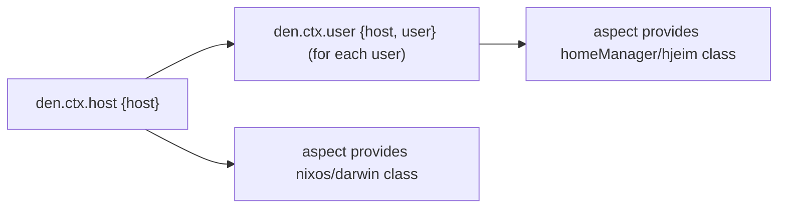

## Den Origins

Den started by exploring the re-usability enabled by the [Dendritic Nix](https://dendrix.oeiuwq.com/Dendritic.html) pattern.

Traditional Nix configurations are powerful but isolated. Even when all nix modules are already functions, it is not common to share configurations outside of what is provided by `NixOS` and projects like `Home Manager` or `Hjem Run`. 

All these different configuration domains have different option sets, they share nothing in common except that they are nix modules. Passing values between different classes of configurations is not intuitive.

When writing their infra, most people do re-invent the wheel an infinite number of times. And most of this is because configurations are not written with re-usability in mind. The result is you find people copy-pasting from other's repositories, or letting an AI slop-generate whatever it had consumed.

## The Fundamental Idea

Just like any Nix module can already be a function. Den explores the idea of Dendritic aspects being functions.

```nix
# a NixOS module is a function.
{ pkgs, ... }: { .... };

# a Dendritic aspect can be a function.
{ host, user }: {
  nixos = { pkgs, ... }: { users.users.${user.name}.packages = [ pkgs.hello ] };
};

```


> Configurations that are **functions of context** become truly re-usable.
> An important point is that `{ host, user }` are NOT module arguments in
> the nix-modules sense. Because they do not depend on config you can use
> them for conditional inclusion of other features.

Instead of writing a NixOS module tied to one machine, you write an [**aspect**](/explanation/aspects/) — a
function that receives [context](/explanation/context-system/) (which host, which user, which platform) and produces
configurations for any Nix class it needs:

```nix
{ host, user, ... }: {
  nixos.users.users.${user.userName}.description = "${user.userName} on ${host.name}";
  darwin.users.users.${user.userName}.home = "/Users/${user.userName}";
  homeManager.programs.git.userName = user.userName;
}
```

One function. Three classes. Any host. Any user. **Truly parametric.**

## Two Core Principles

### 1. Context Transformation

Data flows through a declarative pipeline. You declare the entities (data) that exists in your universe, Den transforms them into progressively richer contexts to which aspects are attached, providing configuration:



Each stage of the pipeline is a [**context type**](/reference/ctx/) defined in `den.ctx`. Context types
declare how to find [aspects](/explanation/aspects/), how to transform into other contexts, and which
[parametric](/explanation/parametric/) includes to activate.

### 2. Context-Aware Aspects

Aspects are composable bundles that inspect their context parameters to decide
what to produce. A function taking `{ host, ... }` only runs when a host context
exists. A function taking `{ host, user, ... }` runs once per user on each host.

Functions that require parameters not present in the current context are
not included. Den introduces pattern matching on context shape.

## Den is Social

Den is fundamentally born to solve a **social** problem: making Dendritic Nix configurations shareable.

Den's [**namespaces**](/guides/namespaces/) and [**aspects**](/explanation/aspects/) create a common language for sharing
configurations across repositories, even across flake/non-flake projects, and communities.

## Built on Flake-Aspects

Den is built on [flake-aspects](https://github.com/vic/flake-aspects) — a
dependency-free library for composable, nested, parametric aspect trees.
Den adds the context transformation pipeline and framework integration
on top of this foundation.

## What's Next?

Ready to try it? Head to the [Getting Started](/tutorials/getting-started/) tutorial.

Want to understand the architecture? Read about the [Core Principles](/explanation/core-principles/).
