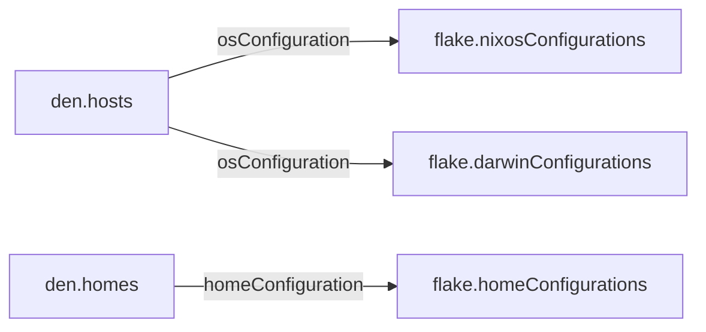
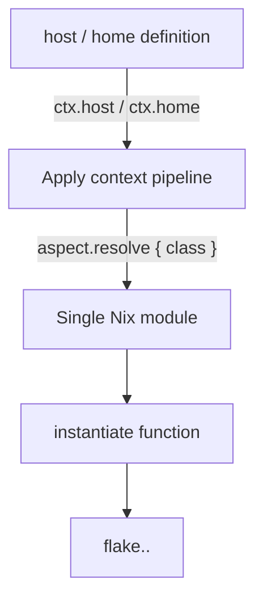

import { Aside } from '@astrojs/starlight/components';

<Aside type="tip">Source: [`modules/config.nix`](https://github.com/vic/den/blob/main/modules/config.nix) · [`modules/output.nix`](https://github.com/vic/den/blob/main/modules/output.nix)</Aside>

## Overview

Den transforms `den.hosts` and `den.homes` declarations into standard Nix
configurations placed on `flake.nixosConfigurations`, `flake.darwinConfigurations`,
and `flake.homeConfigurations`.



## The Build Process

For each entry in `den.hosts` and `den.homes`, Den:

1. **Resolves the main module** — applies the context pipeline to produce a
   single Nix module containing all class-specific configurations
2. **Calls the instantiate function** — passes the module to the platform builder
3. **Places the result** — puts it at `flake.<intoAttr>.<name>`

## OS Configurations

Each host in `den.hosts.<system>.<name>` builds via:

```nix
host.instantiate {
  modules = [
    host.mainModule
    { nixpkgs.hostPlatform = lib.mkDefault host.system; }
  ];
}
```

The `mainModule` is the result of applying `den.ctx.host { host }` and
resolving the aspect tree for the host's class.

## Home Configurations

Each home in `den.homes.<system>.<name>` builds via:

```nix
home.instantiate {
  pkgs = home.pkgs;
  modules = [ home.mainModule ];
}
```

Where `home.pkgs` defaults to `inputs.nixpkgs.legacyPackages.<system>`.

## Output Placement

Results are folded into `flake` by `intoAttr`:

| Class | Default `intoAttr` |
|-------|-------------------|
| `nixos` | `nixosConfigurations` |
| `darwin` | `darwinConfigurations` |
| `systemManager` | `systemConfigs` |
| `homeManager` | `homeConfigurations` |

Override `intoAttr` to place configs elsewhere:

```nix
den.hosts.x86_64-linux.my-wsl = {
  intoAttr = "wslConfigurations";
  users.vic = { };
};
```

## Main Module Resolution

The bridge between Den's schema and final modules is the `mainModule`,
computed internally as:



The context pipeline collects contributions from:
- The entity's own aspect (host aspect or home aspect)
- User aspects (for hosts with users)
- `den.default` includes
- Context-specific includes (`den.ctx.*.includes`)
- Batteries and namespace aspects

All contributions for the matching class are merged into one module.

## Without Flake-Parts

When `inputs.flake-parts` is not present, Den provides a minimal
`options.flake` definition so that configuration outputs have a place
to be collected. This allows Den to work standalone or with any
module evaluation system.
