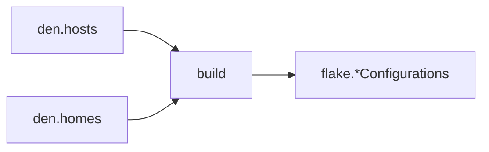

import { Aside, Steps } from '@astrojs/starlight/components';

<Aside title="Source" icon="github">
[`modules/outputs/*.nix`](https://github.com/vic/den/blob/main/modules/outputs) --
[`modules/outputs.nix`](https://github.com/vic/den/blob/main/modules/outputs.nix) --
[`per system tests`](https://github.com/vic/den/blob/main/templates/ci/modules/features/forward-flake-level.nix)
</Aside>

## Build pipeline

Den converts `den.hosts` and `den.homes` declarations into flake outputs
through a unified pipeline:



### Host instantiation

For each host in `den.hosts`, Den calls:

```nix
host.instantiate {
  modules = [
    host.mainModule
    { nixpkgs.hostPlatform = lib.mkDefault host.system; }
  ];
}
```

`host.mainModule` is internally computed by resolving the host's aspect
with its context (`den.ctx.host`), collecting all class-specific config
and dispatched includes.

The result is placed at `flake.<intoAttr>` -- by default
`flake.nixosConfigurations.<name>` or `flake.darwinConfigurations.<name>`.

### Home instantiation

For each home in `den.homes`, Den calls:

```nix
home.instantiate {
  pkgs = home.pkgs;
  modules = [ home.mainModule ];
}
```

The result lands at `flake.homeConfigurations.<name>` by default.

## `outputs.nix` -- flake-parts compatibility

When `inputs.flake-parts` is absent, Den defines its own `options.flake`
option so that output generation works identically with or without flake-parts.

This means Den can produce `nixosConfigurations`, `darwinConfigurations`,
`homeConfigurations`, and any custom output attribute regardless of
whether flake-parts is loaded.

## Custom output paths

Override `intoAttr` on any host or home to place outputs at a custom path:

```nix
den.hosts.x86_64-linux.myhost = {
  intoAttr = [ "nixosConfigurations" "custom-name" ];
};
```

Use `intoAttr = [ ]` to skip placing the configuration.

## Custom instantiation

Override `instantiate` to use a different builder or add `specialArgs`:

```nix
den.hosts.x86_64-linux.myhost = {
  instantiate = inputs.nixos-unstable.lib.nixosSystem;
};
```

## Flake outputs like `packages`, `checks`, etc.

Den aspects can directly contribute to `packages` and similar flake outputs.

The following example are for `packages` but same applies for `checks`, `devShells`,
`legacyPackages` and other per system outputs.

<Steps>

1. Define `flake.packages` output.

     This is only needed if you don't use flake-parts and will have more than one package,
     because the Nix module system needs to know how to merge both output definitions:

     ```nix
     # modules/outputs.nix
     { inputs, ... }:
     {
       imports = [ inputs.den.flakeOutputs.packages ];
     }
     ```

2. Allow aspects to produce `packages`.

     ```nix
     # ANY Host or User aspect can produce outputs:
     den.ctx.flake-system.into.host = { system }: 
       map (host: { inherit host; }) 
       (lib.attrValues den.hosts.${system});

     # ONLY foo aspect can produce packages:
     den.ctx.flake-packages.includes = [ den.aspects.foo ];
     ```

3. Use the `packages` class on your aspects:

     ```nix
     den.aspects.foo = {
        packages = { pkgs, ... }: { inherit (pkgs) hello; };
     };
     ```

</Steps>

See [`forward-flake-level.nix`](https://github.com/vic/den/blob/main/templates/ci/modules/features/forward-flake-level.nix) for all examples.
