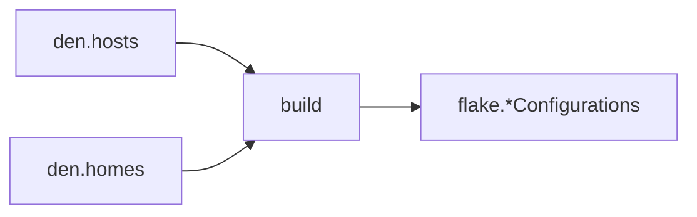

import { Aside } from '@astrojs/starlight/components';

<Aside title="Source" icon="github">
[`modules/config.nix`](https://github.com/vic/den/blob/main/modules/config.nix) --
[`modules/output.nix`](https://github.com/vic/den/blob/main/modules/output.nix)
</Aside>

## Build pipeline

Den converts `den.hosts` and `den.homes` declarations into flake outputs
through a unified pipeline:



### Host instantiation

For each host in `den.hosts`, Den calls:

```nix
host.instantiate {
  modules = [
    host.mainModule
    { nixpkgs.hostPlatform = lib.mkDefault host.system; }
  ];
}
```

`host.mainModule` is internally computed by resolving the host's aspect
with its context (`den.ctx.host`), collecting all class-specific config
and dispatched includes.

The result is placed at `flake.<intoAttr>` -- by default
`flake.nixosConfigurations.<name>` or `flake.darwinConfigurations.<name>`.

### Home instantiation

For each home in `den.homes`, Den calls:

```nix
home.instantiate {
  pkgs = home.pkgs;
  modules = [ home.mainModule ];
}
```

The result lands at `flake.homeConfigurations.<name>` by default.

## `output.nix` -- flake-parts compatibility

When `inputs.flake-parts` is absent, Den defines its own `options.flake`
option (adapted from flake-parts, MIT licensed) so that output generation
works identically with or without flake-parts.

This means Den can produce `nixosConfigurations`, `darwinConfigurations`,
`homeConfigurations`, and any custom output attribute regardless of
whether flake-parts is loaded.

## Custom output paths

Override `intoAttr` on any host or home to place outputs at a custom path:

```nix
den.hosts.x86_64-linux.myhost = {
  intoAttr = [ "nixosConfigurations" "custom-name" ];
};
```

## Custom instantiation

Override `instantiate` to use a different builder or add `specialArgs`:

```nix
den.hosts.x86_64-linux.myhost = {
  instantiate = inputs.nixos-unstable.lib.nixosSystem;
};
```
