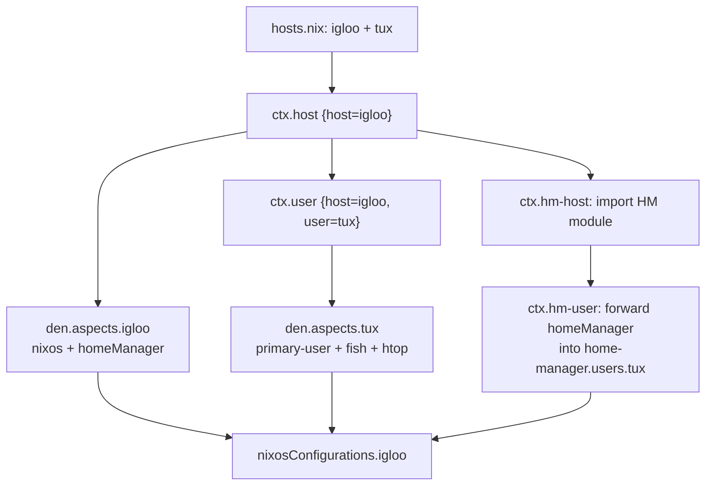

The default template is the recommended way to start a new Den project. It includes flake-parts, Home-Manager, dendritic flake-file, and a VM for testing.

## Initialize

```console
mkdir my-nix && cd my-nix
nix flake init -t github:vic/den#default
nix flake update den
```

## Project Structure

```
flake.nix              # auto-generated by flake-file
modules/
  dendritic.nix        # flake-file + den dendritic setup
  hosts.nix            # host and user declarations
  defaults.nix         # global settings (stateVersion, etc.)
  igloo.nix            # host aspect
  tux.nix              # user aspect
  vm.nix               # VM runner
```

## File by File

### hosts.nix — Declare Your Infrastructure

```nix
{
  den.hosts.x86_64-linux.igloo.users.tux = { };
}
```

This single line declares:
- A host `igloo` on `x86_64-linux` (class: `nixos`)
- A user `tux` on that host (class: `homeManager`)

The host and user each get an aspect (`den.aspects.igloo` and `den.aspects.tux`) that you configure in separate files.

### igloo.nix — Host Aspect

```nix
{
  den.aspects.igloo = {
    nixos = { pkgs, ... }: {
      environment.systemPackages = [ pkgs.hello ];
    };
    homeManager = { pkgs, ... }: {
      home.packages = [ pkgs.vim ];
    };
  };
}
```

The host aspect provides:
- **NixOS config** — system packages available to all users
- **Home-Manager config** — default home environment for every user on this host

### tux.nix — User Aspect

```nix
{ den, ... }:
{
  den.aspects.tux = {
    includes = [
      den.provides.primary-user
      (den.provides.user-shell "fish")
    ];
    homeManager = { pkgs, ... }: {
      home.packages = [ pkgs.htop ];
    };
  };
}
```

The user aspect:
- Includes [`primary-user`](/reference/batteries/#primary-user) — adds wheel + networkmanager groups
- Includes [`user-shell`](/reference/batteries/#user-shell) — sets fish as default shell at OS and HM level
- Provides personal Home-Manager packages

### defaults.nix — Global Settings

```nix
{
  den.default.nixos.system.stateVersion = "25.11";
  den.default.homeManager.home.stateVersion = "25.11";
}
```

`den.default` applies settings to **all** hosts, users, and homes. This is the right place for `stateVersion` and other global policies.

### vm.nix — Test in a VM

```nix
{ inputs, den, ... }:
{
  den.aspects.igloo.includes = [ (den.provides.tty-autologin "tux") ];

  perSystem = { pkgs, ... }: {
    packages.vm = pkgs.writeShellApplication {
      name = "vm";
      text = let
        host = inputs.self.nixosConfigurations.igloo.config;
      in ''
        ${host.system.build.vm}/bin/run-${host.networking.hostName}-vm "$@"
      '';
    };
  };
}
```

Run the VM with:

```console
nix run .#vm
```

### dendritic.nix — Flake Wiring

```nix
{ inputs, ... }:
{
  imports = [
    (inputs.flake-file.flakeModules.dendritic or { })
    (inputs.den.flakeModules.dendritic or { })
  ];
  flake-file.inputs = {
    den.url = "github:vic/den";
    flake-file.url = "github:vic/flake-file";
    home-manager = {
      url = "github:nix-community/home-manager";
      inputs.nixpkgs.follows = "nixpkgs";
    };
  };
}
```

This uses [flake-file](https://github.com/vic/flake-file) so inputs can be defined close to where they are used. Run `nix run .#write-flake` to regenerate `flake.nix` after changing inputs.

## Data Flow



## What It Provides

| Feature | Provided |
|---------|:--------:|
| NixOS host configuration | ✓ |
| Home-Manager integration | ✓ |
| Dendritic flake-file | ✓ |
| VM testing | ✓ |
| flake-parts | ✓ |
| Darwin support | Add input |
| Namespaces | Add manually |

## Next Steps

- Edit `hosts.nix` to add more hosts or users
- Create new aspect files under `modules/`
- Add Darwin support by adding `nix-darwin` input
- Explore the [Example template](/tutorials/example/) for namespaces and advanced features
