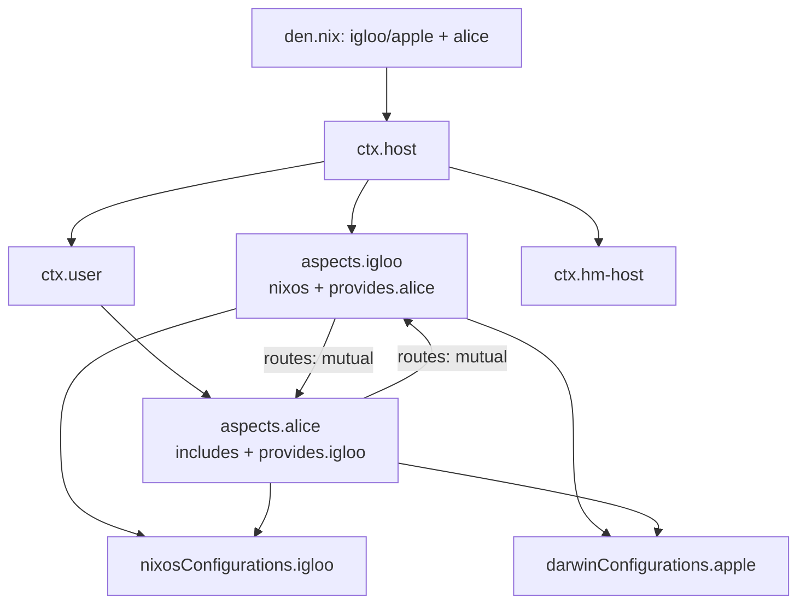

The example template demonstrates Den's advanced features: namespaces, angle brackets, cross-platform hosts, bidirectional providers, and custom aspect libraries.

## Initialize

```console
mkdir my-nix && cd my-nix
nix flake init -t github:vic/den#example
nix flake update den
```

## Project Structure

```
flake.nix
modules/
  den.nix              # host/home declarations
  dendritic.nix        # flake-file + den wiring
  inputs.nix           # flake inputs
  namespace.nix        # creates the "eg" namespace
  tests.nix            # CI checks
  vm.nix               # VM runner
  aspects/
    defaults.nix       # global config + angle brackets demo
    alice.nix           # user aspect
    igloo.nix           # host aspect
    eg/                 # namespace aspects
      autologin.nix
      ci-no-boot.nix
      routes.nix
      vm.nix
      vm-bootable.nix
      xfce-desktop.nix
```

## Key Features Demonstrated

### Cross-Platform Hosts

```nix
# modules/den.nix
{
  den.hosts.x86_64-linux.igloo.users.alice = { };
  den.hosts.aarch64-darwin.apple.users.alice = { };
  den.homes.x86_64-linux.alice = { };
}
```

One user (`alice`) across a NixOS host, a Darwin host, and a standalone Home-Manager config. The same aspects produce appropriate configs for each platform.

### Namespaces

```nix
# modules/namespace.nix
{ inputs, den, ... }:
{
  imports = [ (inputs.den.namespace "eg" true) ];
  _module.args.__findFile = den.lib.__findFile;
}
```

Creates a local namespace `eg` accessible as a module argument. The `true` flag exposes it as a flake output (`flake.denful.eg`). Angle brackets are enabled via `__findFile`.

### Namespace Aspects

The `eg/` directory defines reusable aspects under the `eg` namespace:

```nix
# modules/aspects/eg/vm.nix
{ eg, ... }:
{
  eg.vm.provides = {
    gui.includes = [ eg.vm  eg.vm-bootable._.gui  eg.xfce-desktop ];
    tui.includes = [ eg.vm  eg.vm-bootable._.tui ];
  };
}
```

Aspects can have nested **provides** — `eg.vm._.gui` and `eg.vm._.tui` are sub-aspects accessed via the `_.` provider syntax.

### Angle Brackets

```nix
# modules/aspects/defaults.nix
{ den, __findFile ? __findFile, ... }:
{
  den.default.includes = [
    <eg/routes>          # resolves to eg.routes
    <den/define-user>    # resolves to den.provides.define-user
  ];
}
```

The `<name>` syntax is shorthand for aspect lookup. `<den/define-user>` resolves to `den.provides.define-user`. See [Angle Brackets](/guides/angle-brackets/).

### Bidirectional Providers

```nix
# modules/aspects/alice.nix — user provides config TO the host
den.aspects.alice = {
  provides.igloo = { host, ... }: {
    nixos.programs.nh.enable = host.name == "igloo";
  };
};

# modules/aspects/igloo.nix — host provides config TO the user
den.aspects.igloo = {
  provides.alice = { user, ... }: {
    homeManager.programs.helix.enable = user.name == "alice";
  };
};
```

Hosts and users can contribute configuration **to each other** through `provides`. Alice enables `nh` on igloo, and igloo enables `helix` for alice. These are cross-providers activated during context transformation.

### Custom Routes

```nix
# modules/aspects/eg/routes.nix
{ den, ... }:
{
  eg.routes = let
    inherit (den.lib) parametric;
    mutual = from: to: den.aspects.${from.aspect}._.${to.aspect} or { };
    routes = { host, user, ... }@ctx:
      parametric.fixedTo ctx {
        includes = [ (mutual user host) (mutual host user) ];
      };
  in routes;
}
```

This aspect **wires bidirectional providers** between hosts and users automatically. Including `<eg/routes>` in `den.default` activates all `provides` declarations.

### Tests

```nix
# modules/tests.nix — verifies the template works
{
  checks."alice enabled igloo nh" = checkCond "..." igloo.programs.nh.enable;
  checks."igloo enabled alice helix" = checkCond "..." alice-at-igloo.programs.helix.enable;
}
```

## Data Flow



## What It Provides

| Feature | Provided |
|---------|:--------:|
| NixOS + Darwin hosts | ✓ |
| Home-Manager | ✓ |
| Standalone HM config | ✓ |
| Namespaces (`eg`) | ✓ |
| Angle brackets | ✓ |
| Bidirectional providers | ✓ |
| VM testing | ✓ |
| CI checks | ✓ |

## Next Steps

- Study the `eg/` namespace aspects as examples for your own libraries
- Read [Namespaces](/guides/namespaces/) and [Angle Brackets](/guides/angle-brackets/)
- Explore the [CI Tests template](/tutorials/ci/) for comprehensive feature coverage
