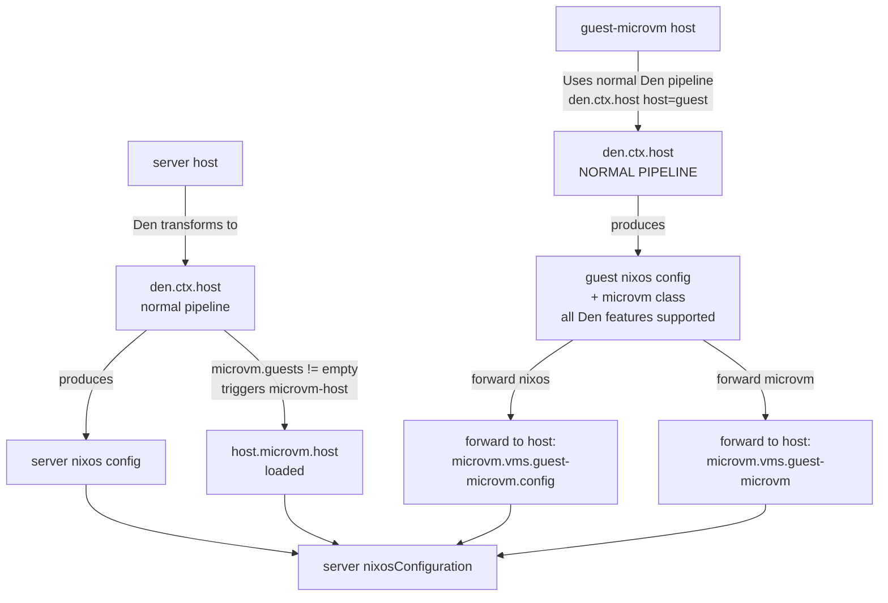

The MicroVM template demonstrates Den's extensibility: custom `den.ctx` and `den.schema` extensions for integrating other Nix libraries. MicroVM shows two patterns for building VMs with Den.

## Two MicroVM Patterns

### 1. Runnable MicroVM as Package

A standalone NixOS configuration that runs as a portable package using QEMU.

- Den example: [runnable-example.nix](https://github.com/vic/den/tree/main/templates/microvm/modules/runnable-example.nix)
- Den support: [microvm-runners.nix](https://github.com/vic/den/tree/main/templates/microvm/modules/microvm-runners.nix)

```console
nix run .#runnable-microvm
```

See [MicroVM Docs on Package Runners](https://microvm-nix.github.io/microvm.nix/packages.html)

### 2. Declarative Guest VMs on Host

Guest MicroVMs declared on a host and managed together.

- Den example: [guests-example.nix](https://github.com/vic/den/tree/main/templates/microvm/modules/guests-example.nix)
- Den support: [microvm-integration.nix](https://github.com/vic/den/tree/main/templates/microvm/modules/microvm-integration.nix)

```console
nixos-rebuild build --flake .#server
```

See [MicroVM Docs on Declarative MicroVMs](https://microvm-nix.github.io/microvm.nix/declarative.html)

## Initialize

```console
mkdir my-nix && cd my-nix
nix flake init -t github:vic/den#microvm
nix flake update den
```

## Project Structure

```
flake.nix
modules/
  den.nix                      # Enable Den + hostname for all hosts

  runnable-example.nix         # Standalone NixOS MicroVM with QEMU
  microvm-runners.nix          # Auto-expose runnable VMs as flake packages

  guests-example.nix           # Server host with declarative guest VMs
  microvm-integration.nix      # Schema extensions + context pipelines
```

## Key Features Demonstrated

### Standalone Runnable MicroVM

Any runnable MicroVM with `declaredRunner` is auto-exposed as a flake package:

```nix
# modules/microvm-runners.nix
flake.packages = {
  x86_64-linux.runnable-microvm = <runner>;
};
```

### Schema Extensions for MicroVM Options

`microvm-integration.nix` extends `den.schema.host` with MicroVM-specific options:

```nix
options.microvm.guests = lib.mkOption {
  type = lib.types.listOf lib.types.raw;
  description = "List of Den hosts to run as guest VMs";
};

options.microvm.sharedNixStore = lib.mkEnableOption "Auto share nix store";
```

### Host with Declarative Guests

```nix
# modules/guests-example.nix

# Server host with guest VM
den.hosts.x86_64-linux.server.microvm.guests = [
  den.hosts.x86_64-linux.guest-microvm
];

# Guest VM declaration (no top-level nixosConfiguration)
den.hosts.x86_64-linux.guest-microvm.intoAttr = [];

# Server config
den.aspects.server = {
  nixos.microvm.host.startupTimeout = 300;
};

# Guest config (forwarded to server's microvm.vms.guest-microvm.config)
den.aspects.guest-microvm = {
  nixos = { pkgs, ... }: {
    environment.systemPackages = [ pkgs.cowsay ];
  };

  # Forwarded to server's microvm.vms.guest-microvm
  microvm.autostart = true;
};
```

### Custom Context Pipeline

Three-stage pipeline for MicroVM host and guests:

```nix
# Stage 1: host → microvm-host (only if guests is non-empty)
ctx.host.into.microvm-host = { host }:
  lib.optional (host.microvm.guests != []) { inherit host; };

# microvm-host provides Host configuration
ctx.microvm-host.provides.microvm-host = { host }: {
  ${host.class}.imports = [ host.microvm.hostModule ];
};

# Stage 2: microvm-host → microvm-guest
ctx.microvm-host.into.microvm-guest = { host }:
  map (vm: { inherit host vm; }) host.microvm.guests;

# Guest configuration forwarded to host
ctx.microvm-host.provides.microvm-guest = { host, vm }: {
  includes = [
    # Auto-share nix store if enabled
    sharedNixStore,

    # Den resolved NixOS forwarded to <host>.nixos.microvm.vms.${vm.name}.config
    (den.provides.forward { ... }),

    # Forward guest microvm class to <host>.nixos.microvm.vms.${vm.name}
    (den.provides.forward { ... }),
  ];
};
```

## Data Flow



## What It Provides

| Feature | Provided |
|---------|:--------:|
| Custom context pipelines | ✓ |
| Schema extensions | ✓ |
| Forward providers | ✓ |
| Standalone runnable VMs | ✓ |
| Host-guest architecture | ✓ |
| Declarative MicroVM | ✓ |
| Auto nix store sharing | ✓ |

## Next Steps

- Read [MicroVM Documentation](https://microvm-nix.github.io/microvm.nix/)
- Check [Package Runners](https://microvm-nix.github.io/microvm.nix/packages.html)
- Explore [Host Configuration](https://microvm-nix.github.io/microvm.nix/host.html)
- Learn [Declarative VMs](https://microvm-nix.github.io/microvm.nix/declarative.html)
