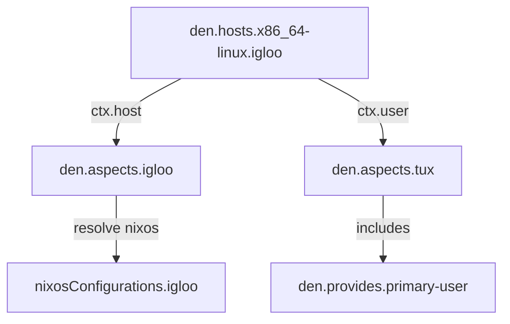

The minimal template demonstrates Den's core with zero extra dependencies beyond nixpkgs.

## Initialize

```console
mkdir my-nix && cd my-nix
nix flake init -t github:vic/den#minimal
nix flake update den
```

## Project Structure

```
flake.nix
modules/
  den.nix
```

## flake.nix

```nix
{
  outputs = inputs:
    (inputs.nixpkgs.lib.evalModules {
      modules = [ (inputs.import-tree ./modules) ];
      specialArgs = { inherit inputs; };
    }).config.flake;

  inputs = {
    nixpkgs.url = "https://channels.nixos.org/nixpkgs-unstable/nixexprs.tar.xz";
    import-tree.url = "github:vic/import-tree";
    flake-aspects.url = "github:vic/flake-aspects";
    den.url = "github:vic/den";
  };
}
```

Key points:
- **No flake-parts** — uses `lib.evalModules` directly
- **import-tree** — recursively loads all `.nix` files under `modules/`
- **Results** land in `.config.flake` (nixosConfigurations, etc.)

## modules/den.nix

```nix
{ inputs, den, ... }:
{
  imports = [ inputs.den.flakeModule ];

  den.hosts.x86_64-linux.igloo.users.tux = { };

  den.aspects.igloo = {
    nixos = { pkgs, ... }: {
      environment.systemPackages = [ pkgs.hello ];
      boot.loader.grub.enable = false;  # TODO: remove for real hardware
      fileSystems."/".device = "/dev/null";
    };
  };

  den.aspects.tux = {
    includes = [ den.provides.primary-user ];
  };
}
```

### What This Declares

1. **One host** named `igloo` on `x86_64-linux` with **one user** named `tux`
2. **Host aspect** `den.aspects.igloo` — provides NixOS config (a package + boot/fs stubs)
3. **User aspect** `den.aspects.tux` — includes the [`primary-user`](/reference/batteries/#primary-user) battery

### How It Works



1. Den reads `den.hosts` and creates a `ctx.host { host = igloo }` context
2. The host aspect `igloo` is activated with its NixOS config
3. For each user, a `ctx.user { host, user }` context is created
4. The user aspect `tux` includes `primary-user` (adds wheel/networkmanager groups)
5. Everything resolves into `nixosConfigurations.igloo`

## Build It

```console
nix build .#nixosConfigurations.igloo.config.system.build.toplevel
```

## Customize

To add your own host configuration, edit `den.aspects.igloo.nixos`. To add user packages, add a `homeManager` key to `den.aspects.tux` (requires adding `home-manager` input). Or keep it simple — the minimal template works without Home-Manager.

## What It Provides

| Feature | Provided |
|---------|:--------:|
| NixOS host configuration | ✓ |
| User with wheel/networkmanager | ✓ |
| Home-Manager | ✗ |
| Darwin support | ✗ |
| Namespaces | ✗ |
| VM testing | ✗ |

## Next Steps

- Add more aspects in separate files under `modules/`
- Graduate to the [Default template](/tutorials/default/) for Home-Manager support
- Read [Core Principles](/explanation/core-principles/) to understand the context pipeline
