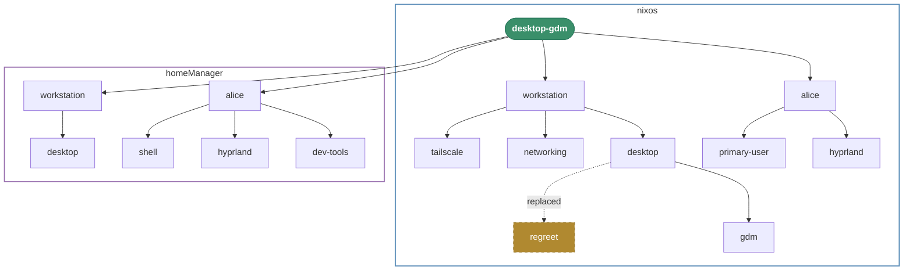

# Aspect Trace: desktop-gdm

```mermaid
graph TD
  desktop_gdm([desktop-gdm]):::host

  subgraph nixos[nixos]
  nixos_alice[alice]
  nixos_desktop[desktop]
  nixos_gdm[gdm]
  nixos_hyprland[hyprland]
  nixos_networking[networking]
  nixos_primary_user[primary-user]
  nixos_regreet[regreet]:::replaced
  nixos_tailscale[tailscale]
  nixos_workstation[workstation]
  nixos_alice --> nixos_hyprland
  nixos_alice --> nixos_primary_user
  nixos_desktop --> nixos_gdm
  nixos_desktop -.->|replaced| nixos_regreet
  desktop_gdm --> nixos_alice
  desktop_gdm --> nixos_workstation
  nixos_workstation --> nixos_desktop
  nixos_workstation --> nixos_networking
  nixos_workstation --> nixos_tailscale
  end
  subgraph homeManager[homeManager]
  homeManager_alice[alice]
  homeManager_desktop[desktop]
  homeManager_dev_tools[dev-tools]
  homeManager_hyprland[hyprland]
  homeManager_shell[shell]
  homeManager_workstation[workstation]
  homeManager_alice --> homeManager_dev_tools
  homeManager_alice --> homeManager_hyprland
  homeManager_alice --> homeManager_shell
  desktop_gdm --> homeManager_alice
  desktop_gdm --> homeManager_workstation
  homeManager_workstation --> homeManager_desktop
  end

  classDef host fill:#3a8f6a,stroke:#2d7a5f,color:#fff,font-weight:bold
  classDef excluded fill:#b05060,stroke:#903040,color:#fff,stroke-dasharray: 5 5
  classDef replaced fill:#b08930,stroke:#907020,color:#fff,stroke-dasharray: 5 5
style nixos fill:transparent,stroke:#5b8db8,stroke-width:2px
style homeManager fill:transparent,stroke:#9b72b0,stroke-width:2px
```
