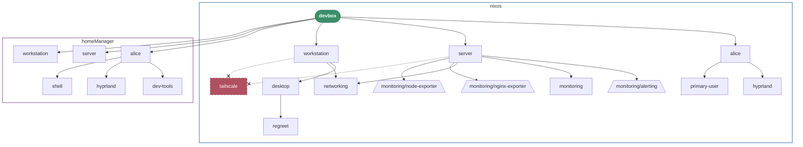

# Aspect Trace: devbox

```mermaid
graph TD
  devbox([devbox]):::host

  subgraph nixos[nixos]
  nixos_alerting[/monitoring/alerting\]
  nixos_alice[alice]
  nixos_desktop[desktop]
  nixos_hyprland[hyprland]
  nixos_monitoring[monitoring]
  nixos_networking[networking]
  nixos_nginx_exporter[/monitoring/nginx-exporter\]
  nixos_node_exporter[/monitoring/node-exporter\]
  nixos_primary_user[primary-user]
  nixos_regreet[regreet]
  nixos_server[server]
  nixos_tailscale[tailscale]:::excluded
  nixos_workstation[workstation]
  nixos_alice --> nixos_hyprland
  nixos_alice --> nixos_primary_user
  nixos_desktop --> nixos_regreet
  devbox --> nixos_alice
  devbox --> nixos_server
  devbox --> nixos_workstation
  nixos_server --> nixos_alerting
  nixos_server --> nixos_monitoring
  nixos_server --> nixos_networking
  nixos_server --> nixos_nginx_exporter
  nixos_server --> nixos_node_exporter
  nixos_server -.-x nixos_tailscale
  nixos_workstation --> nixos_desktop
  nixos_workstation --> nixos_networking
  nixos_workstation -.-x nixos_tailscale
  end
  subgraph homeManager[homeManager]
  homeManager_alice[alice]
  homeManager_dev_tools[dev-tools]
  homeManager_hyprland[hyprland]
  homeManager_server[server]
  homeManager_shell[shell]
  homeManager_workstation[workstation]
  homeManager_alice --> homeManager_dev_tools
  homeManager_alice --> homeManager_hyprland
  homeManager_alice --> homeManager_shell
  devbox --> homeManager_alice
  devbox --> homeManager_server
  devbox --> homeManager_workstation
  end

  classDef host fill:#3a8f6a,stroke:#2d7a5f,color:#fff,font-weight:bold
  classDef excluded fill:#b05060,stroke:#903040,color:#fff,stroke-dasharray: 5 5
  classDef replaced fill:#b08930,stroke:#907020,color:#fff,stroke-dasharray: 5 5
style nixos fill:transparent,stroke:#5b8db8,stroke-width:2px
style homeManager fill:transparent,stroke:#9b72b0,stroke-width:2px
```
