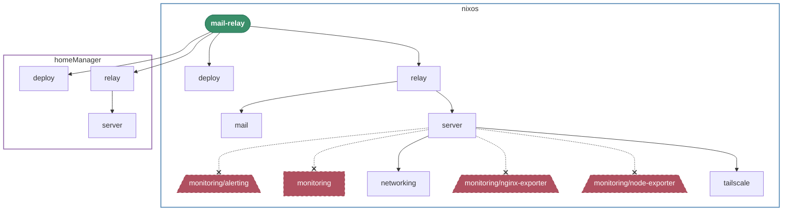

# Aspect Trace: mail-relay

```mermaid
graph TD
  mail_relay([mail-relay]):::host

  subgraph nixos[nixos]
  nixos_alerting[/monitoring/alerting\]:::excluded
  nixos_deploy[deploy]
  nixos_mail[mail]
  nixos_monitoring[monitoring]:::excluded
  nixos_networking[networking]
  nixos_nginx_exporter[/monitoring/nginx-exporter\]:::excluded
  nixos_node_exporter[/monitoring/node-exporter\]:::excluded
  nixos_relay[relay]
  nixos_server[server]
  nixos_tailscale[tailscale]
  mail_relay --> nixos_deploy
  mail_relay --> nixos_relay
  nixos_relay --> nixos_mail
  nixos_relay --> nixos_server
  nixos_server -.-x nixos_alerting
  nixos_server -.-x nixos_monitoring
  nixos_server --> nixos_networking
  nixos_server -.-x nixos_nginx_exporter
  nixos_server -.-x nixos_node_exporter
  nixos_server --> nixos_tailscale
  end
  subgraph homeManager[homeManager]
  homeManager_deploy[deploy]
  homeManager_relay[relay]
  homeManager_server[server]
  mail_relay --> homeManager_deploy
  mail_relay --> homeManager_relay
  homeManager_relay --> homeManager_server
  end

  classDef host fill:#3a8f6a,stroke:#2d7a5f,color:#fff,font-weight:bold
  classDef excluded fill:#b05060,stroke:#903040,color:#fff,stroke-dasharray: 5 5
  classDef replaced fill:#b08930,stroke:#907020,color:#fff,stroke-dasharray: 5 5
style nixos fill:transparent,stroke:#5b8db8,stroke-width:2px
style homeManager fill:transparent,stroke:#9b72b0,stroke-width:2px
```
